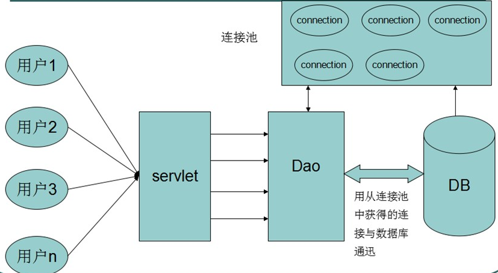
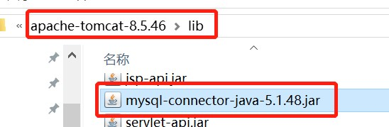

# 连接池

> 数据库连接池负责分配、管理和释放数据库连接，它允许应用程序重复使用一个现有的数据库连接，而不是再重新建立一个；释放空闲时间超过最大空闲时间的数据库连接来避免因为没有释放数据库连接而引起的数据库连接遗漏。



## 技术

1. [DBCP](dbcp)
2. [C3P0](c3p0)

## DBCP 和 C3P0 的区别

`dbcp` 没有自动回收空闲连接的功能

`c3p0` 有自动回收空闲连接功能

## tomcat 管理数据源(DBCP)

`tomcat8.0`  自带数据库连接池 `tomcat/lib/tomcat-dbcp.jar`

1. 拷贝数据库连接 `mysql-connector-java` 的 `jar` 到 `tomcat/lib` 目录下。

   

2. 配置数据源

   1. 将配置信息写在 `tomcat` 下的 `conf` 目录的 `context.xml` 中，那么所有应用都能使用此数据源。
   2. 将配置信息写在应用的 `META-INF` 目录的 `context.xml` 中，那么当前应用可以使用。

   ```xml
   <Context>
   	  <Resource name="jdbc/TestDB" auth="Container" type="javax.sql.DataSource"
                  maxActive="100" maxIdle="30" maxWait="10000"
                  username="root" password="root" driverClassName="com.mysql.jdbc.Driver"
                  url="jdbc:mysql://localhost:3306/hehe_test"/>
   	
   </Context>
   ```

3. 使用连接池

   ```java
   Context initContext = new InitialContext();
   Context envContext = (Context)initContext.lookup("java:/comp/env");
   DataSource ds = (DataSource)envContext.lookup("jdbc/myoracle");
   Connection connection = ds.getConnection();
   
   // 或者
   Context context = new InitialContext();
   DataSource ds = (DataSource)context.lookup("java:/comp/env/jdbc/myoracle");
   Connection connection = ds.getConnection();
   ```

   