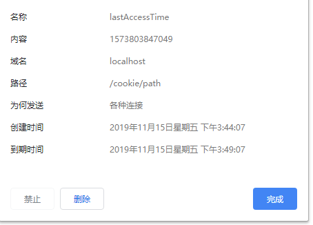
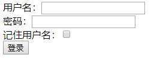

# cookie
> Cookie是 **客户端** 技术，程序把每个用户的数据以cookie的形式写给用户各自的浏览器。当用户使用浏览器再去访问服务器中的web资源时，就会带着各自的数据去。这样，web资源处理的就是用户各自的数据了。 
* 一个 Cookie 只能标识一种信息，它至少含有一个标识该信息的名称（NAME）和设置值（VALUE）。 
* 一个 WEB 站点可以给一个 WEB 浏览器发送多个 Cookie，一个 WEB 浏览器也可以存储多个 WEB 站点提供的 Cookie。
* 浏览器一般只允许存放 300 个 Cookie，每个站点最多存放 20 个 Cookie ，每个 Cookie 的大小限制为 4KB。
* 如果创建了一个 cookie，并将他发送到浏览器，默认情况下它是一个会话级别的 cookie（即存储在浏览器的内存中），用户退出浏览器之后即被删除。若希望浏览器将该 cookie 存储在磁盘上，则需要使用 maxAge，并给出一个以秒为单位的时间。将最大时效设为 0 则是命令浏览器删除该 cookie。
* 注意，删除 cookie 时，path 必须一致，否则不会删除

## [firstCookie](src/main/java/org/lzn/FirstCookie.java)
1. cookie 的获取
2. cookie 的创建
3. 设置 cookie 的生存时间
4. cookie 的响应
### setMaxAge(int)
设置 cookie 的最大生存时间，以秒为单位
1. 正值表示 cookie 将在经过该值表示的秒数后过期。
2. 该值是 cookie 过期的最大生存时间，不是 cookie 的当前生存时间
3. 负值意味着 cookie 不会被持久化存储，将在 web 浏览器退出时删除。0 值会导致删除 cookie。
## [secondCookie](src/main/java/org/lzn/SecondCookie.java)
获取 cookie 的值。用来了解 cookie 的 path 
[firstCookie](src/main/java/org/lzn/FirstCookie.java) 和 [secondCookie](src/main/java/org/lzn/SecondCookie.java) 各自拥有两个请求路径。见 ☞ [web.xml](web/WEB-INF/web.xml)

### path
#### 默认是写入 cookie 那个应用的访问路径 
URL：http://localhost:8080/cookie/path/demo1 
Path：/cookie/path/ 

#### 客户端在访问服务器另外资源时，根据访问的路径来决定是否带着 Cookie 到服务器 
当前访问的路径如果与 cookie 的 path 相同，浏览器就带。否则不带。
1. 访问 `path/demo1` servlet
2. 访问 `demo2` servlet，看页面是否显示最后访问时间
3. 访问 `path/demo2` servlet，看页面是否显示最后访问时间
4. 访问 `demo2` servlet，看页面是否显示最后访问时间
    1. 第一个 cookie `path/demo1` 时保存的 cookie, path 为 `/cookie/path`
    2. 第二个 cookie `path/demo2` 时保存的 cookie, path 为 `/cookie`
## [clearCookie](src/main/java/org/lzn/ClearCookie.java)
清除 `/cookie` 路径下的 cookie
1. 访问 `demo2` servlet，看页面查看 cookie
2. 新建页面访问 `path/demo1` servlet，看页面查看 cookie
3. 点击页面 `demo2` 的 `clear`， 会删除 `/cookie` 路劲下的 cookie
4. 点击页面 `path/demo1` 查看 cookie，看 `/cookie` 路劲下的 cookie 是否已经删除
## [loginServlet](src/main/java/org/lzn/login/LoginServlet.java)
登录页面，如果有 cookie，则将 cookie 的值填进表单对应的值中 

## [doLoginServlet](src/main/java/org/lzn/login/DoLoginServlet.java)
登录功能，记住用户名且登录成功则保存 cookie
## [showAllBooksServlet](src/main/java/org/lzn/history/ShowAllBooksServlet.java)
使用 cookie 实现历史记录。cookie 格式："id"-"id",例如：1-2 
点击图书会打开图书详情的页面，主页刷新会显示最近阅读的三本书 
### 架构
| 类名 | 说明 | package |
| :- | :- | :- |
| Book | 实体类 | entity |
| DBUtil | 工具类，模拟从数据库获取数据 | util |
| ShowAllBooksServlet | Servlet，主页 | history |
| ShowBookDetail | Servlet，图书详情 | history |