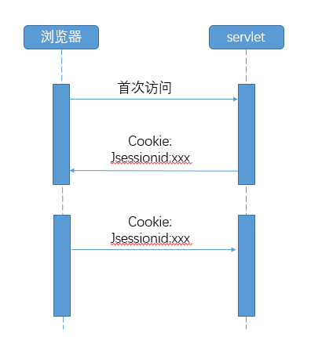
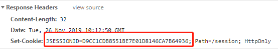

# session
> Session是 **服务器端** 技术，利用这个技术，服务器在运行时可以为每一个用户的浏览器创建一个 **独享的HttpSession对象**，由于session为用户浏览器独享，所以用户在访问服务器的web资源时，可以把各自的数据放在各自的session中，当用户再去访问服务器中的其它web资源时，其它web资源再从用户各自的session中取出数据为用户服务。
## 原理图
session 的实现原理 
 
cookie 中的 jsessionid 

## [firstSession](src/main/java/org/lzn/FirstSession.java)
存放 session
## [secondSession](src/main/java/org/lzn/SecondSession.java)
读取 session
### 研究
与 [firstSession](src/main/java/org/lzn/FirstSession.java) 配合研究，多个浏览器是否能访问同一个 session 
1. 不同浏览器访问的 session 不同
2. 浏览器关闭则 session 清除，则关闭浏览器标签则不会清除