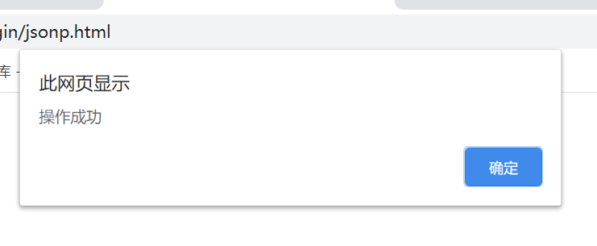
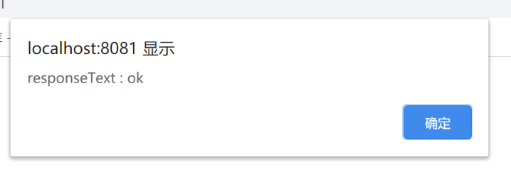

# 跨域

[TOC]

## 跨域

跨域问题源于浏览器的安全策略，同源策略（Same origin policy）。

## 同源策略（Same origin policy）

同源策略（Same origin policy）是一种约定，它是浏览器最核心也最基本的安全功能，如果缺少了同源策略，则浏览器的正常功能可能都会受到影响。可以说Web是构建在同源策略基础之上的，浏览器只是针对同源策略的一种实现。

同源策略，它是由 **Netscape** 提出的一个著名的 **安全策略**。

即执行一个脚本的时候会检查这个脚本是属于哪个页面的，检查是否同源，只有同源的脚本才会被执行。如果非同源，那么在请求数据时，浏览器会在控制台中报一个异常，提示拒绝访问。

同源策略是浏览器的行为，是为了保护本地数据不被 `JavaScript` 代码获取回来的数据污染，因此拦截的是客户端发出的请求回来的数据接收，即请求发送了，服务器响应了，但是无法被浏览器接收。

## 为什么会出现跨域

当前页面 url 与请求 url 的协议、域名、端口三者之间任意一个不同。同源也就是相同的 **协议（protocol），主机（host）和端口号（port）**。

## 解决跨域

### 前端

URL：`http://localhost:8080`

[front 代码](front)

### 后端

URL：`http://localhost:8081`

[back 代码](back)

## JSONP

JSONP(JSON with Padding) 是 JSON(JavaScript Object Notation, JS 对象简谱) 的一种 **使用模式**，可用于解决主流浏览器的跨域数据访问的问题。由于同源策略，一般来说位于 server1.example.com 的网页无法与不是 server1.example.com 的服务器沟通，而 HTML 的 \<script\> 元素是一个例外。利用 \<script\> 元素的这个开放策略，网页可以得到从其他来源动态产生的 JSON 资料，而这种使用模式就是所谓的 JSONP。**用 JSONP 抓到的资料并不是 JSON，而是任意的 JavaScript，用 JavaScript 直译器执行而不是用 JSON 解析器解析**。**发送请求时携带 Cookie**。

### 前端

[jsonp.html](front/web/jsonp.html)

```html
<head>
    <meta charset="UTF-8">
    <title>JSONP</title>
	<script type="text/javascript">
		function showData(data) {
			alert(data.success);
		}
	</script>
    <script type="text/javascript" src="http://localhost:8080/back/jsonpServlet?callback=showData"></script>
</head>
<body>
    <h1>jsonp</h1>
</body>
</html>
```

`<script type="text/javascript" src="http://localhost:8080/cross-origin/jsonpServlet?callback=showData"></script>` 为 JSONP 获取数据, `showData(data)` 为回调函数。

### 后端

[JsonpServlet.java](back/src/main/java/org/lzn/servlet/JsonpServlet.java)

```java
package org.lzn.servlet;

import javax.servlet.ServletException;
import javax.servlet.http.HttpServlet;
import javax.servlet.http.HttpServletRequest;
import javax.servlet.http.HttpServletResponse;
import java.io.IOException;

/**
 * JSONP servlet
 *
 * @author LinZhenNan lin_hehe@qq.com 2020/07/01 23:37
 */
public class JsonpServlet extends HttpServlet {
    @Override
    protected void doGet(HttpServletRequest req, HttpServletResponse resp) throws ServletException, IOException {
        // 请求类型
        resp.setHeader("Content-Type", "application/json;charset=utf-8");

        // 请求参数获取回调函数名称
        String callback = req.getParameter("callback");
        // 数据
        String json = "{\"success\":\"操作成功\", \"info\":\"hehe\"}";
        // 响应，执行回调函数 "(函数(参数))"
        String response = callback + "(" + json + ")";
        resp.getWriter().print(response);
    }
}
```

获取请求参数 `callback` 的值 callback，将 json 作为 callback 参数，让 JavaScript 执行。

### 结果



## CORS

CORS 是跨域资源分享（Cross-Origin Resource Sharing）的缩写。它是 W3C 标准，属于跨源 AJAX 请求的根本解决方法。

**响应头信息**

* <a name="accessControlAllowOrigin" style="text-decoration:none">Access-Control-Allow-Origin</a>：响应头指定了该响应的资源是否被允许与给定的 origin（来源，协议 + 域名 + 端口） 共享

* <a name="accessControlAllowCredentials" style="text-decoration:none">Access-Control-Allow-Credentials</a>：响应头表示是否可以将对请求的响应暴露给页面。返回true则可以，其他值均不可以。前端设置 `XMLHttpRequest.withCredentials` 后端也需要设置 `Access-Control-Allow-Credentials`

* Access-Control-Expose-Headers：列出了哪些头信息可以作为响应的一部分暴露给外部

  默认情况下，只有六种 simple response headers（简单响应首部）可以暴露给外部：

  * Cache-Control
  * Content-Language
  * Content-Type
  * Expires
  * Last-Modified
  * Pragma

* 

**withCredentials**

是否该使用类似 cookies, authorization headers(头部授权)或者TLS客户端证书这一类资格证书来创建一个跨站点访问控制（cross-site Access-Control）请求

`XMLHttpRequest.withCredentials`   属性是一个 `Boolean` 类型，它指示了是否该使用类似 **cookies, authorization headers(头部授权)或者 TLS 客户端证书这一类资格证书来创建一个跨站点访问控制（cross-site Access-Control）请求**。在同一个站点下使用 `withCredentials` 属性是无效的。

### 预检请求（preflight request ）

请求对服务器有特殊要求，比如请求方法是 PUT 或 DELETE，或者 Content-Type 字段的类型是 application/json。则会在正式通信之前，增加一次 HTTP 查询请求，也就是 **预检请求（preflight request ）**

头信息

* Access-Control-Request-Method：出现于 preflight request （预检请求）中，用于通知服务器在真正的请求中会采用哪种  HTTP 方法。因为预检请求所使用的方法总是 OPTIONS ，与实际请求所使用的方法不一样，所以这个请求头是必要的。
* Access-Control-Request-Headers：出现于 preflight request （预检请求）中，用于通知服务器在真正的请求中会额外发送哪些请求头。

### 响应预检请求（preflight request ）

服务器收到 **预检请求** 以后，检查了 `Origin`、`Access-Control-Request-Method` 和 `Access-Control-Request-Headers` 字段以后，确认允许跨源请求，就可以做出回应。

头信息

* Access-Control-Allow-Origin：[同上](#accessControlAllowOrigin)
* Access-Control-Allow-Methods：在对 preflight request （预检请求）的应答中明确了客户端所要访问的资源允许使用的方法列表。
* Access-Control-Allow-Headers：用于 preflight request （预检请求）中，列出了在请求的 Access-Control-Request-Headers 字段中出现的头信息。
* Access-Control-Allow-Credentials：[同上](#accessControlAllowCredentials)
* Access-Control-Max-Age：这个响应头表示 preflight request  （预检请求）的返回结果（即 `Access-Control-Allow-Methods` 和 `Access-Control-Allow-Headers` 提供的信息） 可以被缓存多久。在此期间，不用发出另一条预检请求。单位为秒。

### 普通跨域请求

服务器端设置响应头信息 Access-Control-Allow-Origin。

前端发送一个跨域请求，成功获取后端响应的信息。

#### 前端

[cors-common.html](front/web/cors-common.html)

```html
<!DOCTYPE html>
<!--
  CORS 普通跨域请求
  @author LinZhenNan lin_hehe@qq.com 2020/07/08
-->
<html lang="en">
<head>
    <meta charset="UTF-8">
    <title>CORS 普通跨域请求</title>
    <script type="text/javascript">
        /**
         * 获取 XMLHttpRequest 对象
         *
         * @returns {XMLHttpRequest}
         */
        function getXMLHttpRequest() {
            var xmlhttp;
            if (window.XMLHttpRequest) {
                // code for IE7+, Firefox, Chrome, opera, Safari
                xmlhttp = new XMLHttpRequest();
            } else {
                // code for IE6, IE5
                xmlhttp = new ActiveXObject("Microsoft.XMLHTTP");
            }
            return xmlhttp;
        }

        /**
         * 发送 POST 请求
         *
         * @param url   请求路径
         * @param data  数据
         */
        function sendPost(url, data) {
            // 获取 XMLHttpRequest 对象
            var xmlhttp = getXMLHttpRequest();
            // 处理响应结果
            xmlhttp.onreadystatechange = function () {
                if (xmlhttp.readyState == 4) {
                    if (xmlhttp.status == 200) {
                        console.log("responseHeaders : " + xmlhttp.getAllResponseHeaders());
                        alert("responseText : " + xmlhttp.responseText);
                    }
                }
            }
            // 建立一个连接
            xmlhttp.open("POST", url);
            // 设置头信息
            xmlhttp.setRequestHeader("Content-Type", "application/x-www-form-urlencoded");
            // 发送请求
            xmlhttp.send(data);
        }
        function btn() {
            var form = document.getElementById("form");
            var inputs = form.getElementsByTagName("input");
            var prms = "";
            for (var i = 0; i < inputs.length; i++) {
                if (inputs[i].type === "text") {
                    prms += "&" + inputs[i].name + "=" + inputs[i].value;
                }
            }
            prms = prms.substr(1);
            console.log(prms);
            var url = "http://localhost:8080/back/corsCommonServlet";
            sendPost(url, prms);
            alert("hehe");
        }
    </script>
</head>
<body>
    <h1>CORS 普通跨域请求</h1>
    <form id="form">
        名称：<input type="text" name="name"/><br>
        爱好：<input type="text" name="hobby"/><br>
        <input type="button" value="发送请求" onclick="btn()" />
    </form>
</body>
</html>
```

#### 后端

[CorsCommonServlet.java](back/src/main/java/org/lzn/servlet/CorsCommonServlet.java)

```java
package org.lzn.servlet;

import javax.servlet.ServletException;
import javax.servlet.ServletInputStream;
import javax.servlet.http.Cookie;
import javax.servlet.http.HttpServlet;
import javax.servlet.http.HttpServletRequest;
import javax.servlet.http.HttpServletResponse;
import java.io.IOException;

/**
 * CORS 普通库跨域请求
 *
 * @author LinZhenNan lin_hehe@qq.com 2020/07/08 0:10
 */
public class CorsCommonServlet extends HttpServlet {
    @Override
    protected void doPost(HttpServletRequest req, HttpServletResponse resp) throws ServletException, IOException {
        System.out.println("Referer:" + req.getHeader("Referer"));
        // * 表示接受任何 origin 的请求
        resp.setHeader("Access-Control-Allow-Origin", "*");
        resp.getWriter().write("ok");
    }
}
```

#### 结果



### 预检请求的跨域请求

CORS 请求是对服务器有特殊要求的请求时，比如请求方法是 `PUT` 或 `DELETE`，或者` Content-Type` 字段的类型是`application/json`。会在正式通信之前，增加一次 `HTTP` 查询请求，称为 **预检请求（preflight request ）**。

前端发送一个跨域请求，请求带 `cookie`，自定义头信息 `hehe`，`Content-Type` 为 `application/json`。成功获取后端响应的信息。

#### 前端

[cors.html](front/web/cors.html)

```html
<!DOCTYPE html>
<!--
  cors
  @author LinZhenNan lin_hehe@qq.com 2020/07/09
-->
<html lang="en">
<head>
    <meta charset="UTF-8">
    <title>CORS</title>
    <script type="text/javascript">
        /**
         * 获取 XMLHttpRequest 对象
         *
         * @returns {XMLHttpRequest}
         */
        function getXMLHttpRequest() {
            var xmlhttp;
            if (window.XMLHttpRequest) {
                // code for IE7+, Firefox, Chrome, opera, Safari
                xmlhttp = new XMLHttpRequest();
            } else {
                // code for IE6, IE5
                xmlhttp = new ActiveXObject("Microsoft.XMLHTTP");
            }
            return xmlhttp;
        }

        /**
         * 发送 POST 请求
         *
         * @param url   请求路径
         * @param data  数据
         */
        function sendPost(url, data) {
            // 获取 XMLHttpRequest 对象
            var xmlhttp = getXMLHttpRequest();
            // 处理响应结果
            xmlhttp.onreadystatechange = function () {
                if (xmlhttp.readyState == 4) {
                    if (xmlhttp.status == 200) {
                        console.log("responseHeaders : " + xmlhttp.getAllResponseHeaders());
                        alert("responseText : " + xmlhttp.responseText);
                    }
                }
            }
            // 指示了是否该使用类似 cookies, authorization headers(头部授权)或者 TLS 客户端证书这一类资格证书来创建一个跨站点访问控制（cross-site Access-Control）请求。在同一个站点下使用 withCredentials 属性是无效的。
            xmlhttp.withCredentials = true;
            // 建立一个连接
            xmlhttp.open("POST", url);
            // 设置头信息
            xmlhttp.setRequestHeader("Content-Type", "application/json");
            xmlhttp.setRequestHeader("hehe", "dsa321");
            // 发送请求
            xmlhttp.send(data);
        }
        function btn() {
            var form = document.getElementById("form");
            var inputs = form.getElementsByTagName("input");
            var prms = "{";
            for (var i = 0; i < inputs.length; i++) {
                if (inputs[i].type === "text") {
                    prms += "\"" + inputs[i].name + "\":\"" + inputs[i].value + "\",";
                }
            }
            prms = prms.substr(1);
            prms += "}";
            console.log(prms);
            var url = "http://localhost:8080/back/corsServlet";
            sendPost(url, prms);
            alert("hehe");
        }
    </script>
</head>
<body>
    <h1>CORS</h1>
    <form id="form">
        名称：<input type="text" name="name"/><br>
        爱好：<input type="text" name="hobby"/><br>
        <input type="button" value="发送请求" onclick="btn()" />
    </form>
</body>
</html>
```

#### 后端

[CorsServlet.java](back/src/main/java/org/lzn/servlet/CorsServlet.java)

```java
package org.lzn.servlet;

import javax.servlet.ServletException;
import javax.servlet.http.Cookie;
import javax.servlet.http.HttpServlet;
import javax.servlet.http.HttpServletRequest;
import javax.servlet.http.HttpServletResponse;
import java.io.IOException;

/**
 * CORS
 *
 * @author LinZhenNan lin_hehe@qq.com 2020/07/09 21:53
 */
public class CorsServlet extends HttpServlet {
    @Override
    protected void doPost(HttpServletRequest req, HttpServletResponse resp) throws ServletException, IOException {
        System.out.println(this.getClass().getSimpleName());
        System.out.println("sessionId：" + req.getSession().getId());
        System.out.println("Referer:" + req.getHeader("Referer"));

        // cookie
        System.out.println("Cookies:");
        Cookie[] cookies = req.getCookies();
        boolean flag = true;
        for (Cookie cookie : cookies) {
            System.out.println(cookie.getName() + "\t" + cookie.getValue());
            if ("hehe".equals(cookie.getName())) {
                flag = false;
            }
        }
        if (flag) {
            Cookie cookie = new Cookie("hehe", "asd123");
            cookie.setMaxAge(60 * 5);
            resp.addCookie(cookie);
        }

        // 跨域响应头
        // 允许来源 url，http://localhost:8081
        resp.setHeader("Access-Control-Allow-Origin", "http://localhost:8081");
        // 前端设置 XMLHttpRequest.withCredentials 时，后端需要设置 Access-Control-Allow-Credentials
        resp.setHeader("Access-Control-Allow-Credentials", "true");
        // 允许前端获取头信息
        resp.setHeader("Access-Control-Expose-Headers", "Access-Control-Allow-Origin, Access-Control-Allow-Credentials");
        resp.getWriter().write("ok");
    }

    @Override
    protected void doOptions(HttpServletRequest req, HttpServletResponse resp) throws ServletException, IOException {
        // 允许来源 url，http://localhost:8081
        resp.setHeader("Access-Control-Allow-Origin", "http://localhost:8081");
        // 前端设置 XMLHttpRequest.withCredentials 时，后端需要设置 Access-Control-Allow-Credentials
        resp.setHeader("Access-Control-Allow-Credentials", "true");
        // 允许前端获取头信息
        resp.setHeader("Access-Control-Allow-Headers", "content-type, hehe");
        // 允许使用的访问的资源方法列表
        resp.setHeader("Access-Control-Allow-Methods", "POST, OPTIONS");
        // 可以被缓存多久，单位秒
        resp.setHeader("Access-Control-Max-Age", "300");
    }
}
```

#### 结果

