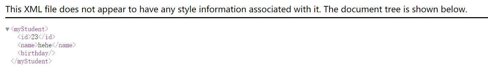

# CXF + Spring 整合发布 REST 的服务（服务端）

[TOC]

## CXF + Spring 整合发布 REST 的服务（服务端）

CXF + Spring 整合发布 REST 的服务。发布查询学生接口。

## 代码

### 学生查询 SEI 接口

[IStudent.java](src/main/java/org/lzn/service/IStudent.java)

```java
package org.lzn.service;

import org.lzn.pojo.Student;

import javax.jws.WebService;
import javax.ws.rs.GET;
import javax.ws.rs.Path;
import javax.ws.rs.PathParam;
import javax.ws.rs.Produces;
import javax.ws.rs.core.MediaType;

/**
 * 学生接口
 *
 * @author LinZhenNan lin_hehe@qq.com 2020/09/12 17:19
 */
@WebService
@Path("/student")
public interface IStudent {

    /**
     * 通过id查询学生<br>
     *     @GET：指定请求方式
     *     @Produces：指定服务数据类型
     *
     * @param id id
     * @return org.lzn.pojo.Student
     * @author LinZhenNan lin_hehe@qq.com
     */
    @GET
    @Path("/{id}")
    @Produces(MediaType.APPLICATION_XML)
    Student get(@PathParam("id") Long id);
}
```

### 学生查询 SEI 实现类

[StudentImpl.java](src/main/java/org/lzn/service/impl/StudentImpl.java)

```java
package org.lzn.service.impl;

import org.lzn.pojo.Student;
import org.lzn.service.IStudent;

import java.time.LocalDate;

/**
 * 学生接口实现类
 *
 * @author LinZhenNan lin_hehe@qq.com 2020/09/12 17:24
 */
public class StudentImpl implements IStudent {
    @Override
    public Student get(Long id) {
        return new Student(id, "hehe", LocalDate.now());
    }
}
```

### 学生 pojo 类

[Student.java](src/main/java/org/lzn/pojo/Student.java)

```java
package org.lzn.pojo;

import javax.xml.bind.annotation.XmlAccessType;
import javax.xml.bind.annotation.XmlAccessorType;
import javax.xml.bind.annotation.XmlRootElement;
import java.time.LocalDate;

/**
 * 学生实体
 *
 * @author LinZhenNan lin_hehe@qq.com 2020/09/12 17:16
 */
@XmlRootElement(name = "myStudent")
@XmlAccessorType(XmlAccessType.FIELD)
public class Student {

    private Long id;
    private String name;
    private LocalDate birthday;

    public Student() {
    }

    public Student(Long id, String name, LocalDate birthday) {
        this.id = id;
        this.name = name;
        this.birthday = birthday;
    }

    //
    // setter/getter
    // ------------------------------------------------------------------------------

    public Long getId() {
        return id;
    }

    public void setId(Long id) {
        this.id = id;
    }

    public String getName() {
        return name;
    }

    public void setName(String name) {
        this.name = name;
    }

    public LocalDate getBirthday() {
        return birthday;
    }

    public void setBirthday(LocalDate birthday) {
        this.birthday = birthday;
    }
}
```

### SPRING 配置

[applicatioinContext.xml](src/main/resources/applicationContext.xml)

```xml
<?xml version="1.0" encoding="UTF-8"?>
<beans xmlns="http://www.springframework.org/schema/beans"
       xmlns:xsi="http://www.w3.org/2001/XMLSchema-instance"
       xmlns:jaxws="http://cxf.apache.org/jaxws"
       xmlns:jaxrs="http://cxf.apache.org/jaxrs"
       xmlns:cxf="http://cxf.apache.org/core"
       xsi:schemaLocation="http://www.springframework.org/schema/beans
                           http://www.springframework.org/schema/beans/spring-beans.xsd
                           http://cxf.apache.org/jaxrs
                           http://cxf.apache.org/schemas/jaxrs.xsd
				           http://cxf.apache.org/jaxws
				           http://cxf.apache.org/schemas/jaxws.xsd
				           http://cxf.apache.org/core
				           http://cxf.apache.org/schemas/core.xsd">

    <!--jaxrs:server 发布 REST 的服务，对 JAXRSServiceFactoryBean 类封装-->
    <jaxrs:server address="/user">
        <jaxrs:serviceBeans>
            <ref bean="studentService" />
        </jaxrs:serviceBeans>
    </jaxrs:server>

    <!--配置服务实现类-->
    <bean name="studentService" class="org.lzn.service.impl.StudentImpl" />
</beans>
```

### web 配置

[web.xml](web/WEB-INF/web.xml)

```xml
<?xml version="1.0" encoding="UTF-8"?>
<web-app xmlns="http://xmlns.jcp.org/xml/ns/javaee"
         xmlns:xsi="http://www.w3.org/2001/XMLSchema-instance"
         xsi:schemaLocation="http://xmlns.jcp.org/xml/ns/javaee http://xmlns.jcp.org/xml/ns/javaee/web-app_4_0.xsd"
         version="4.0">

    <!-- 设置spring的环境 -->
    <context-param>
        <!--contextConfigLocation是不能修改的  -->
        <param-name>contextConfigLocation</param-name>
        <param-value>classpath:applicationContext.xml</param-value>
    </context-param>
    <listener>
        <listener-class>org.springframework.web.context.ContextLoaderListener</listener-class>
    </listener>

    <!--配置 CXF 的 Servlet-->
    <servlet>
        <servlet-name>cxf</servlet-name>
        <servlet-class>org.apache.cxf.transport.servlet.CXFServlet</servlet-class>
    </servlet>
    <servlet-mapping>
        <servlet-name>cxf</servlet-name>
        <url-pattern>/cxf-spring/*</url-pattern>
    </servlet-mapping>

    <welcome-file-list>
        <welcome-file>welcome.jsp</welcome-file>
    </welcome-file-list>
</web-app>
```

### 测试

输入 URL。例如 `http://localhost:8080/SPRING_REST_SERVER/cxf-spring/user/student/23`

