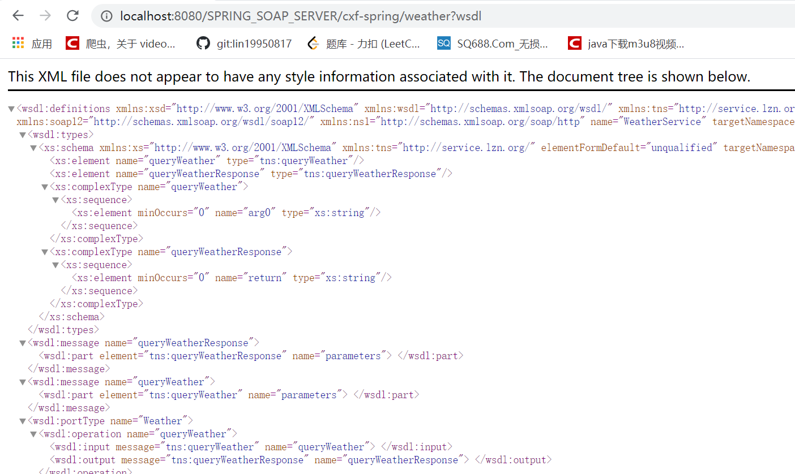

# CXF + Spring 整合发布 SOAP 协议的服务（服务端）

[TOC]

## CXF + Spring 整合发布 SOAP 协议的服务（服务端

CXF + Spring 整合发布 SOAP 协议服务。发布查询天气接口。

## 代码

### 天气查询 SEI 接口

[Weather.java](src/main/java/org/lzn/Weather.java)

```java
package org.lzn.service;

import javax.jws.WebService;
import javax.xml.ws.BindingType;
import javax.xml.ws.soap.SOAPBinding;

/**
 * 天气查询 SEI 接口
 *
 * @author LinZhenNan lin_hehe@qq.com 2020/09/04 22:32
 */
@WebService
@BindingType(SOAPBinding.SOAP12HTTP_BINDING)
public interface Weather {

    /**
     * 通过城市名称查询天气
     *
     * @param cityName 城市名称
     * @return java.lang.String
     * @author LinZhenNan lin_hehe@qq.com
     */
    String queryWeather(String cityName);
}
```

### 天气查询 SEI 实现类

[WeatherImpl.java](src/main/java/org/lzn/WeatherImpl.java)

```java
package org.lzn.service.impl;

import org.lzn.service.Weather;

/**
 * 天气查询 SEI 实现类
 *
 * @author LinZhenNan lin_hehe@qq.com 2020/09/04 22:34
 */
public class WeatherImpl implements Weather {
    @Override
    public String queryWeather(String cityName) {
        System.out.println(this.getClass().getSimpleName().concat("queryWeather：{").concat("cityName：").concat(cityName).concat("}"));
        return "冷";
    }
}
```

### Spring 配置

[applicationContext.xml](src/main/resources/applicationContext.xml)

```xml
<?xml version="1.0" encoding="UTF-8" ?>
<beans xmlns="http://www.springframework.org/schema/beans"
       xmlns:xsi="http://www.w3.org/2001/XMLSchema-instance"
       xmlns:p="http://www.springframework.org/schema/p"
       xmlns:context="http://www.springframework.org/schema/context"
       xmlns:jaxws="http://cxf.apache.org/jaxws"
       xsi:schemaLocation="http://www.springframework.org/schema/beans
                           http://www.springframework.org/schema/beans/spring-beans.xsd
                           http://www.springframework.org/schema/context
                           http://www.springframework.org/schema/context/spring-context.xsd
                           http://cxf.apache.org/jaxws
                           http://cxf.apache.org/schemas/jaxws.xsd">
    <!--jaxws:server 发布 SOAP 协议的服务，对 JaxWsServerFactoryBean 类封装-->
    <jaxws:server address="/weather" serviceClass="org.lzn.service.Weather">
        <jaxws:serviceBean>
            <ref bean="weatherInterface"/>
        </jaxws:serviceBean>

        <!--配置拦截器-->
        <jaxws:inInterceptors>
            <ref bean="inIntercepter" />
        </jaxws:inInterceptors>
        <jaxws:outInterceptors>
            <ref bean="outIntercepter" />
        </jaxws:outInterceptors>
    </jaxws:server>

    <!--配置拦截器的 bean-->
    <bean name="inIntercepter" class="org.apache.cxf.interceptor.LoggingInInterceptor" />
    <bean name="outIntercepter" class="org.apache.cxf.interceptor.LoggingOutInterceptor" />

    <!--配置服务实现类-->
    <bean name="weatherInterface" class="org.lzn.service.impl.WeatherImpl"/>
</beans>
```

### web 配置

[web.xml](web/WEB-INF/web.xml)

```xml
<?xml version="1.0" encoding="UTF-8"?>
<web-app xmlns="http://xmlns.jcp.org/xml/ns/javaee"
         xmlns:xsi="http://www.w3.org/2001/XMLSchema-instance"
         xsi:schemaLocation="http://xmlns.jcp.org/xml/ns/javaee http://xmlns.jcp.org/xml/ns/javaee/web-app_4_0.xsd"
         version="4.0">
    <display-name>SPRING-SOAP-SERVER</display-name>
    
    <!--设置 spring 的环境-->
    <context-param>
        <param-name>contextConfigLocation</param-name>
        <param-value>classpath:applicationContext.xml</param-value>
    </context-param>
    <listener>
        <listener-class>org.springframework.web.context.ContextLoaderListener</listener-class>
    </listener>

    <!--配置 CXF 的 Servlet-->
    <servlet>
        <servlet-name>cxf</servlet-name>
        <servlet-class>org.apache.cxf.transport.servlet.CXFServlet</servlet-class>
    </servlet>
    <servlet-mapping>
        <servlet-name>cxf</servlet-name>
        <url-pattern>/cxf-spring/*</url-pattern>
    </servlet-mapping>
    
    <welcome-file-list>
        <welcome-file>welcome.jsp</welcome-file>
    </welcome-file-list>
</web-app>
```

### 测试

输入 URL `http://IP:端口/项目名/cxf-spring/weather?wsdl`。例如 `http://localhost:8080/SPRING_SOAP_SERVER/cxf-spring/weather?wsdl`。

