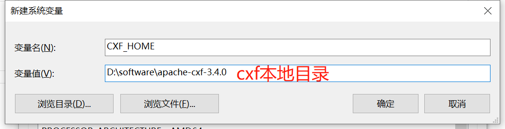
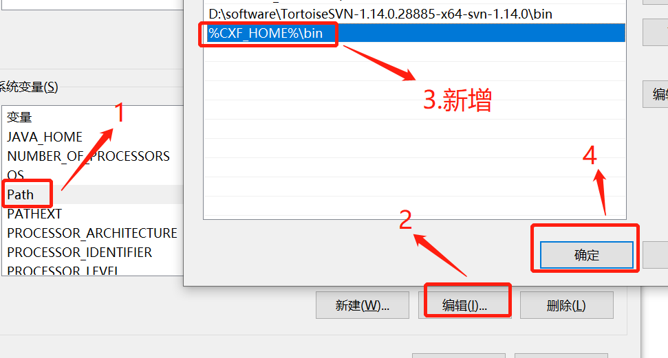
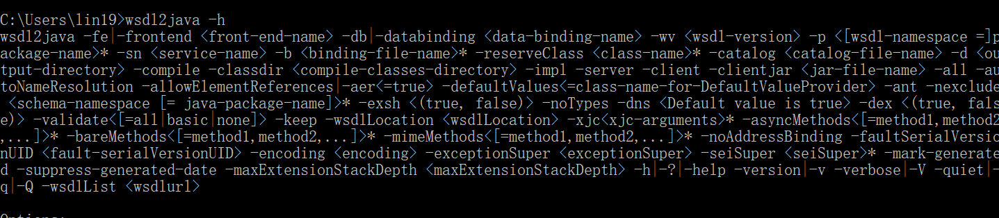

# CXF

[TOC]

## cxf

> Apache CXF = Celtix + XFire，开始叫 Apache CeltiXfire，后来更名为 Apache CXF 了，以下简称为 CXF。CXF 继承了 Celtix 和 XFire 两大开源项目的精华，提供了对 JAX-WS 全面的支持，并且提供了多种 Binding 、DataBinding、Transport 以及各种 Format 的支持，并且可以根据实际项目的需要，采用代码优先（Code First）或者 WSDL 优先（WSDL First）来轻松地实现 Web Services 的发布和使用。Apache CXF已经是一个正式的Apache顶级项目。
>
> Apache CXF 是一个开源的 Services 框架，CXF 帮助您利用 Frontend 编程 API 来构建和开发 Services ，像 JAX-WS 。这些 Services 可以支持多种协议，比如：SOAP、XML/HTTP、RESTful HTTP 或者 CORBA ，并且可以在多种传输协议上运行，比如：HTTP、JMS 或者 JBI，CXF 大大简化了 Services 的创建，同时它继承了 XFire 传统，一样可以天然地和 Spring 进行无缝集成。

## 介绍

* CXF 是一个开源的 webservice 框架，提供很多完善功能，可以实现快速开发
* CXF 支持的协议：SOAP1.1/1.2，REST
* CXF 支持数据格式：XML，JSON（仅在 REST 方式下支持）
* CXF 是基于 SOA 总线结构，依靠 spring 完成模块的集成，实现 SOA 方式。
* 灵活的部署：可以运行有 Tomcat, Jboss, Jetty(内置), weblogic 上面。

## 安装

[官网网站](https://cxf.apache.org/download.html)，`https://cxf.apache.org/download.html`。

1. 安装 JDK

2. 解压 apache-cxf-3.4.0.zip

3. 配置环境变量

   我的电脑 -> 属性 -> 高级 -> 环境变量（图片是 win10 系统）

   

   

4. 测试。在命令行中输入 `wsdl2java -h`

   

## 相关依赖

### cfx 相关 jar

CXF本地安装目录\lib

### maven

```xml
<dependency>
    <groupId>org.apache.cxf</groupId>
    <artifactId>cxf-rt-transports-http-jetty</artifactId>
    <version>3.1.6</version>
</dependency>
<dependency>
    <groupId>org.apache.cxf</groupId>
    <artifactId>cxf-rt-frontend-jaxws</artifactId>
    <version>3.1.1</version>
</dependency>
<dependency>
    <groupId>org.apache.cxf</groupId>
    <artifactId>cxf-rt-transports-http</artifactId>
    <version>3.1.1</version>
</dependency>
<dependency>
    <groupId>org.apache.cxf</groupId>
    <artifactId>cxf-rt-frontend-jaxrs</artifactId>
    <version>3.1.1</version>
</dependency>
```

## CXF 发布服务

1. [CXF 发布 SOAP 协议的服务(服务端)](SOAP-SERVER)
2. [CXF 发布 SOAP 协议的服务(客户端)](SOAP-CLIENT)
3. [CXF + Spring 整合发布 SOAP 协议的服务（服务端）](SPRING-SOAP-SERVER)
4. [CXF + Spring 整合发布 SOAP 协议的服务（客户端）](SPRING-SOAP-CLIENT)
5. [CXF 发布 REST 的服务（服务端）](REST-SERVER)
6. [CXF 发布 REST 的服务（客户端）](REST-CLIENT)
7. [CXF + Spring 整合发布 REST 的服务](SPRING-REST-SERVER)