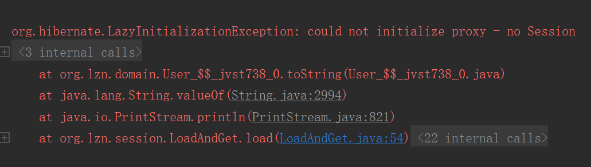
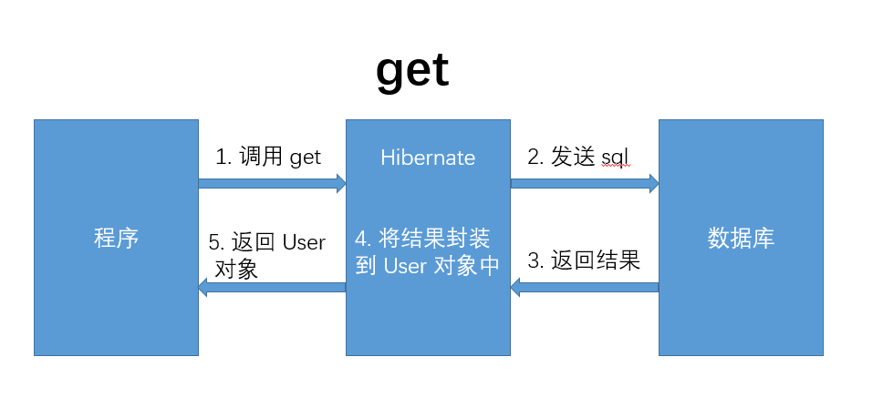
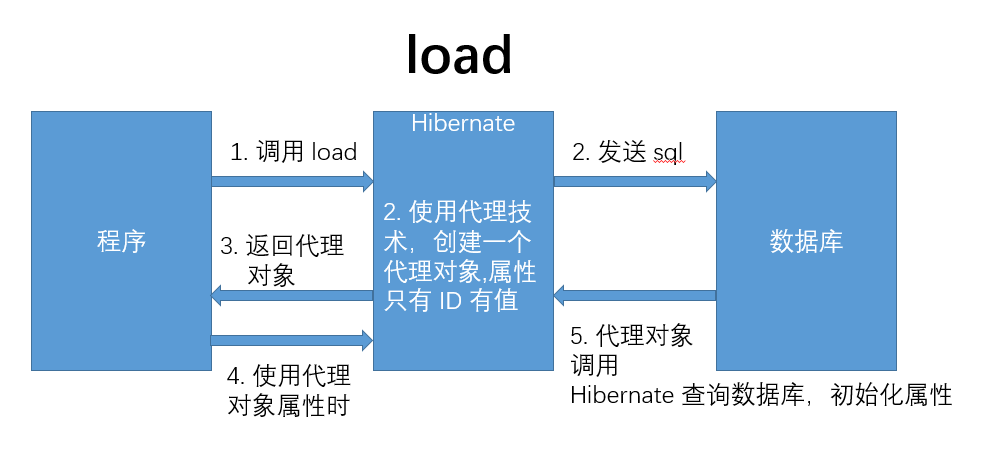
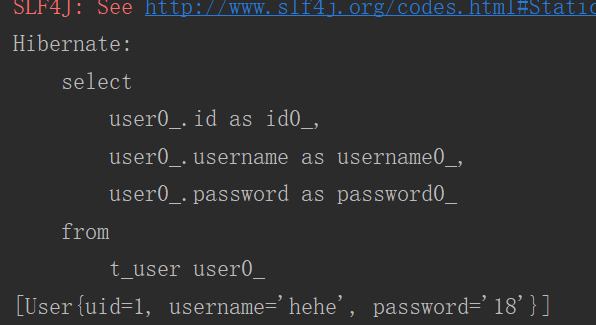
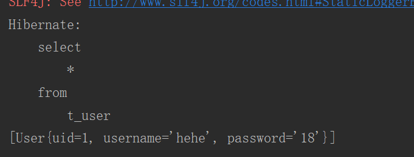
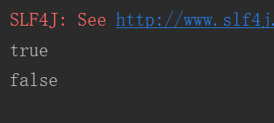
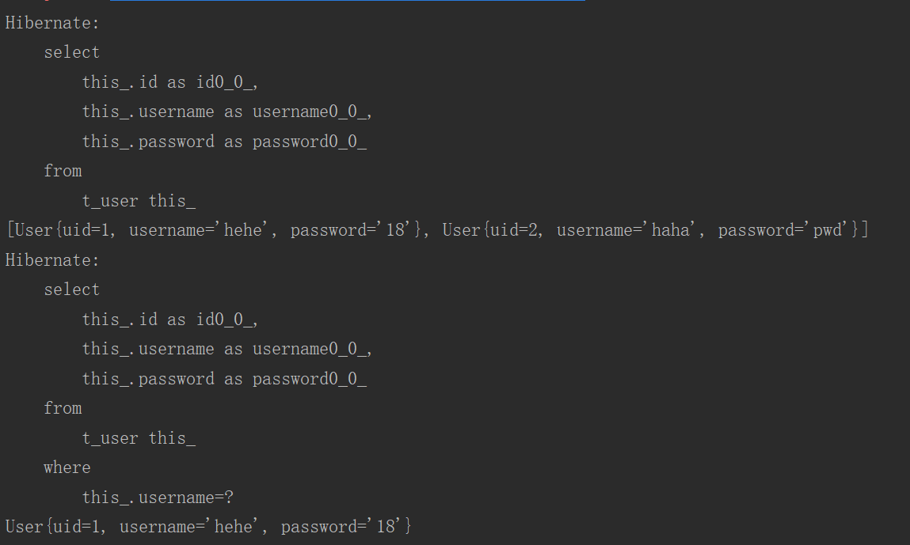

# Hibernate 基础1

## session

### load、get

代码 [hibernate.cfg.xml](src/main/resources/hibernate.cfg.xml)，[User.java](src/main/java/org/lzn/domain/User.java)，[User.hbm.xml](src/main/resources/org/lzn/domain/User.hbm.xml)，[LoadAndGet.java](src/test/java/org/lzn/session/LoadAndGet.java)

执行 `LoadAndGet` 的 `load()` 方法时，回报错



原因，`load()` 方法实行了懒加载，关闭资源后无法再查询数据库





### hql

代码 [hibernate.cfg.xml](src/main/resources/hibernate.cfg.xml)，[User.java](src/main/java/org/lzn/domain/User.java)，[User.hbm.xml](src/main/resources/org/lzn/domain/User.hbm.xml)，[LoadAndGet.java](src/test/java/org/lzn/session/LoadAndGet.java)

hql

```java
public void hql() {
    // 读取配置文件
    Configuration configure = new Configuration().configure();
    // 根据配置创建 Factory
    SessionFactory sessionFactory = configure.buildSessionFactory();
    // 获得操作数据库的 session 对象
    Session session = sessionFactory.openSession();
    // 打开事务
    Transaction transaction = session.beginTransaction();
    // Hql 语言
    Query query = session.createQuery("from User");
    // list 将语句执行，返回结果
    List<User> list = query.list();
    System.out.println(Arrays.toString(list.toArray()));
    // 提交事务
    transaction.commit();
    // 关闭资源
    session.close();
    sessionFactory.close();
}
```

hibernate 执行的 sql



### Sql

代码 [hibernate.cfg.xml](src/main/resources/hibernate.cfg.xml)，[User.java](src/main/java/org/lzn/domain/User.java)，[User.hbm.xml](src/main/resources/org/lzn/domain/User.hbm.xml)，[LoadAndGet.java](src/test/java/org/lzn/session/LoadAndGet.java)

sql

```java
public void sql() {
    // 读取配置文件
    Configuration configure = new Configuration().configure();
    // 根据配置创建 Factory
    SessionFactory sessionFactory = configure.buildSessionFactory();
    // 获得操作数据库的 session 对象
    Session session = sessionFactory.openSession();
    // 打开事务
    Transaction transaction = session.beginTransaction();
    // sql 查询
    SQLQuery sqlQuery = session.createSQLQuery("select * from t_user");
    // addEntity 将查询结果封装到指定对象中
    sqlQuery.addEntity(User.class);
    // list 将语句执行，返回结果。没有 addEntity 方法时返回 List<Object>
    List list = sqlQuery.list();
    System.out.println(Arrays.toString(list.toArray()));
    // 提交事务
    transaction.commit();
    // 关闭资源
    session.close();
    sessionFactory.close();
}
```

Hibernate 执行 sql



## transaction 问题

事务关闭时，会自动把当前线程关联的 session 关闭，并删除

```java
public void transaction() {
    // 读取配置文件
    Configuration configure = new Configuration().configure();
    // 根据配置创建 Factory
    SessionFactory sessionFactory = configure.buildSessionFactory();
    // 获得当前线程绑定的 session
    Session session = sessionFactory.getCurrentSession();
    Session session1 = sessionFactory.getCurrentSession();
    System.out.println(session == session1);
    // 事务关闭时，会自动把当前线程关联的 session 关闭，并删除
    session.beginTransaction().commit();
    Session session2 = sessionFactory.getCurrentSession();
    System.out.println(session == session2);
    // 关闭资源
    session.close();
    sessionFactory.close();
}
```

结果



## Cretiaria

使用 Criteria 查询数据，查询条件封装在 Restrictions 类中。非懒加载模式

```java
public void cretiaria() {
    // 读取配置文件
    Configuration configure = new Configuration().configure();
    // 根据配置创建 Factory
    SessionFactory sessionFactory = configure.buildSessionFactory();
    // 获得操作数据库的 session 对象
    Session session = sessionFactory.openSession();
    // 打开事务
    Transaction transaction = session.beginTransaction();

    Criteria criteria = session.createCriteria(User.class);

    // criteria无条件查询则等于 select * from t_user
    List<User> list = criteria.list();
    System.out.println(Arrays.toString(list.toArray()));

    // 查找 username = 'hehe' 的记录。Restrictions 类包含多个查询条件的方法
    criteria.add(Restrictions.eq("username", "hehe"));

    // 查询一条记录，如果返回多条记录则报错
    User user = (User) criteria.uniqueResult();
    System.out.println(user);

    // 提交事务
    transaction.commit();
    // 关闭资源
    session.close();
    sessionFactory.close();
}
```

结果



## hibernate.cfg.xml

以下都是 `<session-factory>` 标签的子标签 `<property>` 的 `name` 属性即代表含义

### hibernate.hbm2ddl.auto

自动生成表策略配置

* update

  如果当前数据库中不存在表结构，那么自动创建表结构。如果存在表结构，并且表结构与实体一致，那么不做修改。如果存在表结构，并且表结构与实体不一致，那么会修改表结构，会保留原油列。

* create

  无论是否存在表结构，每次启动 Hibernate 都会重新创建表结构（原数据会丢失）

* create-drop

  无论是否存在表结构，每次启动 Hibernate 都会重新创建表结构（原数据会丢失），每次 Hibernate 运行结束时，删除表结构。

* validate

  不会自动创建表结构，也不会自动维护表结构。Hibernate 只校验表结构。如果表结构不一致将会抛出异常。

### Hibernate.dialect

数据库方言配置

**MySQL**

* org.hibernate.dialect.MySQLDialect (推荐)
* org.hibernate.dialect.MySQLInnoDBDialect
* org.hibernate.dialect.MySQLMyISAMDialect

## \*.hbm.xml

### calss 标签

* dynamic-insert 属性

  动态插入，默认值是 `false`。作用是，插入时，不插入值为 `null` 的字段。更新时，不更新没修改的字段。

### id 标签

* name 属性

  实体类主键的字段名称

* column 属性

  主键在表中的列名

* length 属性

  列的数据长度

* unsaved-value 属性

  指定主键为什么时，当做 `null` 来处理。

### id 标签的子标签 generator

主键生成策略

* increment

  数据库自己生成主键。先从数据库中查询最大的 ID 值，将 ID 值加 1 作为新主键。

* identity

  依赖于数据的主键自增功能

* sequence

  序列，依赖于数据中的序列功能（Oracle）。

* hilo

  Hibernate 自己实现序列的算法，自己生成主键（hilo 算法）。

* native

  自动根据数据库判断，三选一（identity、sequence、hilo）。

* uuid

  生成 32 位的不重复的随机字符串当主键

* assigned

  自己指定主键值。表的主键是自然主键时。

### property 标签

实体中属性与表中列的对应

* name

  实体中属性名称

* column

  表中列的名称

* length

  数据长度

* precision

  小数点后精度

* scale

  有效位数

* not-null

  指定属性的约束是否使用非空

* unique

  指定属性的约束是否使用唯一

* insert

  该属性是否加入 insert 语句

* update

  该属性是否 加入 update 语句

* type

  表达该属性的类型。可以用三种方式指定属性，java 类型、数据库类型、Hibernate 类型