# Hibernate 基础2

## 对象状态

代码 [HibernateState.java](src/main/java/org/lzn/state/HibernateState.java)

* 瞬时态 | 临时态
  * 没有与 Hibernate 产生关联
  * 与数据库中的记录没有产生关联。有关联是指，与数据库中的 id 有对应
* 持久态
  * 与 Hibernate 有关联
  * 对象有 Id
* 游离态 | 托管态
  * 没有与 Hibernate 产生关联
  * 对象有 Id

```java
Session session = HibernateUtils.opSession();
session.beginTransaction();

// 瞬时态
User user = new User();
// 瞬时态
user.setUsername("demo1");
// 瞬时态
user.setPassword("pwd001");

// 持久态
session.save(user);

// 持久态
session.getTransaction().commit();
// 游离态
session.close();
```

当主键策略为 `<generator class="native"/>` 时，在 `session.save(user)` 语句会执行 `sql` 

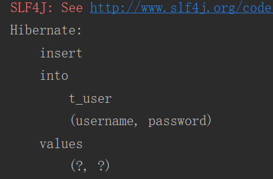

当主键策略为 `<generator class="increment"/>` 时

* 在 `session.save(user)` 语句会执行 `sql` 查询最大 `id`

  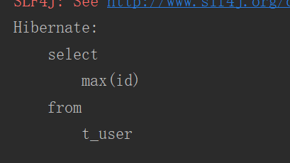

* 在 `session.getTransaction().commit()` 事务提交语句时会执行插入 `sql`

  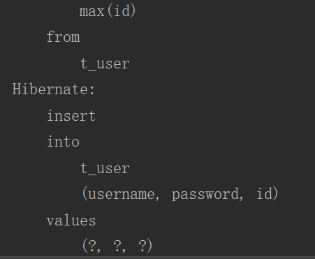

当主键策略为 `<generator class="assigned"/>` 时，执行 `session.save(user)` 语句会直接报错

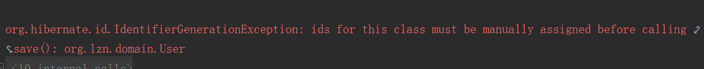

### 状态间的转化

代码 [HibernateState.java](src/main/java/org/lzn/state/HibernateState.java)

* 瞬时态转游离态

  ```java
  public void demo2() {
      Session session = HibernateUtils.opSession();
      session.beginTransaction();
  
      // 瞬时态
      User user = new User();
  
      // 游离态
      user.setUid(1);
  
      session.getTransaction().commit();
      session.close();
  }
  ```

* 持久态转瞬时态

  ```java
  public void demo3() {
      Session session = HibernateUtils.opSession();
      session.beginTransaction();
  
      // 通过 get 方法，得到持久态对象
      User u = (User) session.get(User.class, 1);
  
      session.getTransaction().commit();
      session.close();
  
      // 瞬时态
      u.setUid(null);
  }
  ```

  移除与 `session` 的关联

  ```java
  public void demo4() {
      Session session = HibernateUtils.opSession();
      session.beginTransaction();
  
      // 通过 get 方法，得到持久态对象
      User u = (User) session.get(User.class, 1);
  
      // 将 User 对象与 session 的关联移除
      session.evict(u);
  
      // 瞬时态
      u.setUid(null);
  
      // 持久态
      session.save(u);
  
      session.getTransaction().commit();
      session.close();
  }
  ```

* 持久态转游离态

  ```java
  public void demo5() {
      Session session = HibernateUtils.opSession();
      session.beginTransaction();
  
      // 通过 get 方法，得到持久态对象
      User u = (User) session.get(User.class, 1);
  
      // 游离态，将 User 对象与 session 的关联移除
      session.evict(u);
  
      session.getTransaction().commit();
      session.close();
  }
  ```

* 游离态转瞬时态

  ```java
  public void demo6() {
      Session session = HibernateUtils.opSession();
      session.beginTransaction();
  
      // 通过 get 方法，得到持久态对象
      User u = (User) session.get(User.class, 1);
  
      // 游离态，将 User 对象与 session 的关联移除
      session.evict(u);
  
      // 瞬时态
      u.setUid(null);
  
      session.getTransaction().commit();
      session.close();
  }
  ```

* 游离态转持久态

  ```java
  public void demo7() {
      Session session = HibernateUtils.opSession();
      session.beginTransaction();
  
      // 通过 get 方法，得到持久态对象
      User u = (User) session.get(User.class, 1);
  
      // 游离态，将 User 对象与 session 的关联移除
      session.evict(u);
  
      // 持久态，会执行 sql
      session.update(u);
  
      session.getTransaction().commit();
      session.close();
  }
  ```

Hibernate 中持久态对象的 id 不允许被修改

```java
public void demo8() {
    Session session = HibernateUtils.opSession();
    session.beginTransaction();

    // 通过 get 方法，得到持久态对象
    User u = (User) session.get(User.class, 1);

    // 修改 id
    u.setUid(10086);

    // 持久态，会执行 sql
    session.update(u);

    session.getTransaction().commit();
    session.close();
}
```

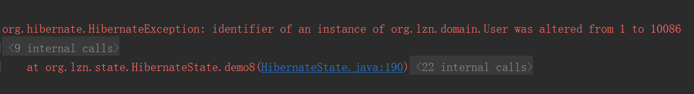

## 一级缓存

`Hibernate` 存在缓存用来提高效率。一级缓存为 `session` 缓存，存于 `session` 中，线程级别的缓存。

代码 [FirstLevelCache.java](src/main/java/org/lzn/cache/FirstLevelCache.java)

```java
public void demo1() {
    Session session = HibernateUtils.opSession();
    session.beginTransaction();

    // 发送 select 语句，从数据库取出记录，并封装成对象并放入缓存中
    User u = (User) session.get(User.class, 1);

    // 再次查询时，会从缓存中查找，不会发送 select
    User u2 = (User) session.get(User.class, 1);

    // 再次查询时，会从缓存中查找，不会发送 select
    User u3 = (User) session.get(User.class, 1);

    session.getTransaction().commit();
    session.close();
}
```

### 一级缓存以什么形式存在

`Map` 形式存在，`Map<Serializable, Object>`。

### HQL 语句批量查询时，查询结果是否会进入缓存

`Criteria` 与 `HQL` 结论一致。查询时不会使用一级缓存，但查询结果会放入。因此查询时会发送 `sql` 语句，但再次发送 `sql` 语句时，相同的数据使用同一个对象。

**`HQL` 查询时不会使用一级缓存。**

```java
public class FirstLevelCache {
    public void demo2() {
        Session session = HibernateUtils.opSession();
        session.beginTransaction();

        // 执行 hql 语句查询
        List<User> listUser = session.createQuery("from User").list();

        // 再次查询，是否执行 sql
        List<User> listUser2 = session.createQuery("from User").list();

        // 再次查询，是否执行 sql
        List<User> listUser3 = session.createQuery("from User").list();

        session.getTransaction().commit();
        session.close();
    }
}
```

结果

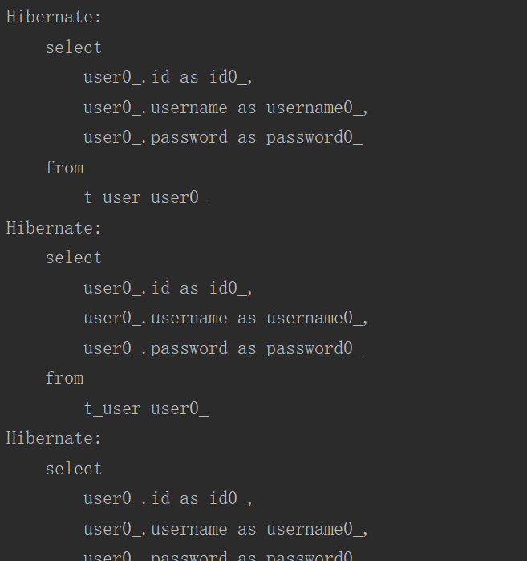

**`HQL` 查询结果会放入缓存中**

```java
public class FirstLevelCache {
    public void demo3() {
        Session session = HibernateUtils.opSession();
        session.beginTransaction();

        // 执行 hql 语句查询
        List<User> listUser = session.createQuery("from User").list();

        // 不会执行 sql
        User user = (User) session.get(User.class, 2);

        session.getTransaction().commit();
        session.close();
    }
}
```

结果

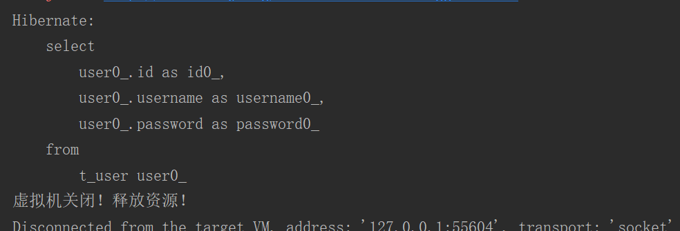

### SQL 语句批量查询时，查询结果是否会进入缓存

**`SQL` 查询时不会使用一级缓存。**

```java
public class FirstLevelCache {
    public void demo4() {
        Session session = HibernateUtils.opSession();
        session.beginTransaction();

        // 执行 hql 语句查询
        List<User> listUser = session.createSQLQuery("select * from t_user").list();

        // 再次查询，是否执行 sql
        List<User> listUser2 = session.createSQLQuery("select * from t_user").list();

        // 再次查询，是否执行 sql
        List<User> listUser3 = session.createSQLQuery("select * from t_user").list();

        session.getTransaction().commit();
        session.close();
    }
}
```

结果

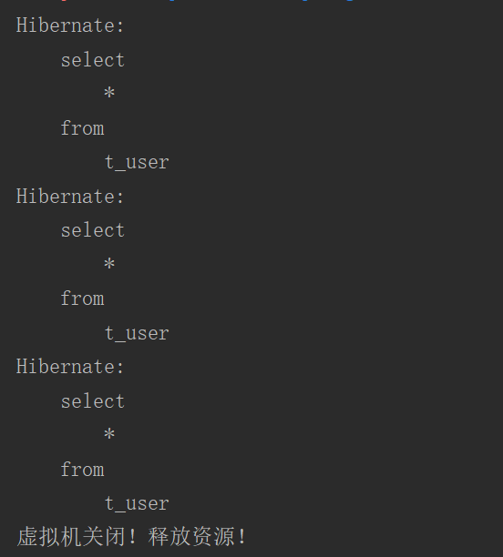

**`SQL` 查询结果会不会放入缓存中，看有没有执行封装对象的方法 `addEntity`**

* 没有执行封装对象的方法 `addEntity`

  ```java
  public class FirstLevelCache {
      public void demo5() {
          Session session = HibernateUtils.opSession();
          session.beginTransaction();
  
          // 执行 hql 语句查询
          List<User> listUser = session.createSQLQuery("select * from t_user").list();
  
          // 不会执行 sql
          User user = (User) session.get(User.class, 2);
  
          session.getTransaction().commit();
          session.close();
      }
  }
  ```

* 结果

  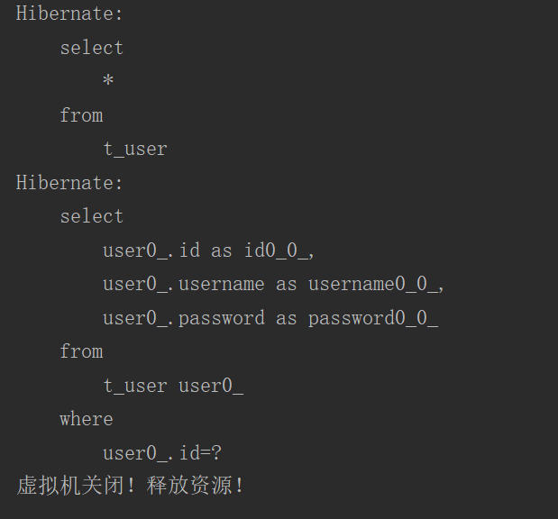

* 执行封装对象的方法 `addEntity`

  ```java
  public class FirstLevelCache {
      public void demo6() {
           Session session = HibernateUtils.opSession();
          session.beginTransaction();
  
          // 执行 hql 语句查询
          List<User> listUser = session.createSQLQuery("select * from t_user").addEntity(User.class).list();
  
          // 不会执行 sql
          User user = (User) session.get(User.class, 2);
  
          session.getTransaction().commit();
          session.close();
      }
  }
  ```

  结果

  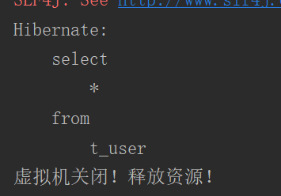

## Session 其他 API

### evict

将持久化对象与 `session` 的关联移除，使状态从 **持久态** 转 **游离态**。

```java
public class SessionApi {
    public void demo1() {
        Session session = HibernateUtils.opSession();
        session.beginTransaction();

        // 通过 get 方法，得到持久态对象
        User u = (User) session.get(User.class, 1);

        // 将 User 对象与 session 的关联移除
        session.evict(u);

        session.getTransaction().commit();
        session.close();
    }
}
```

### clear

清空一级缓存。

```java
public class SessionApi {
    public void demo1() {
        Session session = HibernateUtils.opSession();
        session.beginTransaction();

        // 通过 get 方法，得到持久态对象
        User u = (User) session.get(User.class, 1);

        // 清空一级缓存
        session.clear();

        // 再次查询对象，结果没有使用一级缓存而是发送 sql
        User u2 = (User) session.get(User.class, 1);

        session.getTransaction().commit();
        session.close();
    }
}
```

结果

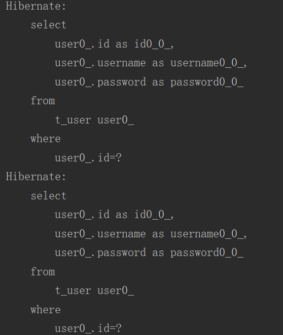

### refresh

强制刷新缓存中的对象（会发送 sql），可以用来解决缓存与数据库数据不同步的问题。

```java
public class SessionApi {
    public void demo3() {
        Session session = HibernateUtils.opSession();
        session.beginTransaction();

        // 通过 get 方法，得到持久态对象
        User u = (User) session.get(User.class, 1);

        // 将缓存中的对象立刻与数据库同步，会再发送一个 sql 语句
        session.refresh(u);

        session.getTransaction().commit();
        session.close();
    }
}
```

结果

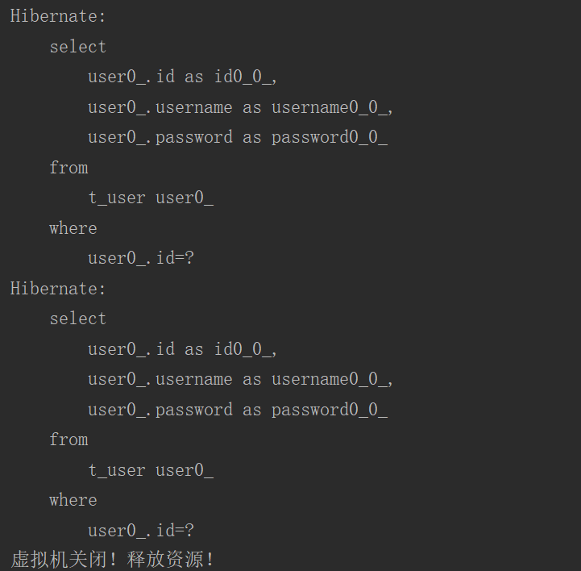

### flus

对比快照，提交（刷新）缓存对象。

```java
public class SessionApi {
    public void demo4() {
        Session session = HibernateUtils.opSession();
        session.beginTransaction();

        // 通过 get 方法，得到持久态对象
        User u = (User) session.get(User.class, 5);
        u.setUsername("demo4");

        // 立刻提交 session 缓存中的对象
        session.flush();

        session.getTransaction().commit();
        session.close();
    }
}
```

结果

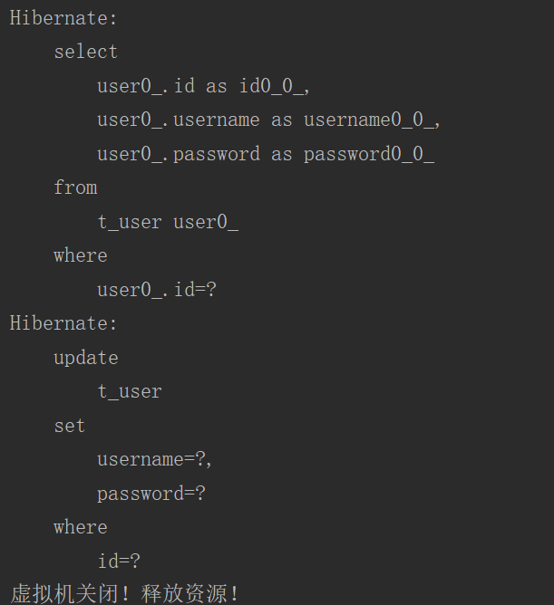

### saveOrUpdate

可以完成保存和更新的操作，当主键为 `null` 执行保存，当主键存在则执行更新。当主键策略为 `assigned` 时，为了判断执行的操作为保存或更新，会发送 `sql` 通过 `id` 查询数据是否存在来判断。

```java
public class SessionApi {
    public void demo5() {
        Session session = HibernateUtils.opSession();
        session.beginTransaction();

        User user = new User();
        user.setUsername("demo5");
        user.setPassword("demo5");
        session.saveOrUpdate(user);

        User user2 = new User();
        user2.setUid(7);
        user2.setUsername("demo5-007");
        user2.setPassword("demo5-007");
        session.saveOrUpdate(user2);

        session.getTransaction().commit();
        session.close();
    }
}
```

结果

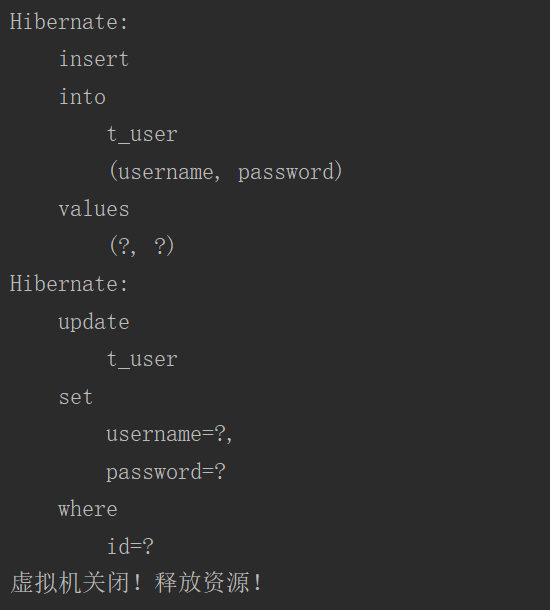

## 一对多、多对一

一个顾客可以拥有多个订单，但一个订单只属于一个用户。顾客和订单存在 **一对多** 关系。

### inverse

在 hibernate 中一对多关系中，一的一方和多的一方都默认维护之间的关系，例如保存一的一方的实体，当该实体拥有多的一方的成员，则发送 sql 维护外键关系。然而当多的一方也保存时也发 sql 维护外键关系。此时需要一的一方来放弃维护外键关系（多的一方来维护关系无法放弃维护）。例如，顾客放弃维护关系。通过在 [Customer.hbm.xml](src/main/resources/org/lzn/one2many/domain/Customer.hbm.xml) 中的 `<set inverse="true">` 的 inverse 来设置放弃维护。

### cascade

配置级联操作。通过在 [Customer.hbm.xml](src/main/resources/org/lzn/one2many/domain/Customer.hbm.xml) 中的 `<set cascade="save-update">` 的 cascade 来设置级联操作。当一的一方存在多的一方的成员时，通知多的一方作配置 cascade 的值的操作。[OneToMany.java](src/main/java/org/lzn/one2many/OneToMany.java) 的 demo3。

| 值                | 说明                                      |
| ----------------- | ----------------------------------------- |
| save-update       | A 保存，同时保存 B                        |
| delete            | 删除 A，同时删除 B，AB 都不存在           |
| delete-orphan     | 孤儿删除，解除关系，同时将 B 删除，A 存在 |
| all               | save-update 和 delete 整合                |
| all-delete-orphan | 三个整合                                  |

### 代码

实体和配置 [Customer.java](src/main/java/org/lzn/one2many/domain/Customer.java)，[Customer.hbm.xml](src/main/resources/org/lzn/one2many/domain/Customer.hbm.xml)，[Order.java](src/main/java/org/lzn/one2many/domain/Order.java)，[Order.hbm.xml](src/main/resources/org/lzn/one2many/domain/Order.hbm.xml)。

Hibernate 配置 [hibernate.cfg.xml](src/main/resources/hibernate.cfg.xml)。

演示 [OneToMany.java](src/main/java/org/lzn/one2many/OneToMany.java)。