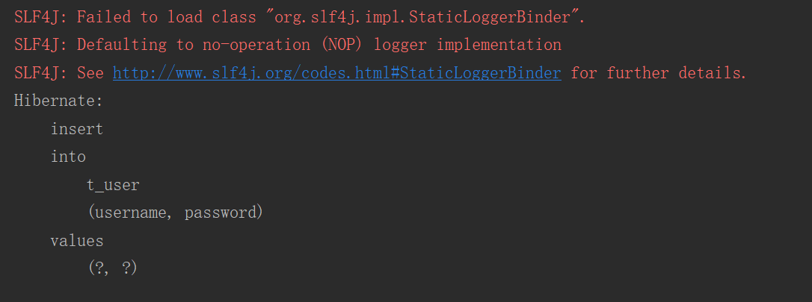
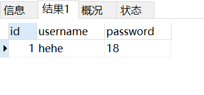

# hibernate 快速入门

1. [导入 jar 包](#jar)
2. [创建数据库和表](#table)
3. [编写核心配置文件（hibernate.cfg.xml）](#hibernate)
4. [编写实体类和映射文件 hibernate mapping(*.hbm.xml)](#mapping)
5. [测试](#run)

## <a name="jar" style="text-decoration:none">相关 jar 包</a>

代码 [pom.xml](pom.xml)

```xml
<dependencies>
    <!--hibernate 核心-->
    <dependency>
        <groupId>org.hibernate</groupId>
        <artifactId>hibernate-core</artifactId>
        <version>3.6.10.Final</version>
    </dependency>

    <!--解析框架，hibernate 用于解析 HQL-->
    <dependency>
        <groupId>antlr</groupId>
        <artifactId>antlr</artifactId>
        <version>2.7.6</version>
    </dependency>

    <!--解析 xml-->
    <dependency>
        <groupId>dom4j</groupId>
        <artifactId>dom4j</artifactId>
        <version>1.6.1</version>
    </dependency>

    <!--jpa 规范支持-->
    <dependency>
        <groupId>org.hibernate.javax.persistence</groupId>
        <artifactId>hibernate-jpa-2.0-api</artifactId>
        <version>1.0.1.Final</version>
    </dependency>

    <!--字节码增强（代理）-->
    <dependency>
        <groupId>org.javassist</groupId>
        <artifactId>javassist</artifactId>
        <version>3.20.0-GA</version>
    </dependency>

    <!--java transaction api 事务规范-->
    <dependency>
        <groupId>javax.transaction</groupId>
        <artifactId>jta</artifactId>
        <version>1.1</version>
    </dependency>

    <!--驱动-->
    <dependency>
        <groupId>mysql</groupId>
        <artifactId>mysql-connector-java</artifactId>
        <version>5.1.22</version>
    </dependency>

    <!--日志框架（整合 log4j）-->
    <dependency>
        <groupId>org.slf4j</groupId>
        <artifactId>slf4j-api</artifactId>
        <version>1.6.1</version>
    </dependency>
</dependencies>
```

## <a name="table" style="text-decoration:none">数据库的表结构</a>

代码 [t_user.sql](database/t_user.sql)

```sql
CREATE TABLE `t_user` (
  `id` int(11) NOT NULL AUTO_INCREMENT COMMENT 'ID',
  `username` varchar(63) DEFAULT NULL COMMENT '用户名',
  `password` varchar(63) DEFAULT NULL COMMENT '密码',
  PRIMARY KEY (`id`)
) ENGINE=InnoDB AUTO_INCREMENT=2 DEFAULT CHARSET=utf8mb4;
```

## <a name="hibernate" style="text-decoration:none">编写核心配置文件</a>

命名为 `hibernate.cfg.xml` 的文件，代码 [hibernate.cfg.xml](src/main/resources/hibernate.cfg.xml)

```xml
<?xml version="1.0" encoding="UTF-8" ?>
<!DOCTYPE hibernate-configuration PUBLIC
        "-//Hibernate/Hibernate Configuration DTD 3.0//EN"
        "http://www.hibernate.org/dtd/hibernate-configuration-3.0.dtd">
<hibernate-configuration>
    <session-factory>
        <!--property 元素用于配置 Hibernate 中的属性-->
        <!--hibernate.connection.driver_class: 连接数据的驱动-->
        <property name="hibernate.connection.driver_class">com.mysql.jdbc.Driver</property>
        <!--hibernate.connection.username: 连接数据库的用户名-->
        <property name="hibernate.connection.username">root</property>
        <!--hibernate.connection.password: 连接数据库的密码-->
        <property name="hibernate.connection.password">root</property>
        <!--hibernate.connection.url: 连接数据库的地址，路径-->
        <property name="hibernate.connection.url">jdbc:mysql:///study_hibernate</property>

        <!--show_sql: 操作数据库时，回想控制台打印 sql 语句-->
        <property name="show_sql">true</property>
        <!--format_sql: 打印 sql 语句前，会将 sql 语句先格式化-->
        <property name="format_sql">true</property>
        <!--hibernate.hbm2ddl.auto: 是否自动生成表结构-->
        <property name="hibernate.hbm2ddl.auto">update</property>
            <!--hibernate.connection.autocommit-->
        <property name="hibernate.connection.autocommit">true</property>
        <!--引入 ORM 映射文件，与 bean 相同路径-->
        <mapping resource="org/org.lzn/domain/User.hbm.xml"/>
    </session-factory>
</hibernate-configuration>
```

## <a name="mapping" style="text-decoration:none">编写实体类和映射文件</a>

实体类，代码 [User.java](src/main/java/org/org.lzn/domain/User.java)

```java
public class User {
    private Integer uid;
    private String username;
    private String password;

    //
    // setter/getter
    // ------------------------------------------------------------------------------

    public Integer getUid() {
        return uid;
    }

    public void setUid(Integer uid) {
        this.uid = uid;
    }

    public String getUsername() {
        return username;
    }

    public void setUsername(String username) {
        this.username = username;
    }

    public String getPassword() {
        return password;
    }

    public void setPassword(String password) {
        this.password = password;
    }
}
```

在实体类同样的目录下命名为 `User.hbm.xml` 的映射文件，代码 [User.hbm.xml](src/main/resources/org/org.lzn/domain/User.hbm.xml)

```xml
<?xml version="1.0" encoding="UTF-8" ?>
<!DOCTYPE hibernate-mapping PUBLIC
        "-//Hibernate/Hibernate Mapping DTD 3.0//EN"
        "http://www.hibernate.org/dtd/hibernate-mapping-3.0.dtd">
<hibernate-mapping>
    <!--
        class: 配置实体与表的关系
            name: 填写实体的完整类名
            table: 与实体对应表的名称
    -->
    <class name="org.org.lzn.domain.User" table="t_user">
        <!--
            id: 配置实体与表中 id 的映射
                name: user 对象中标志主键的属性名称
                column: 主键在表中的列名
        -->
        <id name="uid" column="id">
            <!--
                generator: 主键生成策略
                    native: 有数据库来维护主键(数据库中的配置 主键自增)
            -->
            <generator class="native"/>
        </id>
        <!--
            property: 实体中属性与表中列的映射
                name: 实体中属性名称
                column: 表中列的名称
        -->
        <property name="username" column="username"/>
        <property name="password" column="password"/>
    </class>
</hibernate-mapping>
```

## <a name="run" style="text-decoration:none">测试</a>

```java
public class Main {
    public static void main(String[] args) {
        // 1. 读取配置文件
        Configuration configure = new Configuration().configure();
        // 2. 根据配置创建 Factory
        SessionFactory sessionFactory = configure.buildSessionFactory();
        // 3. 共拓获得操作数据库的 session 对象
        Session session = sessionFactory.openSession();
        // 4. 操作数据库
        User user = new User();
        user.setUsername("hehe");
        user.setPassword("18");
        session.save(user);
        // 5. 关闭资源
        session.close();
        sessionFactory.close();
    }
}
```

## 结果

控制台



表数据

