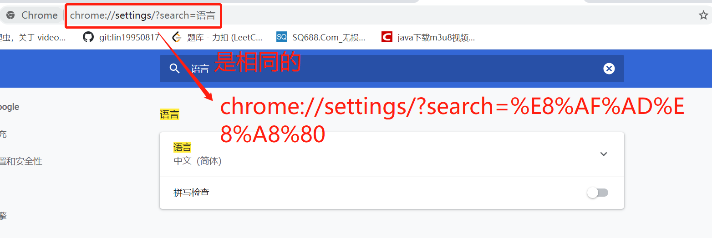
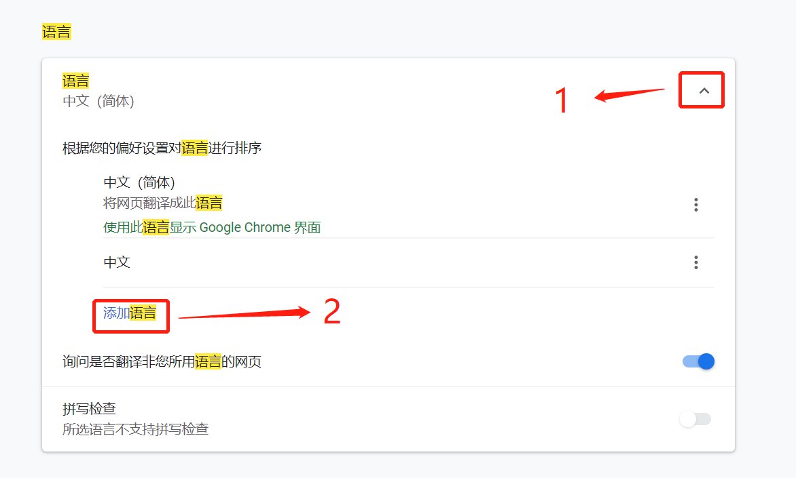
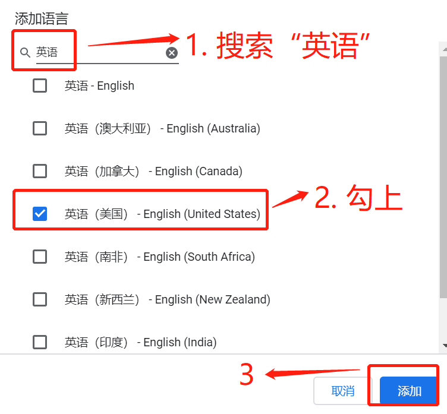
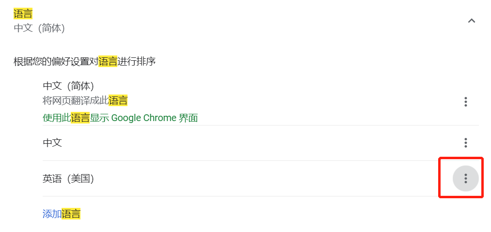
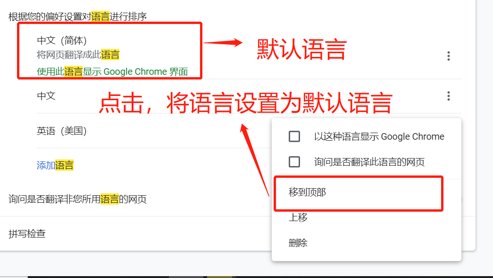

# 国际化

软件的国际化：软件开发时，要使它能同时应对世界不同地区和国家的访问，并针对不同地区和国家的访问，提供相应的、符合来访者阅读习惯的页面或数据。

## 程序国际化

程序需要国际化，但数据是什么样子就是什么样子。

**例如**：用户注册的表单，有用户名，密码这5个汉字，在 `zh_CN` 语言环境，显示的就是用户名和密码。但是在 `en_US` 语言环境，显示的就应该是 `username` 和 `password`。这就是程序。用户名输入的是 "张三"，密码输入的是 "test"，那无论在什么语言环境都应该是是 "张三" 和 "test" 。这就是数据。

### ResourceBundle 使用国际化

定义文件名格式为 **message\_语言编码\_国家编码.properties**，例如 [message_en_US.properties](src/main/resources/message_en_US.properties)，存放 **英语** 数据 和 [message_zh_CN.properties](src/main/resources/message_zh_CN.properties)，存放 **简体中文** 数据。使用 `ResourceBundle` 获取资源对象。例如 [I18NDemo.java](src/main/java/org/lzn/test/I18NDemo.java)

```java
ResourceBundle resourceBundle = ResourceBundle.getBundle("message", Locale.SIMPLIFIED_CHINESE);
String key = resourceBundle.getString("key");
System.out.println(key);
```

## jsp 国际化

简单的 **jsp** 国际化的显示文字的例子。通过 [主页](web/welcome.jsp) 使用 `chrome` 浏览器切换语言进行测试。[chrome 浏览器切换语言方法](#chromeSwitchLanguage)。

* 定义存放语言信息的 **属性配置文件**。

   1. [message_zh_CN.properties](src/main/resources/message_zh_CN.properties)，存放 **简体中文** 数据。

      ```properties
      # login.jsp 使用
      jsp.login.title=国际化
      jsp.login.username=用户名
      jsp.login.password=密码
      jsp.login.submit=登录
      ```

   2. [message_en_US.properties](src/main/resources/message_en_US.properties)，存放 **英语** 数据。

      ```properties
      # use for the login.jsp
      jsp.login.title=I18N
      jsp.login.username=Username
      jsp.login.password=Password
      jsp.login.submit=Submit
      ```

* 定义 [login.jsp](web/jsp/login.jsp)

   ```jsp
   <%@ page contentType="text/html;charset=UTF-8" language="java" %>
   <%@ page import="java.util.Locale" %>
   <%@ page import="java.util.ResourceBundle" %>
   <%
     Locale locale = request.getLocale();
     ResourceBundle bundle = ResourceBundle.getBundle("message", locale);
   %>
   <html>
     <head>
       <title><%=bundle.getString("jsp.login.title")%></title>
     </head>
     <body>
       <form action="#">
         <%=bundle.getString("jsp.login.username")%>：<input type="text" name="username" /><br>
         <%=bundle.getString("jsp.login.password")%>：<input type="password" name="password" /><br>
         <input type="submit" value="<%=bundle.getString("jsp.login.submit")%>" />
       </form>
     </body>
   </html>
   ```

   

## struts2 国际化

在 `Struts2` 中，所有的消息提示都是基于国际化的。要想在 `Struts2` 中使用国际化，动作类必须继承 `ActionSupport` 类。通过 [主页](web/welcome.jsp) 使用 `chrome` 浏览器切换语言进行测试。[chrome 浏览器切换语言方法](#chromeSwitchLanguage)。

配置默认资源包

```xml
<constant name="struts.custom.i18n.resources" value="message"/>
```

* 全局级别资源包

  [message_en_US.properties](src/main/resources/message_en_US.properties)，存放 **英语** 数据 和 [message_zh_CN.properties](src/main/resources/message_zh_CN.properties)，存放 **简体中文** 数据。

  下方是 [DemoAction](src/main/java/org/lzn/struts/DemoAction.java) 获取资源包信息 `key` 对应值的代码。

  ```java
  public class DemoAction extends ActionSupport {
      @Override
      public String execute() throws Exception {
          String key = getText("key");
          System.out.println(key);
          return SUCCESS;
      }
  }
  ```

* 包级别资源包

  [package_en_US.properties](src/main/resources/org/lzn/struts/struts2package/package_en_US.properties)，存放 **英语** 数据 和 [package_zh_CN.properties](src/main/resources/org/lzn/struts/struts2package/package_zh_CN.properties)，存放 **简体中文** 数据。使用此资源包需要在 **同一个包** 下（同一个包的目录）。

  下方是 [Demo2Action](src/main/java/org/lzn/struts/struts2package/Demo2Action.java) 获取资源包信息的 `key` 信息代码。

  ```java
  public class Demo2Action extends ActionSupport {
      @Override
      public String execute() throws Exception {
          String key = getText("key");
          System.out.println(key);
          return SUCCESS;
      }
  }
  ```

* 动作类级别资源包

  [Demo3Action_en_US.properties](src/main/resources/org/lzn/struts/struts2package/action/Demo3Action_en_US.properties)，存放 **英语** 数据 和 [Demo3Action_zh_CN.properties](src/main/resources/org/lzn/struts/struts2package/action/Demo3Action_zh_CN.properties)，存放 **简体中文** 数据。使用次资源包需要在 **同一个目录下且名字需要相同**，例如 ActionClass.java 则资源包名称为 ActionClass\_语言代码\_国家代码。

  下方是 [Demo3Action](src/main/java/struts/strtus2package/action/Demo3Action.java) 获取资源包信息的 `key` 信息的代码。

  ```java
  public class Demo3Action extends ActionSupport {
      @Override
      public String execute() throws Exception {
          String key = getText("key");
          System.out.println(key);
          return SUCCESS;
      }
  }
  ```

* struts2 标签使用资源包实现国际化

  参考 [success.jsp](web/struts2/success.jsp)。引入 struts2 标签库 `<%@ taglib prefix="s" uri="/struts-tags" %>`。
  
  * 获取信息资源包的值，没有经过动作类，只会去查找全局信息资源包。如果经过了动作类，则先去找动作类的。
  
    ```jsp
    <s:text name="key"/>
    ```
  
  * 在消息资源包中都找不到 key 值时，直接把 name 属性的值输出到页面上
  
    ```jsp
    <s:text name="abc"/>
    ```
  
  * 指定信息资源包
  
    ```jsp
    <s:i18n name="message">
      <s:text name="key"/>
    </s:i18n>
    ```
  
  * 当自由读取消息资源包不存在时，按照 [资源包的搜索顺序](#strutsResourceBundleSearchOrder) 去查找。
  
    ```jsp
    <s:i18n name="not_message">
      <s:text name="key"/>
    </s:i18n>
    ```

### <a name="strutsResourceBundleSearchOrder" style="text-decoration:none">struts2 `Resource Bundle` 搜索顺序</a>

> [官方文档](https://struts.apache.org/core-developers/localization.html#resource-bundle-search-order)，下方截取部分。

1. ActionClass.properties
2. Interface.properties (every interface and sub-interface)
3. BaseClass.properties (all the way to Object.properties)
4. ModelDriven’s model (if implements ModelDriven), for the model object repeat from 1
5. package.properties (of the directory where class is located and every parent directory all the way to the root directory)
6. search up the i18n message key hierarchy itself
7. global resource properties

## <a name="chromeSwitchLanguage" style="text-decoration:none">chrome 浏览器切换语言</a>

1. 在浏览器地址栏出输入 `chrome://settings/?search=%E8%AF%AD%E8%A8%80`

   

2. 点击 **语言** 右边的 `V`，再点击 **添加语言**。

   

3. 在弹出窗口中，在搜索栏搜索 **英语**，在下方勾上 **英语（美国）**，然后确定。

   

4. 点击新添加的语言 **英语（美国）** 右边的按钮。

   

5. 在弹出的菜单中，选择移到顶部。排第一个的语言为默认语言。

   