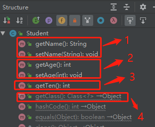

# 内省 [myIntrospector](src/main/java/org/lzn/myIntrospector.java)
## demo1
1. Introspector构建一个 BeanInfo对象
2. BeanInfo将以各类的所有属性进行了封装

结果：**4** 
原因：☟ 

## demo2
使用 `PropertyDescriptor` 获取指定的属性并调用它

## demo3
使用 `BeanUtils` 对属性读取与写入。 
`BeanUtils` 默认支持 8 种基本数据类型，自动转换

## demo4
`BeanUtils` 无法将 `String` 转换 `Date` ，需要借助类型转换器 `ConvertUtils`

## demo5
与 **demo4** 相同，但类型转换器使用 `Convert` 接口的匿名转换类

