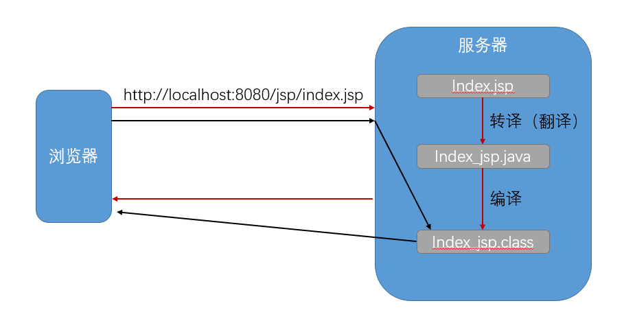
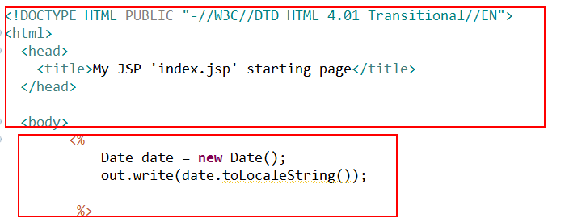

# jsp
> JSP全称是Java Server Pages，它和servle技术一样，都是SUN公司定义的一种用于开发动态web资源的技术。**JSP实际上就是Servlet**。
## jsp 原理
`_jsp.java` 路径 
```
C:\Users\用户名\.IntelliJIdea2019.1\system\tomcat\项目名\work\Catalina\localhost\项目名\org\apache\jsp\
```
### 浏览器访问 jsp 页面时，web 服务器是如何调用并执行一个 jsp 页面的？（Servlet）
转译 -> 翻译 -> 执行<br>

### Web服务器在执行jsp页面时，是如何把Jsp页面中的html排版标签发送到客户端的？
#### jsp<br>
<br>
#### _jsp<br>
