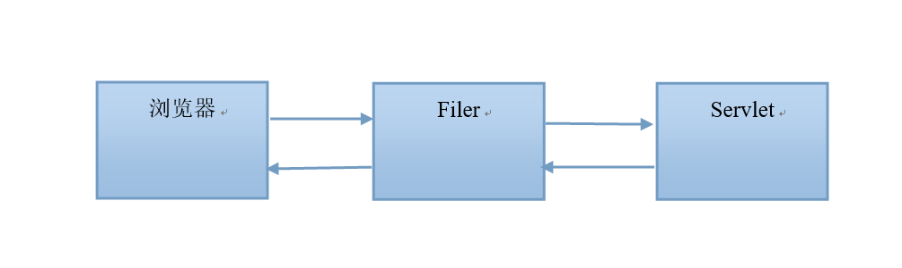

# `Filter` 过滤器

`Javaweb` 中的过滤器可以拦截所有访问 `web` 资源的请求或响应操作。

## 目录

* [快速入门](#getStarted)
* [FilterChain](#filterChain)
* [Filter生命周期](#filterLife)
* [FilterConfig](#filterConfig)
* [\<dispatcher\>标签](#dispatcher)
* 案例：[自动登录](../auto-login)

## <a name="getStarted" style="text-decoration:none">快速入门</a>

1. 创建一个实现 `Filter` 接口的实现类 [MyFilter](src/main/java/org/lzn/filter/MyFilter.java)
2. 重写接口中的方法，`doFilter` 方法是真正过滤的
3. 在 [web.xml](web/WEB-INF/web.xml) 文件中配置

## <a name="filterChain" style="text-decoration:none">FilterChain</a>

`FilterChain` 是 `servlet` 容器为开发人员提供的对象，它提供了对某一资源的已过滤请求调用链的视图。过滤器使用 `FilterChain` 调用链中的下一个过滤器，如果调用的过滤器是链中的最后一个过滤器，则调用链末尾的资源。

* 怎样可以形成一个 `Filter` 链？

  只要多个 `Filter` 对同一个资源进行拦截就可以形成 `Filter` 链

* 怎样确定 `Filter` 的执行顺序？

  由 `<filter-mapping>` 来确定

## <a name="filterLife" style="text-decoration:none">Filter 生命周期</a>

`Servlet` 生命周期：实例化 -> 初始化 -> 服务 -> 销毁

* 当服务器启动，会创建 `Filter` 对象，并调用 `init` 方法，只调用一次
* 当访问资源时，路径与 `Filter` 拦截路径匹配，会执行 `Filter` 中的 `doFilter`
* 当服务器关闭时，会调用 `Filter` 的 `destroy` 方法来进行销毁

## <a name="filterConfig" style="text-decoration:none">FilterConfig</a>

在 `Filter` 的 `init` 方法上有一个参数，类型就是 `FilterConfig`。`FilterConfig` 它是 `Filter` 的配置对象，它可以完成下列功能。

* 获取 `Filter` 名称

* 获取 `Filter` 初始化参数

* 获取 `ServletContext` 对象

  

怎样在Filter中获取一个 `FIlterConfig` 对象？

源码 [MyFilterConfigTest.java](src/main/java/org/lzn/config/MyFilterConfigTest.java)

## <a name="dispatcher" style="text-decoration:none">\<dispatcher\> 标签</a>

可以取的值有 `REQUEST`、`FORWARD`、`ERROR`、`INCLUDE`

它的作用是：当以什么方式去访问web资源时，进行拦截操作。

* `REQUEST`：当是从浏览器直接访问资源，或是重定向到某个资源时进行拦截方式配置的，它也是默认值。
* `FORWARD`：它描述的是请求转发的拦截方式配置。
* `ERROR`：如果目标资源是通过声明式异常处理机制调用时，那么该过滤器将被调用。除此之外，过滤器不会被调用。
* `INCLUDE`：如果目标资源是通过 `RequestDispatcher` 的 `include()` 方法访问时，那么该过滤器将被调用。除此之外，该过滤器不会被调用。

**学习**

1. 定义配置为 `REQUEST`、`FORWARD` 的过滤器 [MyFilterDispatcher.java](src/main/java/org/lzn/filter/MyFilterDispatcher.java)
2. 定义配置为 `FORWARD` 的过滤器 [MyFilterDispatcher2.java](src/main/java/org/lzn/filter/MyFilterDispatcher2.java)
3. 创建 `servlet` 执行转发的 [SenderServlet.java](src/main/java/org/lzn/servlet/SenderServlet.java)
4. 创建 `serlvet` 接收转发的 [RecipientServlet.java](src/main/java/org/lzn/servlet/RecipientServlet.java)
5. [首页](web/welcome.jsp) 观察过滤器行为