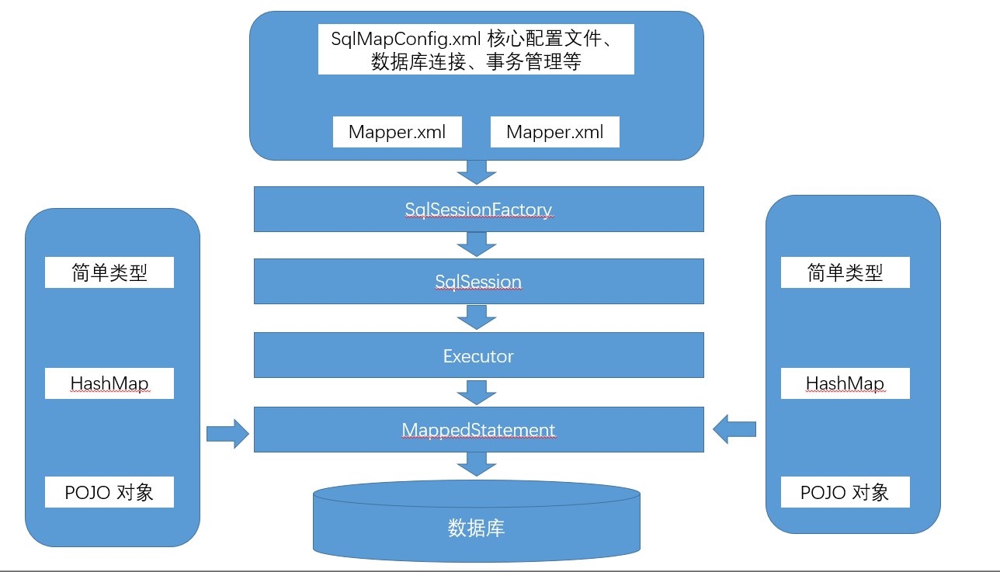

# mybatis

[TOC]

## mybatis

> MyBatis 本是 apache 的一个开源项目 iBatis, 2010 年这个项目由 apache software foundation  迁移到了 google code，并且改名为 MyBatis 。2013 年 11 月迁移到 Github。
> iBATIS 一词来源于 “internet” 和 “abatis” 的组合，是一个基于 Java 的持久层框架。iBATIS 提供的持久层框架包括 SQL Maps 和 Data Access Objects（DAOs）
>
> MyBatis 是一款优秀的持久层框架，它支持定制化 SQL、存储过程以及高级映射。MyBatis 避免了几乎所有的 JDBC 代码和手动设置参数以及获取结果集。MyBatis 可以使用简单的 XML 或注解来配置和映射原生信息，将接口和 Java 的 POJOs(Plain Ordinary Java Object,普通的 Java 对象)映射成数据库中的记录。

## mybatis 框架原理

### 框架图



### 分析

1. mybatis 配置文件，包括 **Mybatis 全局配置文件** 和 **Mybatis 映射文件**，其中全局配置文件配置了数据源、事务等信息；映射文件配置了 SQL 执行相关的 信息。
2. mybatis 通过读取配置文件信息（全局配置文件和映射文件），构造出 SqlSessionFactory，即会话工厂。
3. 通过 SqlSessionFactory，可以创建 **SqlSession** 即会话。Mybatis 是通过 SqlSession 来操作数据库的。
4. SqlSession 本身不能直接操作数据库，它是通过底层的 **Executor** 执行器接口来操作数据库的。Executor 接口有两个实现类，一个是普通执行器，一个是 **缓存执行器（默认）**。
5. Executor 执行器要处理的 SQL 信息是封装到一个底层对象 **MappedStatement** 中。该对象包括：SQL 语句、输入参数映射信息、输出结果集映射信息。其中输入参数和输出结果的映射类型包括 java 的简单类型、HashMap 集合对象、POJO 对象类型。

## mybatis 全局配置

### 加载顺序

1. Properties 属性
2. Settings 全局参数设置
3. typeAliases 类型别名
4. typeHandlers 类型处理器
5. objectFactory 对象工厂
6. plugins 插件
7. environments 环境信息集合
   1. environment 单个环境信息
      1. transactionManager 事务
      2. dataSource 数据源
8. mappers 映射器

### 常用配置

#### Properties

mybatis 全局配置文件中可以引用 java 属性文件的配置信息

[db.properties](src/main/resources/db.properties)

```properties
db.driver=com.mysql.jdbc.Driver
db.url=jdbc:mysql://localhost:3306/study_hibernate?useUnicode=true&characterEncoding=utf8
db.username=root
db.password=root
```

SqlMapConfig.xml 使用 properties 标签

```xml
<!--属性-->
<properties resource="db.properties" />
<!--全局参数-->
<settings>
	<!-- 打印查询语句 -->
	<setting name="logImpl" value="STDOUT_LOGGING" />
</settings>
<!-- 配置mybatis的环境信息 -->
<environments default="development">
	<environment id="development">
		<!-- 配置JDBC事务控制，由mybatis进行管理 -->
		<transactionManager type="JDBC" />
		<!-- 配置数据源，采用dbcp连接池 -->
		<dataSource type="POOLED">
			<property name="driver" value="${db.driver}"/>
			<property name="url" value="${db.url}"/>
			<property name="username" value="${db.username}"/>
			<property name="password" value="${db.password}"/>
		</dataSource>
	</environment>
</environments>
```

**注意**

* Properties 标签体内定义的属性首先被读取
* Properties 引用的属性会被读取，如果发现上面已经有同名的属性了，那后面会覆盖前面的值
* parameterType 接收的值会最后被读取，如果发现上面已经有同名的属性了，那后面会覆盖前面的值

mybatis 读取属性的顺序 **由高到低**

1. parameterType 接收的属性值
2. properties 引用的属性
3. properties 标签内定义的属性

#### Settings

mybatis 全局配置参数，会影响 mybatis 的运行行为

| Setting(设置)             | Description（描述）                                          | Valid Values(验证值组)                                       | Default(默认值)                                              |
| ------------------------- | ------------------------------------------------------------ | ------------------------------------------------------------ | ------------------------------------------------------------ |
| cacheEnabled              | 在全局范围内启用或禁用缓存配置任何映射器在此配置下。         | true \| false                                                | TRUE                                                         |
| lazyLoadingEnabled        | 在全局范围内启用或禁用延迟加载。禁用时，所有协会将热加载。   | true \| false                                                | TRUE                                                         |
| aggressiveLazyLoading     | 启用时，有延迟加载属性的对象将被完全加载后调用懒惰的任何属性。否则，每一个属性是按需加载。 | true \| false                                                | TRUE                                                         |
| multipleResultSetsEnabled | 允许或不允许从一个单独的语句（需要兼容的驱动程序）要返回多个结果集。 | true \| false                                                | TRUE                                                         |
| useColumnLabel            | 使用列标签，而不是列名。在这方面，不同的驱动有不同的行为。参考驱动文档或测试两种方法来决定你的驱动程序的行为如何。 | true \| false                                                | TRUE                                                         |
| useGeneratedKeys          | 允许JDBC支持生成的密钥。兼容的驱动程序是必需的。此设置强制生成的键被使用，如果设置为true，一些驱动会不兼容性，但仍然可以工作。 | true \| false                                                | FALSE                                                        |
| autoMappingBehavior       | 指定MyBatis的应如何自动映射列到字段/属性。NONE自动映射。 PARTIAL只会自动映射结果没有嵌套结果映射定义里面。 FULL会自动映射的结果映射任何复杂的（包含嵌套或其他）。 | NONE, PARTIAL, FULL                                          | PARTIAL                                                      |
| defaultExecutorType       | 配置默认执行人。SIMPLE执行人确实没有什么特别的。 REUSE执行器重用准备好的语句。 BATCH执行器重用语句和批处理更新。 | SIMPLE REUSE BATCH                                           | SIMPLE                                                       |
| defaultStatementTimeout   | 设置驱动程序等待一个数据库响应的秒数。                       | Any positive integer                                         | Not Set (null)                                               |
| safeRowBoundsEnabled      | 允许使用嵌套的语句RowBounds。                                | true \| false                                                | FALSE                                                        |
| mapUnderscoreToCamelCase  | 从经典的数据库列名A_COLUMN启用自动映射到骆驼标识的经典的Java属性名aColumn。 | true \| false                                                | FALSE                                                        |
| localCacheScope           | MyBatis的使用本地缓存，以防止循环引用，并加快反复嵌套查询。默认情况下（SESSION）会话期间执行的所有查询缓存。如果localCacheScope=STATMENT本地会话将被用于语句的执行，只是没有将数据共享之间的两个不同的调用相同的SqlSession。 | SESSION \| STATEMENT                                         | SESSION                                                      |
| dbcTypeForNull            | 指定为空值时，没有特定的JDBC类型的参数的JDBC类型。有些驱动需要指定列的JDBC类型，但其他像NULL，VARCHAR或OTHER的工作与通用值。 | JdbcType enumeration. Most common are: NULL, VARCHAR and OTHER | OTHER                                                        |
| lazyLoadTriggerMethods    | 指定触发延迟加载的对象的方法。                               | A method name list separated by commas                       | equals,clone,hashCode,toString                               |
| defaultScriptingLanguage  | 指定所使用的语言默认为动态SQL生成。                          | A type alias or fully qualified class name.                  | org.apache.ibatis.scripting.xmltags.XMLDynamicLanguageDriver |
| callSettersOnNulls        | 指定如果setter方法或地图的put方法时，将调用检索到的值是null。它是有用的，当你依靠Map.keySet（）或null初始化。注意原语（如整型，布尔等）不会被设置为null。 | true \| false                                                | FALSE                                                        |
| logPrefix                 | 指定的前缀字串，MyBatis将会增加记录器的名称。                | Any String                                                   | Not set                                                      |
| logImpl                   | 指定MyBatis的日志实现使用。如果此设置是不存在的记录的实施将自动查找。 | SLF4J \| LOG4J \| LOG4J2 \| JDK_LOGGING \| COMMONS_LOGGING \| STDOUT_LOGGING \| NO_LOGGING | Not set                                                      |
| proxyFactory              | 指定代理工具，MyBatis将会使用创建懒加载能力的对象。          | CGLIB \| JAVASSIST                                           |                                                              |

#### typeAliases

别名是使用是为了在映射文件中，更方便的去指定入参和结果集的类型，不再用写很长的一段全限定名。

支持的别名：

| 别名       | 映射的类型 |
| ---------- | ---------- |
| _byte      | byte       |
| _long      | long       |
| _short     | short      |
| _int       | int        |
| _integer   | int        |
| _double    | double     |
| _float     | float      |
| _boolean   | boolean    |
| string     | String     |
| byte       | Byte       |
| long       | Long       |
| short      | Short      |
| int        | Integer    |
| integer    | Integer    |
| double     | Double     |
| float      | Float      |
| boolean    | Boolean    |
| date       | Date       |
| decimal    | BigDecimal |
| bigdecimal | BigDecimal |

**自定义别名**

```xml
<!--定义别名-->
<typeAliases>
	<!--单个别名-->
	<typeAlias type="org.lzn.po.User" alias="user" />
	<!--批量定义别名，name：指定包名，别名为类名（首字母大小写都可以）-->
	<package name="org.lzn.po"/>
</typeAliases>
```

#### mappers

**\<mapper resource="" />**

使用相对于类路径的资源，例如 `<mapper resource="mapper/UserMapper.xml" />`

**\<mapper url="" />**

使用完全限定路径，例如 `<mapper url="file:///D:\project\java-study\mybatis\src\main\resources\mapper\UserMapper.xml"`

**\<mapper class="" />**

使用 mapper 接口的全限定名，**此种方法要求 mapper 接口和 mapper 映射文件要名称相同，且放到同一个目录下**，例如 `<mapper class="org.lzn.mapper.UserMapper" />`

**\<package name="" />**

注册指定包下的所有映射文件，**此种方法要求 mapper 接口和 mapper 映射文件名称相同，且放到同一个目录下**，例如 `<package name="org.lzn.mapper" />`

## #{} 和 ${}

### #{}

* 相当于预处理中的占位符
* #{}里面的参数表示接收java输入参数的名称。
* #{}可以接受HashMap、简单类型、POJO类型的参数。
* 当接受简单类型的参数时，#{}里面可以是value，也可以是其他。
* #{}可以防止SQL注入。

### ${}

* 相当于拼接SQL串，对传入的值不做任何解释的原样输出。
* ${}会引起SQL注入，所以要谨慎使用。
* ${}可以接受HashMap、简单类型、POJO类型的参数。
* 当接受简单类型的参数时，${}里面只能是value。

## 入门程序

简单的单表查询，通过 id 查询用户信息，通过用户名查询多个用户信息

**步骤**

1. 创建PO类，根据需求创建；
2. 创建全局配置文件SqlMapConfig.xml；
3. 编写映射文件；
4. 加载映射文件，在SqlMapConfig.xml中进行加载；
5. 编写测试程序，即编写Java代码，连接并操作数据库。
   1. 读取配置文件；
   2. 通过 SqlSessionFactoryBuilder 创建 SqlSessionFactory 会话工厂。
   3. 通过 SqlSessionFactory 创建 SqlSession。
   4. 调用 SqlSession 的操作数据库方法。
   5. 关闭 SqlSession。

### 数据库表

[t_user.sql](sql/t_user.sql)

```sql
/*
Navicat MySQL Data Transfer

Source Server         : LinHehe
Source Server Version : 50729
Source Host           : localhost:3306
Source Database       : study_hibernate

Target Server Type    : MYSQL
Target Server Version : 50729
File Encoding         : 65001

Date: 2020-10-18 22:09:43
*/

SET FOREIGN_KEY_CHECKS=0;

-- ----------------------------
-- Table structure for t_user
-- ----------------------------
DROP TABLE IF EXISTS `t_user`;
CREATE TABLE `t_user` (
  `id` int(11) NOT NULL AUTO_INCREMENT COMMENT 'ID',
  `username` varchar(63) DEFAULT NULL COMMENT '用户名',
  `password` varchar(63) DEFAULT NULL COMMENT '密码',
  PRIMARY KEY (`id`)
) ENGINE=InnoDB AUTO_INCREMENT=13 DEFAULT CHARSET=utf8mb4;

-- ----------------------------
-- Records of t_user
-- ----------------------------
INSERT INTO `t_user` VALUES ('1', 'hehe', '18');
INSERT INTO `t_user` VALUES ('2', 'haha', 'pwd');
```

### Maven 依赖

```xml
<dependency>
    <groupId>org.mybatis</groupId>
    <artifactId>mybatis</artifactId>
    <version>3.5.2</version>
</dependency>

<dependency>
    <groupId>mysql</groupId>
    <artifactId>mysql-connector-java</artifactId>
    <version>5.1.47</version>
</dependency>
```

### PO 类

[User.java](src/main/java/org/lzn/po/User.java)

```java
package org.lzn.po;

import java.time.LocalDateTime;
import java.time.format.DateTimeFormatter;

/**
 * 用户实体
 *
 * @author LinZhenNan lin_hehe@qq.com 2020/10/14 22:11
 */
public class User {
    /**
     * 主键
     */
    private Long id;
    /**
     * 用户名
     */
    private String username;
    /**
     * 密码
     */
    private String password;

    //
    // setter/getter/toString
    // ------------------------------------------------------------------------------

    public Long getId() {
        return id;
    }

    public void setId(Long id) {
        this.id = id;
    }

    public String getUsername() {
        return username;
    }

    public void setUsername(String username) {
        this.username = username;
    }

    public String getPassword() {
        return password;
    }

    public void setPassword(String password) {
        this.password = password;
    }

    @Override
    public String toString() {
        return "User{" +
                "id=" + id +
                ", username='" + username + '\'' +
                ", password='" + password + '\'' +
                '}';
    }
}
```

### SqlMapConfig 配置（mybatis 全局）文件

[SqlMapConfig.xml](src/main/resources/SqlMapConfig.xml)

```xml
<?xml version="1.0" encoding="UTF-8" ?>
<!DOCTYPE configuration
        PUBLIC "-//mybatis.org//DTD Config 3.0//EN"
        "http://mybatis.org/dtd/mybatis-3-config.dtd">
<configuration>
    <settings>
        <!-- 打印查询语句 -->
        <setting name="logImpl" value="STDOUT_LOGGING" />
    </settings>
    <!-- 配置mybatis的环境信息 -->
    <environments default="development">
        <environment id="development">
            <!-- 配置JDBC事务控制，由mybatis进行管理 -->
            <transactionManager type="JDBC"></transactionManager>
            <!-- 配置数据源，采用dbcp连接池 -->
            <dataSource type="POOLED">
                <property name="driver" value="com.mysql.jdbc.Driver"/>
                <property name="url" value="jdbc:mysql://localhost:3306/study_hibernate?useUnicode=true&amp;characterEncoding=utf8"/>
                <property name="username" value="root"/>
                <property name="password" value="hehe"/>
            </dataSource>
        </environment>
    </environments>

    <!-- 加载 mapper -->
    <mappers>
        <mapper resource="User.xml"/>
    </mappers>
</configuration>
```

### 查询

#### 通过用户 id 查询用户信息

* id：statement 的 id，要求在命名空间内唯一
* parameterType：入参的 java 类型
* resultType：查询出的单条结果集对应的 java 类型
* #{}：表示一个占位符
* #{id}：表示该占位符待接收参数的名称为 id。如果参数为简单类型时，#{}里面的参数名称可以是任意定义

**mybatis 配置**

```xml
<select id="findUserById" parameterType="int" resultType="org.lzn.po.User">
	select * from t_user where id = #{id}
</select>
```

**测试**

```java
package org.lzn.quickstart;

import org.apache.ibatis.io.Resources;
import org.apache.ibatis.session.SqlSession;
import org.apache.ibatis.session.SqlSessionFactory;
import org.apache.ibatis.session.SqlSessionFactoryBuilder;
import org.junit.Test;
import org.lzn.po.User;

import java.io.InputStream;
import java.time.LocalDateTime;
import java.util.List;

/**
 * mybatis 快速入门
 *
 * @author LinZhenNan lin_hehe@qq.com 2020/10/14 22:26
 */
public class QuickStart {
    @Test
    public void findUserByIdTest() throws Exception {
        // 1. 读取配置文件
        String resource = "SqlMapConfig.xml";
        InputStream inputStream = Resources.getResourceAsStream(resource);
        // 2. 根据配置文件创建 SqlSessionFactory
        SqlSessionFactory sqlSessionFactory = new SqlSessionFactoryBuilder().build(inputStream);
        // 3. SQLSessionFactory 创建 SqlSession
        SqlSession sqlSession = sqlSessionFactory.openSession();
        // 4. SqlSession 执行 statement，并返回映射结果
        // 第一个参数：statement 的 id，建议：namespace.statementId （确保唯一）
        // 第二个参数：入参的值，他的类型要和映射文件中对应的 statement 的入参类型一致
        User user = sqlSession.selectOne("quickstart.findUserById", 1);

        // 打印结果集
        System.out.println(user);

        // 5. 关闭资源
        sqlSession.close();
    }
}
```

#### 通过用户名模糊查询用户信息列表

* ${}：表示拼接 SQL 字符串
* ${value}：表示要拼接的是简单类型参数
* 注意：
  1. 如果参数为简单类型时，${} 里面的参数名称必须为 value
  2. ${} 引起 SQL 注入，一般情况下不推荐使用。但是有些场景必须使用${}，比如order by ${colname}

**mybatis 配置**

```xml
<select id="findUserByUsername" parameterType="String" resultType="org.lzn.po.User">
	select * from t_user where username like '%${value}%'
</select>
```

**测试**

```java
package org.lzn.quickstart;

import org.apache.ibatis.io.Resources;
import org.apache.ibatis.session.SqlSession;
import org.apache.ibatis.session.SqlSessionFactory;
import org.apache.ibatis.session.SqlSessionFactoryBuilder;
import org.junit.Test;
import org.lzn.po.User;

import java.io.InputStream;
import java.time.LocalDateTime;
import java.util.List;

/**
 * mybatis 快速入门
 *
 * @author LinZhenNan lin_hehe@qq.com 2020/10/14 22:26
 */
public class QuickStart {

    @Test
    public void findUserByUsernameTest() throws Exception {
        // 1. 读取配置文件
        String resource = "SqlMapConfig.xml";
        InputStream inputStream = Resources.getResourceAsStream(resource);
        // 2. 根据配置文件创建 SqlSessionFactory
        SqlSessionFactory sqlSessionFactory = new SqlSessionFactoryBuilder().build(inputStream);
        // 3. SQLSessionFactory 创建 SqlSession
        SqlSession sqlSession = sqlSessionFactory.openSession();
        // 4. SqlSession 执行 statement，并返回映射结果
        // 第一个参数：statement 的 id，建议：namespace.statementId （确保唯一）
        // 第二个参数：入参的值，他的类型要和映射文件中对应的 statement 的入参类型一致
        List<User> users = sqlSession.selectList("quickstart.findUserByUsername", "o");

        // 打印结果集
        System.out.println(users);

        // 5. 关闭资源
        sqlSession.close();
    }
}
```

### 添加

#### 普通 insert

**mybatis 配置**

```xml
<insert id="insertUser" parameterType="org.lzn.po.User">
	insert into user (username, `password`) values(#{username}, #{password})
</insert>
```

**测试**

```java
package org.lzn.quickstart;

import org.apache.ibatis.io.Resources;
import org.apache.ibatis.session.SqlSession;
import org.apache.ibatis.session.SqlSessionFactory;
import org.apache.ibatis.session.SqlSessionFactoryBuilder;
import org.junit.Test;
import org.lzn.po.User;

import java.io.InputStream;
import java.util.List;

/**
 * mybatis 快速入门
 *
 * @author LinZhenNan lin_hehe@qq.com 2020/10/14 22:26
 */
public class QuickStart {

    @Test
    public void insertUserTest() throws Exception {
        // 1. 读取配置文件
        String resource = "SqlMapConfig.xml";
        InputStream inputStream = Resources.getResourceAsStream(resource);
        // 2. 根据配置文件创建 SqlSessionFactory
        SqlSessionFactory sqlSessionFactory = new SqlSessionFactoryBuilder().build(inputStream);
        // 3. SQLSessionFactory 创建 SqlSession。sqlSessionFactory.openSession() 默认关闭自动提交事务，打开使用 sqlSessionFactory.openSession(true)
        SqlSession sqlSession = sqlSessionFactory.openSession();
        // 4. SqlSession 执行 statement，并返回映射结果
        // 构建 user 参数，没有赋值的属性采取默认值
        User user = new User();
        user.setUsername("mybaties insert");
        user.setPassword("insertUserTest");
        // 第一个参数：statement 的 id，建议：namespace.statementId （确保唯一）
        // 第二个参数：入参的值，他的类型要和映射文件中对应的 statement 的入参类型一致
        sqlSession.insert("quickstart.insertUser", user);

        // sqlSessionFactory.openSession() 默认关闭自动提交事务，所以增删改，要执行 commit 操作。
        sqlSession.commit();

        // 打印结果集
        System.out.println(user);

        // 5. 关闭资源
        sqlSession.close();
    }
}
```

#### 主键返回，mysql 自增主键

* \<selectKey> 标签：通过select查询来生成主键
* keyProperty 属性：指定存放生成主键的属性
* resultType 属性：生成主键所对应的Java类型
* order 属性：指定该查询主键SQL语句的执行顺序，相对于insert语句
* LAST_INSERT_ID()：MySQL的函数，要配合insert语句一起使用

**mybatis 配置**

```xml
<insert id="insertUserOfSelectKeyMySql" parameterType="org.lzn.po.User">
    <selectKey keyProperty="id" resultType="java.lang.Long" order="AFTER">
        select LAST_INSERT_ID()
    </selectKey>
	insert into user (username, `password`) values(#{username}, #{password})
</insert>
```

**测试**

```java
package org.lzn.quickstart;

import org.apache.ibatis.io.Resources;
import org.apache.ibatis.session.SqlSession;
import org.apache.ibatis.session.SqlSessionFactory;
import org.apache.ibatis.session.SqlSessionFactoryBuilder;
import org.junit.Test;
import org.lzn.po.User;

import java.io.InputStream;
import java.util.List;

/**
 * mybatis 快速入门
 *
 * @author LinZhenNan lin_hehe@qq.com 2020/10/14 22:26
 */
public class QuickStart {

    @Test
    public void insertUserOfSelectKeyMySqlTest() throws Exception {
        // 1. 读取配置文件
        String resource = "SqlMapConfig.xml";
        InputStream inputStream = Resources.getResourceAsStream(resource);
        // 2. 根据配置文件创建 SqlSessionFactory
        SqlSessionFactory sqlSessionFactory = new SqlSessionFactoryBuilder().build(inputStream);
        // 3. SQLSessionFactory 创建 SqlSession。sqlSessionFactory.openSession() 默认关闭自动提交事务，打开使用 sqlSessionFactory.openSession(true)
        SqlSession sqlSession = sqlSessionFactory.openSession();
        // 4. SqlSession 执行 statement，并返回映射结果
        // 构建 user 参数，没有赋值的属性采取默认值
        User user = new User();
        user.setUsername("mybaties insert");
        user.setPassword("insertUserOfSelectKeyMySqlTest");
        // 第一个参数：statement 的 id，建议：namespace.statementId （确保唯一）
        // 第二个参数：入参的值，他的类型要和映射文件中对应的 statement 的入参类型一致
        sqlSession.insert("quickstart.insertUserOfSelectKeyMySql", user);

        // sqlSessionFactory.openSession() 默认关闭自动提交事务，所以增删改，要执行 commit 操作。
        sqlSession.commit();

        // 打印结果集
        System.out.println(user);

        // 5. 关闭资源
        sqlSession.close();
    }
}
```

#### 主键返回，mysql 函数 uuid

* UUID()：mysql 的函数，生成的主键是 35 位的字符串，所以使用它时要修改 id 的类型为字符类型

* 注意：

  1. 此时 order 采用 BEFORE
  2. 显示的给 ID 赋值

**mybatis 配置**

```xml
<insert id="insertUserOfUuidMySql" parameterType="org.lzn.po.User">
    <selectKey keyProperty="id" resultType="java.lang.String" order="BEFORE">
    	select UUID()
    </selectKey>
	insert into user (id, username, `password`) values(#{id}, #{username}, #{password})
</insert>
```

#### 主键返回，oracle 序列返回

通过 oracle 的 sequence 获取主键方式与 MySql 的 uuid 方式基本一致

**mybatis 配置**

```xml
<insert id="insertUserOfSequenceOracle" parameterType="org.lzn.po.User">
    <selectKey keyProperty="id" resultType="java.lang.Long" order="BEFORE">
    	select user_seq.nextval() from dual
    </selectKey>
    insert into user (id, username, `password`) values(#{id}, #{username}, #{password})
</insert>
```

### 删除

**mybatis 配置**

```xml
<delete id="deleteUser" parameterType="java.lang.Long">
	delete from t_user where id = #{id}
</delete>
```

**测试**

```java
package org.lzn.quickstart;

import org.apache.ibatis.io.Resources;
import org.apache.ibatis.session.SqlSession;
import org.apache.ibatis.session.SqlSessionFactory;
import org.apache.ibatis.session.SqlSessionFactoryBuilder;
import org.junit.Test;
import org.lzn.po.User;

import java.io.InputStream;
import java.time.LocalDateTime;
import java.util.List;

/**
 * mybatis 快速入门
 *
 * @author LinZhenNan lin_hehe@qq.com 2020/10/14 22:26
 */
public class QuickStart {

    @Test
    public void deleteUserTest() throws Exception {
        // 1. 读取配置文件
        String resource = "SqlMapConfig.xml";
        InputStream inputStream = Resources.getResourceAsStream(resource);
        // 2. 根据配置文件创建 SqlSessionFactory
        SqlSessionFactory sqlSessionFactory = new SqlSessionFactoryBuilder().build(inputStream);
        // 3. SQLSessionFactory 创建 SqlSession。sqlSessionFactory.openSession() 默认关闭自动提交事务，打开使用 sqlSessionFactory.openSession(true)
        SqlSession sqlSession = sqlSessionFactory.openSession();
        // 4. SqlSession 执行 statement，并返回映射结果
        // 第一个参数：statement 的 id，建议：namespace.statementId （确保唯一）
        // 第二个参数：入参的值，他的类型要和映射文件中对应的 statement 的入参类型一致
        sqlSession.delete("quickstart.deleteUser", 10L);

        // sqlSessionFactory.openSession() 默认关闭自动提交事务，所以增删改，要执行 commit 操作。
        sqlSession.commit();

        // 5. 关闭资源
        sqlSession.close();
    }
}
```

### 更新

**mybatis 配置**

```xml
<update id="updateUser" parameterType="org.lzn.po.User">
	update user set username = #{username}, password = #{password} where id = #{id}
</update>
```

**测试**

```java
package org.lzn.quickstart;

import org.apache.ibatis.io.Resources;
import org.apache.ibatis.session.SqlSession;
import org.apache.ibatis.session.SqlSessionFactory;
import org.apache.ibatis.session.SqlSessionFactoryBuilder;
import org.junit.Test;
import org.lzn.po.User;

import java.io.InputStream;
import java.util.List;

/**
 * mybatis 快速入门
 *
 * @author LinZhenNan lin_hehe@qq.com 2020/10/14 22:26
 */
public class QuickStart {

    @Test
    public void updateUserTest() throws Exception {
        // 1. 读取配置文件
        String resource = "SqlMapConfig.xml";
        InputStream inputStream = Resources.getResourceAsStream(resource);
        // 2. 根据配置文件创建 SqlSessionFactory
        SqlSessionFactory sqlSessionFactory = new SqlSessionFactoryBuilder().build(inputStream);
        // 3. SQLSessionFactory 创建 SqlSession。sqlSessionFactory.openSession() 默认关闭自动提交事务，打开使用 sqlSessionFactory.openSession(true)
        SqlSession sqlSession = sqlSessionFactory.openSession();
        // 4. SqlSession 执行 statement，并返回映射结果
        // 构建 user 参数，没有赋值的属性采取默认值
        User user = new User();
        user.setId(15L);
        user.setUsername("mybaties update");
        user.setPassword("updateUserTest");
        // 第一个参数：statement 的 id，建议：namespace.statementId （确保唯一）
        // 第二个参数：入参的值，他的类型要和映射文件中对应的 statement 的入参类型一致
        sqlSession.update("quickstart.updateUser", user);

        // sqlSessionFactory.openSession() 默认关闭自动提交事务，所以增删改，要执行 commit 操作。
        sqlSession.commit();

        // 打印结果集
        System.out.println(user);

        // 5. 关闭资源
        sqlSession.close();
    }
}
```

### mybatis 配置

[User.xml](src/main/resources/User.xml)

```xml
<?xml version="1.0" encoding="UTF-8" ?>
<!DOCTYPE mapper
        PUBLIC "-//mybatis.org//DTD Config 3.0//EN"
        "http://mybatis.org/dtd/mybatis-3-mapper.dtd">
<mapper namespace="quickstart">
    <!--根据用户 id，查询用户信息-->
    <!--
        [id]：statement 的 id，要求在命名空间内唯一
        [parameterType]：入参的 java 类型
        [resultType]：查询出的单条结果集对应的 java 类型
        [#{}]：表示一个占位符
        [#{id}]：表示该占位符待接收参数的名称为 id。如果参数为简单类型时，#{}里面的参数名称可以是任意定义
    -->
    <select id="findUserById" parameterType="int" resultType="org.lzn.po.User">
        select * from t_user where id = #{id}
    </select>

    <!--根据用户名称模糊查询用户信息列表-->
    <!--
        [${}]：表示拼接 SQL 字符串
        [${value}]：表示要拼接的是简单类型参数
        注意：
            1. 如果参数为简单类型时，${} 里面的参数名称必须为 value
            2. ${} 会引起 SQL 注入，一般情况下不推荐使用。但是有些场景必须使用${}，比如order by ${colname}
    -->
    <select id="findUserByUsername" parameterType="String" resultType="org.lzn.po.User">
        select * from t_user where username like '%${value}%'
    </select>

    <!--添加用户-->
    <insert id="insertUser" parameterType="org.lzn.po.User">
        insert into user (username, `password`) values(#{username}, #{password})
    </insert>

    <!--主键返回-->
    <!--MySql selectKey 方式-->
    <!--
        [selectKey 标签]：通过 select 查询来生成主键
        [keyProperty]：指定存放生成主键的属性
        [resultType]：生成主键所对应的 java 类型
        [order]：指定该查询主键 Sql 语句的执行顺序，相对于 insert 语句，自增主键则使用 AFTER。
        [LAST_INSERT_ID()]：mysql 的函数，要配合 insert 语句一起使用
    -->
    <insert id="insertUserOfSelectKeyMySql" parameterType="org.lzn.po.User">
        <selectKey keyProperty="id" resultType="java.lang.Long" order="AFTER">
            select LAST_INSERT_ID()
        </selectKey>
        insert into user (username, `password`) values(#{username}, #{password})
    </insert>
    <!--MySql uuid 方式-->
    <!--
        [UUID()]：mysql 的函数，生成的主键是 35 位的字符串，所以使用它时要修改 id 的类型为字符类型
        注意：
            1. 此时 order 采用 BEFORE
            2. 显示的给 ID 赋值
    -->
    <insert id="insertUserOfUuidMySql" parameterType="org.lzn.po.User">
        <selectKey keyProperty="id" resultType="java.lang.String" order="BEFORE">
            select UUID()
        </selectKey>
        insert into user (id, username, `password`) values(#{id}, #{username}, #{password})
    </insert>
    <!--oracle sequence 方式-->
    <!--
        通过 oracle 的 sequence 获取主键方式与 MySql 的 uuid 方式基本一致
    -->
    <insert id="insertUserOfSequenceOracle" parameterType="org.lzn.po.User">
        <selectKey keyProperty="id" resultType="java.lang.Long" order="BEFORE">
            select user_seq.nextval() from dual
        </selectKey>
        insert into user (id, username, `password`) values(#{id}, #{username}, #{password})
    </insert>

    <!--删除用户-->
    <delete id="deleteUser" parameterType="java.lang.Long">
        delete from t_user where id = #{id}
    </delete>
    
    <!--修改用户信息-->
    <update id="updateUser" parameterType="org.lzn.po.User">
        update user set username = #{username}, password = #{password} where id = #{id}
    </update>
</mapper>
```

### 测试

[QuickStart.java](src/main/java/org/lzn/quickstart/QuickStart.java)

```java
package org.lzn.quickstart;

import org.apache.ibatis.io.Resources;
import org.apache.ibatis.session.SqlSession;
import org.apache.ibatis.session.SqlSessionFactory;
import org.apache.ibatis.session.SqlSessionFactoryBuilder;
import org.junit.Test;
import org.lzn.po.User;

import java.io.InputStream;
import java.util.List;

/**
 * mybatis 快速入门
 *
 * @author LinZhenNan lin_hehe@qq.com 2020/10/14 22:26
 */
public class QuickStart {

    @Test
    public void findUserByIdTest() throws Exception {
        // 1. 读取配置文件
        String resource = "SqlMapConfig.xml";
        InputStream inputStream = Resources.getResourceAsStream(resource);
        // 2. 根据配置文件创建 SqlSessionFactory
        SqlSessionFactory sqlSessionFactory = new SqlSessionFactoryBuilder().build(inputStream);
        // 3. SQLSessionFactory 创建 SqlSession
        SqlSession sqlSession = sqlSessionFactory.openSession();
        // 4. SqlSession 执行 statement，并返回映射结果
        // 第一个参数：statement 的 id，建议：namespace.statementId （确保唯一）
        // 第二个参数：入参的值，他的类型要和映射文件中对应的 statement 的入参类型一致
        User user = sqlSession.selectOne("quickstart.findUserById", 1);

        // 打印结果集
        System.out.println(user);

        // 5. 关闭资源
        sqlSession.close();
    }

    @Test
    public void findUserByUsernameTest() throws Exception {
        // 1. 读取配置文件
        String resource = "SqlMapConfig.xml";
        InputStream inputStream = Resources.getResourceAsStream(resource);
        // 2. 根据配置文件创建 SqlSessionFactory
        SqlSessionFactory sqlSessionFactory = new SqlSessionFactoryBuilder().build(inputStream);
        // 3. SQLSessionFactory 创建 SqlSession
        SqlSession sqlSession = sqlSessionFactory.openSession();
        // 4. SqlSession 执行 statement，并返回映射结果
        // 第一个参数：statement 的 id，建议：namespace.statementId （确保唯一）
        // 第二个参数：入参的值，他的类型要和映射文件中对应的 statement 的入参类型一致
        List<User> users = sqlSession.selectList("quickstart.findUserByUsername", "o");

        // 打印结果集
        System.out.println(users);

        // 5. 关闭资源
        sqlSession.close();
    }

    @Test
    public void insertUserTest() throws Exception {
        // 1. 读取配置文件
        String resource = "SqlMapConfig.xml";
        InputStream inputStream = Resources.getResourceAsStream(resource);
        // 2. 根据配置文件创建 SqlSessionFactory
        SqlSessionFactory sqlSessionFactory = new SqlSessionFactoryBuilder().build(inputStream);
        // 3. SQLSessionFactory 创建 SqlSession。sqlSessionFactory.openSession() 默认关闭自动提交事务，打开使用 sqlSessionFactory.openSession(true)
        SqlSession sqlSession = sqlSessionFactory.openSession();
        // 4. SqlSession 执行 statement，并返回映射结果
        // 构建 user 参数，没有赋值的属性采取默认值
        User user = new User();
        user.setUsername("mybaties insert");
        user.setPassword("insertUserTest");
        // 第一个参数：statement 的 id，建议：namespace.statementId （确保唯一）
        // 第二个参数：入参的值，他的类型要和映射文件中对应的 statement 的入参类型一致
        sqlSession.insert("quickstart.insertUser", user);

        // sqlSessionFactory.openSession() 默认关闭自动提交事务，所以增删改，要执行 commit 操作。
        sqlSession.commit();

        // 打印结果集
        System.out.println(user);

        // 5. 关闭资源
        sqlSession.close();
    }

    @Test
    public void insertUserOfSelectKeyMySqlTest() throws Exception {
        // 1. 读取配置文件
        String resource = "SqlMapConfig.xml";
        InputStream inputStream = Resources.getResourceAsStream(resource);
        // 2. 根据配置文件创建 SqlSessionFactory
        SqlSessionFactory sqlSessionFactory = new SqlSessionFactoryBuilder().build(inputStream);
        // 3. SQLSessionFactory 创建 SqlSession。sqlSessionFactory.openSession() 默认关闭自动提交事务，打开使用 sqlSessionFactory.openSession(true)
        SqlSession sqlSession = sqlSessionFactory.openSession();
        // 4. SqlSession 执行 statement，并返回映射结果
        // 构建 user 参数，没有赋值的属性采取默认值
        User user = new User();
        user.setUsername("mybaties insert");
        user.setPassword("insertUserOfSelectKeyMySqlTest");
        // 第一个参数：statement 的 id，建议：namespace.statementId （确保唯一）
        // 第二个参数：入参的值，他的类型要和映射文件中对应的 statement 的入参类型一致
        sqlSession.insert("quickstart.insertUserOfSelectKeyMySql", user);

        // sqlSessionFactory.openSession() 默认关闭自动提交事务，所以增删改，要执行 commit 操作。
        sqlSession.commit();

        // 打印结果集
        System.out.println(user);

        // 5. 关闭资源
        sqlSession.close();
    }

    @Test
    public void deleteUserTest() throws Exception {
        // 1. 读取配置文件
        String resource = "SqlMapConfig.xml";
        InputStream inputStream = Resources.getResourceAsStream(resource);
        // 2. 根据配置文件创建 SqlSessionFactory
        SqlSessionFactory sqlSessionFactory = new SqlSessionFactoryBuilder().build(inputStream);
        // 3. SQLSessionFactory 创建 SqlSession。sqlSessionFactory.openSession() 默认关闭自动提交事务，打开使用 sqlSessionFactory.openSession(true)
        SqlSession sqlSession = sqlSessionFactory.openSession();
        // 4. SqlSession 执行 statement，并返回映射结果
        // 第一个参数：statement 的 id，建议：namespace.statementId （确保唯一）
        // 第二个参数：入参的值，他的类型要和映射文件中对应的 statement 的入参类型一致
        sqlSession.delete("quickstart.deleteUser", 10L);

        // sqlSessionFactory.openSession() 默认关闭自动提交事务，所以增删改，要执行 commit 操作。
        sqlSession.commit();

        // 5. 关闭资源
        sqlSession.close();
    }

    @Test
    public void updateUserTest() throws Exception {
        // 1. 读取配置文件
        String resource = "SqlMapConfig.xml";
        InputStream inputStream = Resources.getResourceAsStream(resource);
        // 2. 根据配置文件创建 SqlSessionFactory
        SqlSessionFactory sqlSessionFactory = new SqlSessionFactoryBuilder().build(inputStream);
        // 3. SQLSessionFactory 创建 SqlSession。sqlSessionFactory.openSession() 默认关闭自动提交事务，打开使用 sqlSessionFactory.openSession(true)
        SqlSession sqlSession = sqlSessionFactory.openSession();
        // 4. SqlSession 执行 statement，并返回映射结果
        // 构建 user 参数，没有赋值的属性采取默认值
        User user = new User();
        user.setId(15L);
        user.setUsername("mybaties update");
        user.setPassword("updateUserTest");
        // 第一个参数：statement 的 id，建议：namespace.statementId （确保唯一）
        // 第二个参数：入参的值，他的类型要和映射文件中对应的 statement 的入参类型一致
        sqlSession.update("quickstart.updateUser", user);

        // sqlSessionFactory.openSession() 默认关闭自动提交事务，所以增删改，要执行 commit 操作。
        sqlSession.commit();

        // 打印结果集
        System.out.println(user);

        // 5. 关闭资源
        sqlSession.close();
    }
}
```

## Mapper 代理开发方式

Mapper 代理的开发方式，程序员只需要编写 mapper 接口（相当于 dao 接口）即可。Mybatis 会自动的为 mapper 接口生成动态代理实现类。

**不过要实现 mapper 代理的开发方式，需要遵循一些开发规范。**

### 开发规范

1. mapper 接口的全限定名要和 mapper 映射文件的 namespace 的值相同
2. mapper 接口的方法名称要和 mapper 映射文件中的 statement 的 id 相同
3. mapper 接口的方法参数只能有一个，且类型要和 mapper 映射文件中 statement 的 parameterType 的值保持一致
4. mapper 接口的返回值类型要和 mapper 映射文件中 statement 的 resultType 值或 resultMap 中的 type 值保持一致

### mapper 映射文件

mybatis 全局配置加上 `<mapper resource="mapper/UserMapper.xml"/>`

功能

* 通过用户 id 查询用户信息
* 通过用户名模糊查询用户信息
* 添加用户

[UserMapper.xml](src/main/resources/mapper/UserMapper.xml)

```xml
<?xml version="1.0" encoding="UTF-8" ?>
<!DOCTYPE mapper
        PUBLIC "-//mybatis.org//DTD Config 3.0//EN"
        "http://mybatis.org/dtd/mybatis-3-mapper.dtd">
<mapper namespace="org.lzn.mapper.UserMapper">

    <!--通过id查询用户信息-->
    <select id="getUserById" parameterType="Long" resultType="org.lzn.po.User">
        select * from t_user where id = #{id}
    </select>

    <!--通过名称模糊查询用户信息-->
    <select id="listUsersByName" parameterType="String" resultType="org.lzn.po.User">
        select * from t_user where username like '%${value}%'
    </select>

    <!--添加用户-->
    <insert id="insertUser" parameterType="org.lzn.po.User">
        <selectKey keyProperty="id" resultType="Long" order="AFTER">
            select LAST_INSERT_ID()
        </selectKey>
        insert into user (username, `password`) values(#{username}, #{password})
    </insert>
</mapper>
```

### mapper

相当于 dao 

[UserMapper.java](src/main/java/org/lzn/mapper/UserMapper.xml)

```java
package org.lzn.mapper;

import org.lzn.po.User;

import java.util.List;

/**
 * 用户信息mapper
 *
 * @author LinZhenNan lin_hehe@qq.com 2020/10/17 21:26
 */
public interface UserMapper {

    /**
     * 根据用户 id 来查询用户信息
     *
     * @param id 用户id
     * @return org.lzn.po.User
     * @author LinZhenNan lin_hehe@qq.com
     */
    User getUserById(Long id);

    /**
     * 根据用户名来模糊查询用户信息列表
     *
     * @param username 用户名称
     * @return java.util.List<org.lzn.po.User>
     * @author LinZhenNan lin_hehe@qq.com
     */
    List<User> listUsersByName(String username);

    /**
     * 添加用户
     *
     * @param user 待添加用户信息
     * @return int 受影响的行数
     * @author LinZhenNan lin_hehe@qq.com
     */
    int insertUser(User user);
}
```

## 进阶

### 表


### POJO

[Address.java](src/main/java/org/lzn/po/Address.java)

```java
package org.lzn.po;

/**
 * 地址实体，与公司存在一对一关系
 *
 * @author LinZhenNan lin_hehe@qq.com 2020/10/18 22:25
 */
public class Address {
    /**
     * 主键
     */
    private Long id;
    /**
     * 地址名称
     */
    private String name;
    
    //
    // setter/getter/toString
    // ------------------------------------------------------------------------------

    public Long getId() {
        return id;
    }

    public void setId(Long id) {
        this.id = id;
    }

    public String getName() {
        return name;
    }

    public void setName(String name) {
        this.name = name;
    }

    @Override
    public String toString() {
        return "Address{" +
                "id=" + id +
                ", name='" + name + '\'' +
                '}';
    }
}
```

[Company.java](src/main/java/org/lzn/po/Company.java)

```java
package org.lzn.po;

/**
 * 公司实体，与地址存在一对一关系
 *
 * @author LinZhenNan lin_hehe@qq.com 2020/10/18 22:21
 */
public class Company {
    /**
     * 主键
     */
    private Long id;
    /**
     * 公司名称
     */
    private String name;

    //
    // setter/getter/toString
    // ------------------------------------------------------------------------------

    public Long getId() {
        return id;
    }

    public void setId(Long id) {
        this.id = id;
    }

    public String getName() {
        return name;
    }

    public void setName(String name) {
        this.name = name;
    }

    @Override
    public String toString() {
        return "Company{" +
                "id=" + id +
                ", name='" + name + '\'' +
                '}';
    }
}
```

[Customer.java](src/main/java/org/lzn/po/Customer.java)

```java
package org.lzn.po;

/**
 * 客户实体，与订单存在一对多关系
 *
 * @author LinZhenNan lin_hehe@qq.com 2020/10/18 23:26
 */
public class Customer {
    /**
     * 主键
     */
    private Long id;
    /**
     * 客户名称
     */
    private String name;

    //
    // setter/getter/toString
    // ------------------------------------------------------------------------------

    public Long getId() {
        return id;
    }

    public void setId(Long id) {
        this.id = id;
    }

    public String getName() {
        return name;
    }

    public void setName(String name) {
        this.name = name;
    }

    @Override
    public String toString() {
        return "Customer{" +
                "id=" + id +
                ", name='" + name + '\'' +
                '}';
    }
}
```

[Order.java](src/main/java/org/lzn/po/Order.java)

```java
package org.lzn.po;

/**
 * 订单实体，与客户存在一对一关系
 *
 * @author LinZhenNan lin_hehe@qq.com 2020/10/18 23:28
 */
public class Order {
    /**
     * 主键
     */
    private Long id;
    /**
     * 商品名称
     */
    private String name;

    //
    // setter/getter/toString
    // ------------------------------------------------------------------------------

    public Long getId() {
        return id;
    }

    public void setId(Long id) {
        this.id = id;
    }

    public String getName() {
        return name;
    }

    public void setName(String name) {
        this.name = name;
    }

    @Override
    public String toString() {
        return "Order{" +
                "id=" + id +
                ", name='" + name + '\'' +
                '}';
    }
}
```

[CompanyDTO](src/main/java/org/lzn/dto/CompanyDTO.java)

```java
package org.lzn.dto;

import org.lzn.po.Address;

/**
 * 公司DTO
 *
 * @author LinZhenNan lin_hehe@qq.com 2020/10/18 22:44
 */
public class CompanyDTO {
    /**
     * 公司主键
     */
    private Long id;
    /**
     * 公司名称
     */
    private String companyName;
    /**
     * 地址名称
     */
    private String addressName;

    /**
     * 地址信息
     */
    private Address address;

    //
    // setter/getter/toString
    // ------------------------------------------------------------------------------

    public Long getId() {
        return id;
    }

    public void setId(Long id) {
        this.id = id;
    }

    public String getCompanyName() {
        return companyName;
    }

    public void setCompanyName(String companyName) {
        this.companyName = companyName;
    }

    public String getAddressName() {
        return addressName;
    }

    public void setAddressName(String addressName) {
        this.addressName = addressName;
    }

    public Address getAddress() {
        return address;
    }

    public void setAddress(Address address) {
        this.address = address;
    }

    @Override
    public String toString() {
        return "CompanyDTO{" +
                "id=" + id +
                ", companyName='" + companyName + '\'' +
                ", addressName='" + addressName + '\'' +
                ", address=" + address +
                '}';
    }
}
```

[CustomerDTO](src/main/java/org/lzn/dto/CustomerDTO.java)

```java
package org.lzn.dto;

import org.lzn.po.Order;

import java.util.List;

/**
 * 客户DTO
 *
 * @author LinZhenNan lin_hehe@qq.com 2020/10/18 23:29
 */
public class CustomerDTO {
    /**
     * 客户id
     */
    private Long customerId;
    /**
     * 客户名称
     */
    private String customerName;

    /**
     * 客户的订单
     */
    private List<Order> orders;

    //
    // setter/getter/toString、
    // ------------------------------------------------------------------------------

    public Long getCustomerId() {
        return customerId;
    }

    public void setCustomerId(Long customerId) {
        this.customerId = customerId;
    }

    public String getCustomerName() {
        return customerName;
    }

    public void setCustomerName(String customerName) {
        this.customerName = customerName;
    }

    public List<Order> getOrders() {
        return orders;
    }

    public void setOrders(List<Order> orders) {
        this.orders = orders;
    }

    @Override
    public String toString() {
        return "CustomerDTO{" +
                "customerId=" + customerId +
                ", customerName='" + customerName + '\'' +
                ", orders=" + orders +
                '}';
    }
}
```

### 一对一映射

查询公司及其地址信息，公司与地址关系一对一

#### resultType

[AdvanceMapper.java](src/main/java/org/lzn/advance/AdvanceMapper.java)

```java
package org.lzn.advance;

import org.lzn.dto.CompanyDTO;
import org.lzn.dto.CustomerDTO;

/**
 * 一对一，一对多
 *
 * @author LinZhenNan lin_hehe@qq.com 2020/10/18 22:28
 */
public interface AdvanceMapper {

    /**
     * 查询公司与地址信息，使用 resultType 来进行一对一结果映射
     *
     * @param id 公司id
     * @return org.lzn.dto.CompanyDTO
     * @author LinZhenNan lin_hehe@qq.com
     */
    CompanyDTO getCompanyByResultType(Long id);
}
```

[AdvanceMapper.xml](src/main/resources/advance/AdvanceMapper.xml)

```xml
<?xml version="1.0" encoding="UTF-8" ?>
<!DOCTYPE mapper
        PUBLIC "-//mybatis.org//DTD Config 3.0//EN"
        "http://mybatis.org/dtd/mybatis-3-mapper.dtd">
<mapper namespace="org.lzn.advance.AdvanceMapper">
    <!--查询公司与地址信息，使用 resultType 来进行一对一结果映射-->
    <select id="getCompanyByResultType" parameterType="Long" resultType="CompanyDTO">
        SELECT
            c.id,
            c.`name` companyName,
            a.`name` addressName
        FROM
            t_company c
        JOIN t_address a ON a.id = c.id
        WHERE
            c.id = #{id}
    </select>
</mapper>
```

#### resultMap

[AdvanceMapper.java](src/main/java/org/lzn/advance/AdvanceMapper.java)

```java
package org.lzn.advance;

import org.lzn.dto.CompanyDTO;
import org.lzn.dto.CustomerDTO;

/**
 * 一对一，一对多
 *
 * @author LinZhenNan lin_hehe@qq.com 2020/10/18 22:28
 */
public interface AdvanceMapper {
    /**
     * 查询公司与地址信息，使用 resultMap 来进行一对一结果映射
     *
     * @param id 公司id
     * @return org.lzn.dto.CompanyDTO
     * @author LinZhenNan lin_hehe@qq.com
     */
    CompanyDTO getCompanyByResultMap(Long id);
}
```

[AdvanceMapper.xml](src/main/resources/advance/AdvanceMapper.xml)

```xml
<?xml version="1.0" encoding="UTF-8" ?>
<!DOCTYPE mapper
        PUBLIC "-//mybatis.org//DTD Config 3.0//EN"
        "http://mybatis.org/dtd/mybatis-3-mapper.dtd">
<mapper namespace="org.lzn.advance.AdvanceMapper">
    <!--动态 sql 片段，可以让代码有更高的可重用性，需要先定义后使用-->
    <sql id="companyFields">
        c.id companyId,
        c.`name` companyName
    </sql>
    <!--查询公司与地址信息，使用 resultMap 来进行一对一结果映射-->
    <resultMap id="companyDTOResultMap" type="CompanyDTO">
        <!--公司信息-->
        <id column="companyId" property="id"/>
        <result column="companyName" property="companyName"/>

        <!--地址信息，一对一关系-->
        <association property="address" javaType="Address">
            <id column="addressId" property="id"/>
            <result column="addressName" property="name"/>
        </association>
    </resultMap>
    <select id="getCompanyByResultMap" resultMap="companyDTOResultMap">
        SELECT
            a.id addressId,
            a.`name` addressName,
            -- 引入 sql 片段
            <include refid="companyFields"/>
        FROM
            t_company c
        JOIN t_address a ON a.id = c.id
        WHERE
            c.id = #{id}
    </select>
</mapper>
```

### 一对多

查询客户及其订单信息，客户与订单存在一对多关系

[AdvanceMapper.java](src/main/java/org/lzn/advance/AdvanceMapper.java)

```java
package org.lzn.advance;

import org.lzn.dto.CompanyDTO;
import org.lzn.dto.CustomerDTO;

/**
 * 一对一，一对多
 *
 * @author LinZhenNan lin_hehe@qq.com 2020/10/18 22:28
 */
public interface AdvanceMapper {
    /**
     * 通过id查询客户及订单信息，一对多
     *
     * @param id 客户id
     * @return org.lzn.dto.CustomerDTO
     * @author LinZhenNan lin_hehe@qq.com
     */
    CustomerDTO getCustomer(Long id);
}
```

[AdvanceMapper.xml](src/main/resources/advance/AdvanceMapper.xml)

```xml
<?xml version="1.0" encoding="UTF-8" ?>
<!DOCTYPE mapper
        PUBLIC "-//mybatis.org//DTD Config 3.0//EN"
        "http://mybatis.org/dtd/mybatis-3-mapper.dtd">
<mapper namespace="org.lzn.advance.AdvanceMapper">
    <!--通过id查询客户及订单信息，一对多-->
    <resultMap id="customerResultMap" type="CustomerDTO">
        <id column="customerId" property="customerId"/>
        <result column="customerName" property="customerName"/>

        <collection property="orders" ofType="Order">
            <id column="orderId" property="id"/>
            <result column="orderName" property="name"/>
        </collection>
    </resultMap>
    <select id="getCustomer" resultMap="customerResultMap">
        SELECT
            c.id customerId,
            c.`name` customerName,
            o.id orderId,
            o.`name` orderName
        FROM
            t_customer c
        JOIN t_order o ON o.cid = c.id
        WHERE
            c.id = #{id}
    </select>
</mapper>
```

### 延迟加载

查询客户信息，延迟加载订单信息

[AdvanceMapper.java](src/main/java/org/lzn/advance/AdvanceMapper.java)

```java
package org.lzn.advance;

import org.lzn.dto.CompanyDTO;
import org.lzn.dto.CustomerDTO;

/**
 * 一对一，一对多
 *
 * @author LinZhenNan lin_hehe@qq.com 2020/10/18 22:28
 */
public interface AdvanceMapper {
    /**
     * 延迟加载查询，查询客户信息赖加载订单信息
     *
     * @param id 客户id
     * @return org.lzn.dto.CustomerDTO
     * @author LinZhenNan lin_hehe@qq.com
     */
    CustomerDTO getCustomerLazyLoad(Long id);
}
```

[AdvanceMapper.xml](src/main/resources/advance/AdvanceMapper.xml)

```xml
<?xml version="1.0" encoding="UTF-8" ?>
<!DOCTYPE mapper
        PUBLIC "-//mybatis.org//DTD Config 3.0//EN"
        "http://mybatis.org/dtd/mybatis-3-mapper.dtd">
<mapper namespace="org.lzn.advance.AdvanceMapper">
    <resultMap id="customerLazyLoad" type="CustomerDTO">
        <id column="id" property="customerId"/>
        <result column="name" property="customerName"/>

        <!--延迟加载-->
        <!--
            select：指定关联查询的查询 statementId，然后将查询结果，封装到 property 属性指定的变量中
            column：通过 column 指定的列所查询出的结果，作为 select 指的 statement 的入参
            注意：如果 select 指定的 statementId，参数有多个，需要在 column 中 {col1=prop1,col2=prop2}
        -->
        <collection property="orders" ofType="Order" select="org.lzn.advance.AdvanceMapper.getOrderLazyLoad" column="id">
            <id column="id" property="id"/>
            <result column="name" property="name"/>
        </collection>
    </resultMap>
    <select id="getCustomerLazyLoad" resultMap="customerLazyLoad" parameterType="Long">
        SELECT
            id,
            `name`
        FROM
            t_customer
        WHERE
            id = #{id}
    </select>
    <select id="getOrderLazyLoad" resultType="Order" parameterType="Long">
        SELECT
            id,
            `name`
        FROM
            t_order
        WHERE
            cid = #{id}
    </select>
</mapper>
```

### 一级缓存

一级缓存指的就是 sqlsession，在 sqlsession 中有一个数据区域，是 map 结构，这个区域就是一级缓存区域。一级缓存中的 key 是由 sql 语句、条件、statement 等信息组成一个唯一值。一级缓存中的 value，就是查询出的结果对象。

一级缓存是默认使用的。

**修改、添加、删除执行 commit 会清空缓存。**

### 二级缓存

二级缓存指的就是同一个 namespace 下的 mapper，二级缓存中，也有一个 map 结构，这个区域就是一级缓存区域。一级缓存中的 key 是由 sql 语句、条件、statement 等信息组成一个唯一值。一级缓存中的 value，就是查询出的结果对象。

二级缓存需要手动开启。

#### 开启二级缓存

mybatis 全局配置

```xml
<settings>
	<!--二级缓存的总开关-->
	<setting name="cacheEnabled" value="true"/>
</settings>
```

mapper 开启

```xml
<!--开启二级缓存，默认使用 PerpetualCache-->
<cache />
```

mapper 禁用缓存

```xml
<select id="getCustomerLazyLoad" resultMap="customerLazyLoad" parameterType="Long"  useCache="false">
	SELECT
		id,
		`name`
	FROM
		customer
	WHERE
		id = #{id}
</select>
```

mapper 刷新缓存

在 select 语句中，默认值是 false，在增删改语句中，默认值为 true

```xml
<select id="getCustomerLazyLoad" resultMap="customerLazyLoad" parameterType="Long"  flushCache="true">
	SELECT
		id,
		`name`
	FROM
		customer
	WHERE
		id = #{id}
</select>
```

### 测试

[AdvanceMapperTest.java](src/test/java/org/lzn/advance/AdvanceMapperTest.java)

```xml
package org.lzn.advance;

import org.apache.ibatis.io.Resources;
import org.apache.ibatis.session.SqlSession;
import org.apache.ibatis.session.SqlSessionFactory;
import org.apache.ibatis.session.SqlSessionFactoryBuilder;
import org.junit.Before;
import org.junit.Test;
import org.lzn.dto.CompanyDTO;
import org.lzn.dto.CustomerDTO;

import java.io.InputStream;

/**
 * 一对一，一对多 测试
 *
 * @author LinZhenNan lin_hehe@qq.com 2020/10/18 22:58
 */
public class AdvanceMapperTest {

    private SqlSessionFactory sqlSessionFactory;

    @Before
    public void setUp() throws Exception {
        System.out.println("setUp");
        // 读取配置文件
        String resource = "SqlMapConfig.xml";
        InputStream inputStream = Resources.getResourceAsStream(resource);
        // 2、根据配置文件创建SqlSessionFactory
        this.sqlSessionFactory = new SqlSessionFactoryBuilder().build(inputStream);
    }

    @Test
    public void getCompanyByResultType() {
        // 创建SqlSession
        SqlSession sqlSession = sqlSessionFactory.openSession();
        // 通过SqlSession，获取mapper接口的动态代理对象
        AdvanceMapper mapper = sqlSession.getMapper(AdvanceMapper.class);

        CompanyDTO company = mapper.getCompanyByResultType(1L);

        System.out.println(company);
        // 关闭SqlSession
        sqlSession.close();
    }

    @Test
    public void getCompanyByResultMap() {
        // 创建SqlSession
        SqlSession sqlSession = sqlSessionFactory.openSession();
        // 通过SqlSession，获取mapper接口的动态代理对象
        AdvanceMapper mapper = sqlSession.getMapper(AdvanceMapper.class);

        CompanyDTO company = mapper.getCompanyByResultMap(1L);

        System.out.println(company);
        // 关闭SqlSession
        sqlSession.close();
    }

    @Test
    public void getCustomer() {
        // 创建SqlSession
        SqlSession sqlSession = sqlSessionFactory.openSession();
        // 通过SqlSession，获取mapper接口的动态代理对象
        AdvanceMapper mapper = sqlSession.getMapper(AdvanceMapper.class);

        CustomerDTO customer = mapper.getCustomer(1L);

        System.out.println(customer);
        // 关闭SqlSession
        sqlSession.close();
    }

    @Test
    public void getCustomerLazyLoad() {
        // 创建SqlSession
        SqlSession sqlSession = sqlSessionFactory.openSession();
        // 通过SqlSession，获取mapper接口的动态代理对象
        AdvanceMapper mapper = sqlSession.getMapper(AdvanceMapper.class);

        CustomerDTO customer = mapper.getCustomerLazyLoad(1L);

        // 不查询订单信息则打印 customer.getCustomerName()
        System.out.println(customer);
        // 关闭SqlSession
        sqlSession.close();
    }

    @Test
    public void oneLevelCache() {
        // 创建SqlSession
        SqlSession sqlSession = sqlSessionFactory.openSession();
        // 通过SqlSession，获取mapper接口的动态代理对象
        AdvanceMapper mapper = sqlSession.getMapper(AdvanceMapper.class);

        // 第一次查询
        CustomerDTO customer = mapper.getCustomerLazyLoad(1L);
        System.out.println(customer);

        // 第二次查询
        CustomerDTO customer2 = mapper.getCustomerLazyLoad(1L);
        System.out.println(customer2);

        // 关闭SqlSession
        sqlSession.close();
    }

    @Test
    public void twoLevelCache() {
        // 创建 Mapper 对象
        SqlSession sqlSession1 = sqlSessionFactory.openSession();
        SqlSession sqlSession2 = sqlSessionFactory.openSession();
        SqlSession sqlSession3 = sqlSessionFactory.openSession();

        // 由 mybatis 通过 sqlsession 来创建代理对象
        AdvanceMapper mapper1 = sqlSession1.getMapper(AdvanceMapper.class);
        AdvanceMapper mapper2 = sqlSession2.getMapper(AdvanceMapper.class);
        AdvanceMapper mapper3 = sqlSession3.getMapper(AdvanceMapper.class);

        // 第一次查询
        CustomerDTO customer1 = mapper1.getCustomerLazyLoad(1L);
        System.out.println(customer1);
        // 在 close 的时候，才会将数据写进二级缓存
        sqlSession1.close();

        // 第二次查询
        CustomerDTO customer2 = mapper2.getCustomerLazyLoad(1L);
        System.out.println(customer2);
        sqlSession2.close();

//        CustomerDTO customer3 = mapper3.getCustomerLazyLoad(1L);

        // 关闭资源
        sqlSession2.close();
        sqlSession3.close();
    }
}
```

## mybatis 整合 spring

1. 数据源信息交给 spring 管理
2. SqlSessionFactory 交给 spring 进行单例管理
3. 由 spring 来管理原始 dao 的实现类或者 mapper 代理的代理类

### maven 依赖

```xml
<dependencies>
    <!--mybatis-->
    <dependency>
        <groupId>org.mybatis</groupId>
        <artifactId>mybatis</artifactId>
        <version>3.5.2</version>
    </dependency>
    <dependency>
        <groupId>mysql</groupId>
        <artifactId>mysql-connector-java</artifactId>
        <version>5.1.47</version>
    </dependency>

    <!--spring-->
    <dependency>
        <groupId>aopalliance</groupId>
        <artifactId>aopalliance</artifactId>
        <version>1.0</version>
    </dependency>
    <dependency>
        <groupId>org.ow2.asm</groupId>
        <artifactId>asm</artifactId>
        <version>8.0.1</version>
    </dependency>
    <dependency>
        <groupId>org.aspectj</groupId>
        <artifactId>aspectjweaver</artifactId>
        <version>1.9.5</version>
    </dependency>
    <dependency>
        <groupId>cglib</groupId>
        <artifactId>cglib</artifactId>
        <version>3.3.0</version>
    </dependency>
    <dependency>
        <groupId>org.apache.commons</groupId>
        <artifactId>commons-dbcp2</artifactId>
        <version>2.6.0</version>
    </dependency>
    <dependency>
        <groupId>commons-logging</groupId>
        <artifactId>commons-logging</artifactId>
        <version>1.2</version>
    </dependency>
    <dependency>
        <groupId>org.apache.commons</groupId>
        <artifactId>commons-pool2</artifactId>
        <version>2.7.0</version>
    </dependency>
    <dependency>
        <groupId>javassist</groupId>
        <artifactId>javassist</artifactId>
        <version>3.11.0.GA</version>
    </dependency>
    <dependency>
        <groupId>javax.servlet</groupId>
        <artifactId>jstl</artifactId>
        <version>1.2</version>
    </dependency>
    <dependency>
        <groupId>log4j</groupId>
        <artifactId>log4j</artifactId>
        <version>1.2.17</version>
    </dependency>
    <dependency>
        <groupId>org.apache.logging.log4j</groupId>
        <artifactId>log4j-api</artifactId>
        <version>2.12.1</version>
    </dependency>
    <dependency>
        <groupId>org.apache.logging.log4j</groupId>
        <artifactId>log4j-core</artifactId>
        <version>2.13.3</version>
    </dependency>
    <dependency>
        <groupId>org.mybatis</groupId>
        <artifactId>mybatis-spring</artifactId>
        <version>1.3.1</version>
    </dependency>
    <dependency>
        <groupId>mysql</groupId>
        <artifactId>mysql-connector-java</artifactId>
        <version>5.1.48</version>
    </dependency>
    <dependency>
        <groupId>org.slf4j</groupId>
        <artifactId>slf4j-api</artifactId>
        <version>1.7.7</version>
    </dependency>
    <dependency>
        <groupId>org.slf4j</groupId>
        <artifactId>slf4j-log4j12</artifactId>
        <version>1.7.30</version>
    </dependency>
    <dependency>
        <groupId>org.springframework</groupId>
        <artifactId>spring-aop</artifactId>
        <version>4.3.13.RELEASE</version>
    </dependency>
    <dependency>
        <groupId>org.springframework</groupId>
        <artifactId>spring-aspects</artifactId>
        <version>4.3.13.RELEASE</version>
    </dependency>
    <dependency>
        <groupId>org.springframework</groupId>
        <artifactId>spring-beans</artifactId>
        <version>4.3.13.RELEASE</version>
    </dependency>
    <dependency>
        <groupId>org.springframework</groupId>
        <artifactId>spring-context</artifactId>
        <version>4.3.13.RELEASE</version>
    </dependency>
    <dependency>
        <groupId>org.springframework</groupId>
        <artifactId>spring-context-support</artifactId>
        <version>4.3.13.RELEASE</version>
    </dependency>
    <dependency>
        <groupId>org.springframework</groupId>
        <artifactId>spring-core</artifactId>
        <version>4.3.13.RELEASE</version>
    </dependency>
    <dependency>
        <groupId>org.springframework</groupId>
        <artifactId>spring-expression</artifactId>
        <version>4.3.13.RELEASE</version>
    </dependency>
    <dependency>
        <groupId>org.springframework</groupId>
        <artifactId>spring-jdbc</artifactId>
        <version>4.3.13.RELEASE</version>
    </dependency>
    <dependency>
        <groupId>org.springframework</groupId>
        <artifactId>spring-orm</artifactId>
        <version>4.3.13.RELEASE</version>
    </dependency>
    <dependency>
        <groupId>org.springframework</groupId>
        <artifactId>spring-test</artifactId>
        <version>4.3.13.RELEASE</version>
    </dependency>
    <dependency>
        <groupId>org.springframework</groupId>
        <artifactId>spring-tx</artifactId>
        <version>4.3.13.RELEASE</version>
    </dependency>
    <dependency>
        <groupId>org.springframework</groupId>
        <artifactId>spring-web</artifactId>
        <version>4.3.25.RELEASE</version>
    </dependency>
    <dependency>
        <groupId>org.springframework</groupId>
        <artifactId>spring-webmvc</artifactId>
        <version>4.3.13.RELEASE</version>
    </dependency>

    <dependency>
        <groupId>junit</groupId>
        <artifactId>junit</artifactId>
        <version>4.12</version>
    </dependency>
</dependencies>
```

### spring 配置

[applicationConfig.xml](src/main/resources/spring/applicationConfig.xml)

```xml
<?xml version="1.0" encoding="UTF-8"?>
<beans xmlns="http://www.springframework.org/schema/beans"
       xmlns:xsi="http://www.w3.org/2001/XMLSchema-instance"
       xmlns:context="http://www.springframework.org/schema/context"
       xsi:schemaLocation="http://www.springframework.org/schema/beans http://www.springframework.org/schema/beans/spring-beans.xsd http://www.springframework.org/schema/context https://www.springframework.org/schema/context/spring-context.xsd">

    <!--加载 java 的配置文件-->
    <context:property-placeholder location="db.properties" />

    <!--创建数据源-->
    <bean id="dataSource" class="org.apache.commons.dbcp2.BasicDataSource">
        <property name="driverClassName" value="${db.driver}" />
        <property name="url" value="${db.url}" />
        <property name="username" value="${db.username}" />
        <property name="password" value="${db.password}" />
    </bean>

    <!--SqlSessionFactory-->
    <bean id="sqlSessionFactory" class="org.mybatis.spring.SqlSessionFactoryBean">
        <!--指定 mybatis 的全局配置文件的路径-->
        <property name="configLocation" value="spring/SqlMapConfig.xml"/>
        <!--数据源-->
        <property name="dataSource" ref="dataSource"/>
    </bean>

    <!--userDao-->
    <bean id="userDao" class="org.lzn.spring.dao.impl.UserDaoImpl">
        <!--依赖注入 SqlSessionFactory-->
        <property name="sqlSessionFactory" ref="sqlSessionFactory"/>
    </bean>
</beans>
```

### mybatis 配置

全局配置

[SqlMapConfig.xml](src/main/resources/spring/SqlMapConfig.xml)

```xml
<?xml version="1.0" encoding="UTF-8" ?>
<!DOCTYPE configuration
        PUBLIC "-//mybatis.org//DTD Config 3.0//EN"
        "http://mybatis.org/dtd/mybatis-3-config.dtd">
<configuration>
    <!--自定义别名-->
    <typeAliases>
        <package name="org.lzn.po"/>
    </typeAliases>
    <!--加载映射文件-->
    <mappers>
        <mapper resource="User.xml" />
    </mappers>
</configuration>
```

mapper 

[User.xml](src/main/resources/User.xml)

```xml
<?xml version="1.0" encoding="UTF-8" ?>
<!DOCTYPE mapper
        PUBLIC "-//mybatis.org//DTD Config 3.0//EN"
        "http://mybatis.org/dtd/mybatis-3-mapper.dtd">
<mapper namespace="quickstart">
    <select id="findUserById" parameterType="int" resultType="org.lzn.po.User">
        select * from t_user where id = #{id}
    </select>
</mapper>
```

### PO

[User.java](src/main/java/org/lzn/po/User.java)

```java
package org.lzn.po;

/**
 * 用户实体
 *
 * @author LinZhenNan lin_hehe@qq.com 2020/10/14 22:11
 */
public class User {
    /**
     * 主键
     */
    private Long id;
    /**
     * 用户名
     */
    private String username;
    /**
     * 密码
     */
    private String password;

    //
    // setter/getter/toString
    // ------------------------------------------------------------------------------

    public Long getId() {
        return id;
    }

    public void setId(Long id) {
        this.id = id;
    }

    public String getUsername() {
        return username;
    }

    public void setUsername(String username) {
        this.username = username;
    }

    public String getPassword() {
        return password;
    }

    public void setPassword(String password) {
        this.password = password;
    }

    @Override
    public String toString() {
        return "User{" +
                "id=" + id +
                ", username='" + username + '\'' +
                ", password='" + password + '\'' +
                '}';
    }
}
```

### Dao

[UserDao.java](src/main/java/org/lzn/spring/dao/UserDao.java)

```java
package org.lzn.spring.dao;

import org.lzn.po.User;

/**
 * dao
 *
 * @author LinZhenNan lin_hehe@qq.com 2020/10/24 21:25
 */
public interface UserDao {
    /**
     * 通过 userId 查询用户信息
     *
     * @param id 用户id
     * @return org.lzn.po.User
     * @author LinZhenNan lin_hehe@qq.com
     */
    User getUserById(int id);
}
```

[UserDaoImpl.java](src/main/java/org/lzn/spring/dao/impl/UserDaoImpl.java)

```java
package org.lzn.spring.dao.impl;

import org.lzn.po.User;
import org.lzn.spring.dao.UserDao;
import org.mybatis.spring.support.SqlSessionDaoSupport;

/**
 * dao实现类
 *
 * @author LinZhenNan lin_hehe@qq.com 2020/10/24 21:26
 */
public class UserDaoImpl extends SqlSessionDaoSupport implements UserDao {
    @Override
    public User getUserById(int id) {
        String statementId = "quickstart.findUserById";
        return this.getSqlSession().selectOne(statementId, id);
    }
}
```

### 测试

[UserDaoTest.java](src/test/java/org/lzn/spring/dao/UserDaoTest.java)

```java
package org.lzn.spring.dao;

import org.junit.Before;
import org.junit.Test;
import org.lzn.po.User;
import org.springframework.context.ApplicationContext;
import org.springframework.context.support.ClassPathXmlApplicationContext;

import static org.junit.Assert.*;

/**
 * mybatis整合spring测试
 *
 * @author LinZhenNan lin_hehe@qq.com 2020/10/24 21:37
 */
public class UserDaoTest {

    private ApplicationContext context;

    @Before
    public void setUp() throws Exception {
        context = new ClassPathXmlApplicationContext("spring/applicationConfig.xml");
    }

    @Test
    public void getUserById() {
        // 创建 UserDao
        UserDao userDao = (UserDao) context.getBean("userDao");
        User user = userDao.getUserById(1);
        System.out.println(user);
    }
}
```

