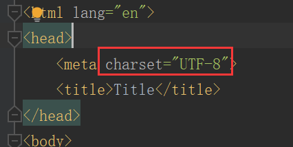

# request
## [FirstHttpServletRequest(请求行信息)](request-response/request/src/main/java/org/lzn/FirstHttpServletRequest.java)
1. 请求方式
2. URL
3. URI
4 当前应用的虚拟目录
5. 参数部分
## [SecondHttpServletRequest(请求头信息)](request-response/request/src/main/java/org/lzn/SecondHttpServletRequest.java)
1. 浏览器类型信息
2. 所有消息头信息
## [ThirdHttpServletRequest(获取表单数据)](request-response/request/src/main/java/org/lzn/ThirdHttpServletRequest.java)
**[register](request-response/request/webapp/register.html)** 提交表单数据 
|接口名称|说明|
|:-|:-|
|showDesignativeFormData|获取指定的表单数据|
|showAllFormData|获取所有的表单数据|
|showFormDataOfEncapsulation|获取表单数据并封装(反射)|
|showFormDataForFrame|使用框架封装表单数据(反射)|
|showFormDataByInputStream|使用 `getInputStream()` 获得表单数据| 
解决 `post`方式编码问题：`req.setCharacterEncoding("UTF-8");` 
前端编码: 

