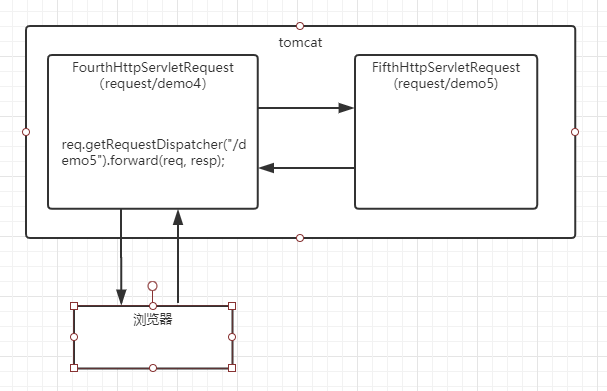

# request
## [FirstHttpServletRequest(请求行信息)](src/main/java/org/lzn/FirstHttpServletRequest.java)
1. 请求方式
2. URL
3. URI
4 当前应用的虚拟目录
5. 参数部分
## [SecondHttpServletRequest(请求头信息)](src/main/java/org/lzn/SecondHttpServletRequest.java)
1. 浏览器类型信息
2. 所有消息头信息
## [ThirdHttpServletRequest(获取表单数据)](src/main/java/org/lzn/ThirdHttpServletRequest.java)
|接口名称|说明|
|:-|:-|
|showDesignativeFormData|获取指定的表单数据|
|showAllFormData|获取所有的表单数据|
|showFormDataOfEncapsulation|获取表单数据并封装(反射)|
|showFormDataForFrame|使用框架封装表单数据(反射)|
|showFormDataByInputStream|使用 `getInputStream()` 获得表单数据|

1. **[register](webapp/register.html)** 提交表单数据 
2. 解决 `post`方式编码问题：`req.setCharacterEncoding("UTF-8");` 
前端编码: 

## [FourthHttpServletRequest(请求转发和操作非表单数据的方法)](src/main/java/org/lzn/FourthHttpServletRequest.java)
1. 请求转发
2. 通过 `request.setAttribute()` 在域中添加非表单数据
3. 图解 

## [FifthHttpServletRequest](src/main/java/org/lzn/FifthHttpServletRequest.java)
请求接收者
## [SixthHttpServletRequest](src/main/java/org/lzn/SixthHttpServletRequest.java)
1. 请求包含
