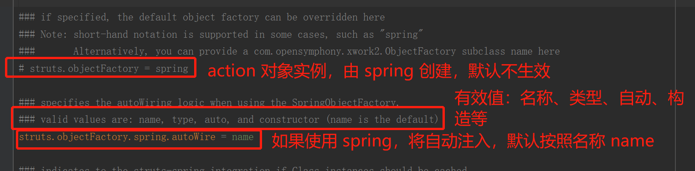
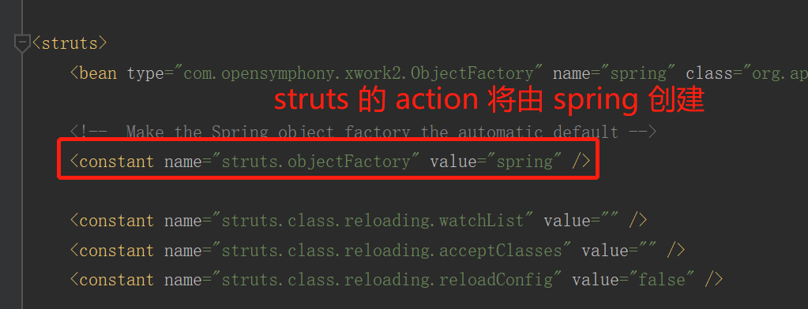

# Spring 基础 3

[TOC]

## 事务

一组业务操作，要么全部成功，要么全部不成功。

## 事务管理

### 顶层接口

* PlatformTransactionManager

  平台事务管理器，spring 要管理事务，必须使用事务管理器

  进行事务配置时，必须 **配置事务管理**

* TransactionDefinition

  事务详情（事务定义、事务属性），spring 用于确定事务具体详情。例如：隔离级别、是否只读、超时时间等

  进行事务配置时，**必须配置详情**。spring 将配置项封装到该对象实例

* TransactionStatus

  事务状态，spring 用于记录当前事务运行状态。例如：是否有保存点，事务是否完成

  spring 底层根据状态进行响应操作

### PlatformTransactionManager（事务管理器）

**导入 jar，需要平台事务管理器的实现类**

```xml
<dependency>
    <groupId>org.springframework</groupId>
    <artifactId>spring-jdbc</artifactId>
    <version>4.3.13.RELEASE</version>
</dependency>
<dependency>
    <groupId>org.springframework</groupId>
    <artifactId>spring-orm</artifactId>
    <version>4.3.13.RELEASE</version>
</dependency>
<dependency>
    <groupId>org.springframework</groupId>
    <artifactId>spring-tx</artifactId>
    <version>4.3.13.RELEASE</version>
</dependency>
```

**常见的事务管理器**

* DataSourceTransactionManager：jdbc 开发时事务管理器
* HibernateTransactionManager：hibernate 开发时事务管理器，整合 hibernate

**api 详解**

* `TransactionStatus getTransaction(TransactionDefinition definition)`

  事务管理器 通过“事务详情”，获得“事务状态”，从而管理事务

* `void commit(TransactionStatus status)`

  根据状态提交

* `void rollback(TransactionStatus status)`

  根据状态回滚

### TransactionStatus

* `boolean isNewTransaction()`：是否是新的事务
* `boolean hasSavepoint()`：是否有保存点
* `void setRollbackOnly()`：设置回滚
* `boolean isRollbackOnly()`：是否回滚
* `void flush()`：刷新
* `boolean isCompleted()`：是否完成

### TransactionDefinition

* `int getPropagationBehavior()`：传播行为
* `int getIsolationLevel()`：隔离级别
* `int getTimeout()`：获得超时时间
* `boolean isReadOnly()`：是否只读（增删改：读写。查询：只读）
* `String getName()`：配置事务详情名称。一般方法名称。例如 save、add* 等

**传播行为**

在两个业务之间如何共享事务

| 传播行为                  | 说明                                                         |
| ------------------------- | ------------------------------------------------------------ |
| PROPAGATION_REQUIRED      | required，必须，默认值<br>支持当前事务，A 如果有事务，B 将使用该事务<br>如果 A 没有事务，B 将创建一个新的事务 |
| PROPAGATION_SUPPORTS      | supports，支持<br>支持当前事务，A 如果有事务，B 将使用该事务<br>如果 A 没有事务，B 将以非事务执行 |
| PROPAGATION_MANDATORY     | mandatory，强制<br>支持当前事务，A 如果有事务，B 将使用该事务<br>如果 A 没有事务，B 将抛异常 |
| PROPAGATION_REQUIRES_NEW  | requires_new，必须新的<br>如果 A 有事务，将 A 的事务挂起，B 创建一个新的事务<br>如果 A 没有事务，B 创建一个新的事务 |
| PROPAGATION_NOT_SUPPORTED | not_supported，不支持<br>如果 A 有事务，将 A 的事务挂起，B 将以非事务执行<br>如果 A 没有事务，B 将以非事务执行 |
| PROPAGATION_NEVER         | never，从不<br>如果 A 有事务，B 将抛异常<br>如果 A 没有事务，B 将以非事务执行 |
| PROPAGATION_NESTED        | nested，嵌套<br>A 和 B 底层采用保存点机制，形成嵌套事务      |

## 案例-转账

### 环境搭建

**表结构**

```sql
/*
Navicat MySQL Data Transfer

Source Server         : LinHehe
Source Server Version : 50729
Source Host           : localhost:3306
Source Database       : hehe_test

Target Server Type    : MYSQL
Target Server Version : 50729
File Encoding         : 65001

Date: 2020-05-28 23:20:00
*/

SET FOREIGN_KEY_CHECKS=0;

-- ----------------------------
-- Table structure for account
-- ----------------------------
DROP TABLE IF EXISTS `account`;
CREATE TABLE `account` (
  `id` int(11) NOT NULL AUTO_INCREMENT,
  `name` varchar(255) DEFAULT NULL,
  `money` decimal(10,0) DEFAULT NULL,
  PRIMARY KEY (`id`)
) ENGINE=InnoDB AUTO_INCREMENT=3 DEFAULT CHARSET=utf8mb4;

-- ----------------------------
-- Records of account
-- ----------------------------
INSERT INTO `account` VALUES ('1', 'hehe', '10000');
INSERT INTO `account` VALUES ('2', 'haha', '8000');
```

**导入 jar 包**

```xml
<dependency>
    <groupId>com.mchange</groupId>
    <artifactId>c3p0</artifactId>
    <version>0.9.5.5</version>
</dependency>
<dependency>
    <groupId>aopalliance</groupId>
    <artifactId>aopalliance</artifactId>
    <version>1.0</version>
</dependency>
<dependency>
    <groupId>org.apache.commons</groupId>
    <artifactId>commons-dbcp2</artifactId>
    <version>2.6.0</version>
</dependency>
<dependency>
    <groupId>commons-logging</groupId>
    <artifactId>commons-logging</artifactId>
    <version>1.2</version>
</dependency>
<dependency>
    <groupId>org.apache.commons</groupId>
    <artifactId>commons-pool2</artifactId>
    <version>2.7.0</version>
</dependency>
<dependency>
    <groupId>org.aspectj</groupId>
    <artifactId>aspectjweaver</artifactId>
    <version>1.9.5</version>
</dependency>
<dependency>
    <groupId>mysql</groupId>
    <artifactId>mysql-connector-java</artifactId>
    <version>5.1.48</version>
</dependency>
<dependency>
    <groupId>org.springframework</groupId>
    <artifactId>spring-aop</artifactId>
    <version>4.3.13.RELEASE</version>
</dependency>
<dependency>
    <groupId>org.springframework</groupId>
    <artifactId>spring-aspects</artifactId>
    <version>4.3.13.RELEASE</version>
</dependency>
<dependency>
    <groupId>org.springframework</groupId>
    <artifactId>spring-beans</artifactId>
    <version>4.3.13.RELEASE</version>
</dependency>
<dependency>
    <groupId>org.springframework</groupId>
    <artifactId>spring-context</artifactId>
    <version>4.3.13.RELEASE</version>
</dependency>
<dependency>
    <groupId>org.springframework</groupId>
    <artifactId>spring-core</artifactId>
    <version>4.3.13.RELEASE</version>
</dependency>
<dependency>
    <groupId>org.springframework</groupId>
    <artifactId>spring-expression</artifactId>
    <version>4.3.13.RELEASE</version>
</dependency>
<dependency>
    <groupId>org.springframework</groupId>
    <artifactId>spring-jdbc</artifactId>
    <version>4.3.13.RELEASE</version>
</dependency>
<dependency>
    <groupId>org.springframework</groupId>
    <artifactId>spring-tx</artifactId>
    <version>4.3.13.RELEASE</version>
</dependency>
```

**代码**

[dao 层](#dao)：[AccountDao.java](src/main/java/org/lzn/dao/AccountDao.java)，[AccountDaoImpl.java](src/main/java/org/lzn/dao/impl/AccountDaoImpl.java)

[service 层](#service)：[AccountService.java](src/main/java/org/lzn/service/AccountService.java)，[AccountServiceImpl.java](src/main/java/org/lzn/service/impl/AccountServiceImpl.java)

[spring 配置](#config)：[applicationContext.xml](src/main/resources/applicationContext.xml)

[演示](#test)：[AccountTest.java](src/main/java/org/lzn/AccountTest.java)

<a name="dao" style="text-decoration:none">**dao**</a>

AccountDao

```java
package org.lzn.dao;

/**
 * 转账 Dao
 *
 * @author LinZhenNan lin_hehe@qq.com 2020/05/28 23:35
 */
public interface AccountDao {
    /**
     * 汇款
     *
     * @param outer 汇款人
     * @param money 金额
     * @author LinZhenNan lin_hehe@qq.com
     */
    void out(String outer, Integer money);
    
    /**
     * 收款
     *
     * @param inner 收款人
     * @param money 金额
     * @author LinZhenNan lin_hehe@qq.com
     */
    void in(String inner, Integer money);
}
```

AccountDaoImpl

```java
package org.lzn.dao.impl;

import org.lzn.dao.AccountDao;
import org.springframework.jdbc.core.support.JdbcDaoSupport;

/**
 * 转账接口实现类
 *
 * @author LinZhenNan lin_hehe@qq.com 2020/05/28 23:42
 */
public class AccountDaoImpl extends JdbcDaoSupport implements AccountDao {
    @Override
    public void out(String outer, Integer money) {
        String sql = "UPDATE account SET money = money - ? WHERE `name` = ?";
        this.getJdbcTemplate().update(sql, money, outer);
    }

    @Override
    public void in(String inner, Integer money) {
        String sql = "UPDATE account SET money = money + ? WHERE `name` = ?";
        this.getJdbcTemplate().update(sql, money, inner);
    }
}
```

<a name="service" style="text-decoration:none">**service**</a>

AccountService

```java
package org.lzn.service;

/**
 * 转账服务
 *
 * @author LinZhenNan lin_hehe@qq.com 2020/05/28 23:48
 */
public interface AccountService {
    /**
     * 转账
     *
     * @param outer 汇款人
     * @param inner 收款人
     * @param money 金额
     * @author LinZhenNan lin_hehe@qq.com
     */
    void transfer(String outer, String inner, Integer money);
}
```

AccountServiceImpl

```java
package org.lzn.service.impl;

import org.lzn.AccountTest;
import org.lzn.dao.AccountDao;
import org.lzn.service.AccountService;

/**
 * 转账实现类
 *
 * @author LinZhenNan lin_hehe@qq.com 2020/05/28 23:52
 */
public class AccountServiceImpl implements AccountService {

    private AccountDao accountDao;

    @Override
    public void transfer(String outer, String inner, Integer money) {
        accountDao.out(outer, money);
        AccountTest.getException();
        accountDao.in(inner, money);
    }

    //
    // setter
    // ------------------------------------------------------------------------------

    public void setAccountDao(AccountDao accountDao) {
        this.accountDao = accountDao;
    }
}
```

<a name="config" style="text-decoration:none">**spring 配置**</a>

```xml
<?xml version="1.0" encoding="UTF-8"?>
<beans xmlns="http://www.springframework.org/schema/beans"
       xmlns:xsi="http://www.w3.org/2001/XMLSchema-instance"
       xmlns:context="http://www.springframework.org/schema/context"
       xmlns:aop="http://www.springframework.org/schema/aop"
       xsi:schemaLocation="http://www.springframework.org/schema/beans
                           http://www.springframework.org/schema/beans/spring-beans.xsd
                           http://www.springframework.org/schema/aop
       					   http://www.springframework.org/schema/aop/spring-aop.xsd
                           http://www.springframework.org/schema/context
       					   http://www.springframework.org/schema/context/spring-context.xsd">

    <!--datasource-->
    <bean id="dataSource" class="com.mchange.v2.c3p0.ComboPooledDataSource">
        <property name="driverClass" value="com.mysql.jdbc.Driver"/>
        <property name="jdbcUrl" value="jdbc:mysql://localhost:3306/hehe_test?useUnicode=true&amp;characterEncoding=utf-8&amp;useSSL=false"/>
        <property name="user" value="root"/>
        <property name="password" value="root"/>
    </bean>

    <!--dao-->
    <bean id="accountDao" class="org.lzn.dao.impl.AccountDaoImpl">
        <property name="dataSource" ref="dataSource"/>
    </bean>

    <!--service-->
    <bean id="accountService" class="org.lzn.service.impl.AccountServiceImpl">
        <property name="accountDao" ref="accountDao"/>
    </bean>
</beans>
```

<a name="test" style="text-decoration:none">**演示**</a>

AccountTest

```java
public class AccountTest {
    public void demo1() {
        ApplicationContext applicationContext = new ClassPathXmlApplicationContext("applicationContext.xml");
        AccountService accountService = (AccountService) applicationContext.getBean("accountService");
        accountService.transfer("haha", "hehe", 500);
    }

    public static void getException() {
        throw new RuntimeException("断电了");
    }
}
```

### 手动管理事务

* spring 底层使用 TransactionTemplate 事务模板进行操作
* 操作
  1. service 需要获得 TransactionTemplate
  2. spring 配置模板，并注入给 service
  3. 模板需要注入事务管理器
  4. 配置事务管理器：DataSourceTransactionManager，需要注入 DataSource

**代码**

[ManualAccountServiceImpl.java](src/main/java/org/lzn/manual/ManualAccountServiceImpl.java)

```java
package org.lzn.manual;

import org.lzn.AccountTest;
import org.lzn.dao.AccountDao;
import org.lzn.service.AccountService;
import org.springframework.transaction.TransactionStatus;
import org.springframework.transaction.support.TransactionCallbackWithoutResult;
import org.springframework.transaction.support.TransactionTemplate;

/**
 * 手动管理事务，转账服务
 *
 * @author LinZhenNan lin_hehe@qq.com 2020/05/29 23:33
 */
public class ManualAccountServiceImpl implements AccountService {
    private AccountDao accountDao;
    private TransactionTemplate transactionTemplate;

    @Override
    public void transfer(final String outer, final String inner, final Integer money) {
        transactionTemplate.execute(new TransactionCallbackWithoutResult() {
            @Override
            protected void doInTransactionWithoutResult(TransactionStatus status) {
                accountDao.out(outer, money);
                AccountTest.getException();
                accountDao.in(inner, money);
            }
        });
    }

    //
    // setter/getter
    // ------------------------------------------------------------------------------

    public void setAccountDao(AccountDao accountDao) {
        this.accountDao = accountDao;
    }

    public void setTransactionTemplate(TransactionTemplate transactionTemplate) {
        this.transactionTemplate = transactionTemplate;
    }
}
```

[配置](src/main/resources/applicationContext.xml)

```xml
<?xml version="1.0" encoding="UTF-8"?>
<beans xmlns="http://www.springframework.org/schema/beans"
       xmlns:xsi="http://www.w3.org/2001/XMLSchema-instance"
       xmlns:context="http://www.springframework.org/schema/context"
       xmlns:aop="http://www.springframework.org/schema/aop"
       xsi:schemaLocation="http://www.springframework.org/schema/beans
                           http://www.springframework.org/schema/beans/spring-beans.xsd
                           http://www.springframework.org/schema/aop
       					   http://www.springframework.org/schema/aop/spring-aop.xsd
                           http://www.springframework.org/schema/context
       					   http://www.springframework.org/schema/context/spring-context.xsd">

    <!--datasource-->
    <bean id="dataSource" class="com.mchange.v2.c3p0.ComboPooledDataSource">
        <property name="driverClass" value="com.mysql.jdbc.Driver"/>
        <property name="jdbcUrl" value="jdbc:mysql://localhost:3306/hehe_test?useUnicode=true&amp;characterEncoding=utf-8&amp;useSSL=false"/>
        <property name="user" value="root"/>
        <property name="password" value="root"/>
    </bean>

    <!--dao-->
    <bean id="accountDao" class="org.lzn.dao.impl.AccountDaoImpl">
        <property name="dataSource" ref="dataSource"/>
    </bean>
    
    <!--service-->
    <bean id="manualAccountService" class="org.lzn.manual.ManualAccountServiceImpl">
        <property name="accountDao" ref="accountDao"/>
        <property name="transactionTemplate" ref="transactionTemplate"/>
    </bean>
    <!--创建模板-->
    <bean id="transactionTemplate" class="org.springframework.transaction.support.TransactionTemplate">
        <property name="transactionManager" ref="txManager"/>
    </bean>
    <!--配置事务管理器，事务管理器需要事务，事务从 Connection 获得，连接从连接池 DataSource 获得-->
    <bean id="txManager" class="org.springframework.jdbc.datasource.DataSourceTransactionManager">
        <property name="dataSource" ref="dataSource"/>
    </bean>
</beans>
```

[演示](src/main/java/org/lzn/AccountTest.java)

```java
public class AccountTest {
    public void demo2() {
        ApplicationContext applicationContext = new ClassPathXmlApplicationContext("applicationContext.xml");
        AccountService accountService = (AccountService) applicationContext.getBean("manualAccountService");
        accountService.transfer("haha", "hehe", 500);
    }

    public static void getException() {
        throw new RuntimeException("断电了");
    }
}
```

### 工厂 bean 生成代理：半自动

spring 提供 管理事务的代理工厂 bean TransactionProxyFactoryBean

1. getBean() 获得代理对象
2. spring 配置一个代理

**spring 配置**

* proxyInterfaces：接口

* target：目标类

* transactionManager：事务管理器

* transactionAttributes：事务属性（事务详情）

  * prop.key：确定哪些方法使用当前事务配置

  * prop.text：用于配置事务详情

    | 值          | 说明     |
    | ----------- | -------- |
    | PROPAGATION | 传播行为 |
    | ISOLATION   | 隔离级别 |
    | readOnly    | 是否只读 |
    | -Exception  | 异常回滚 |
    | +Exception  | 异常提交 |

    例如 `<prop key="transfer">PROPAGATION_REQUIRED,ISOLATION_DEFAULT,+java.lang.ArithmeticException</prop>`，有 `ArithmeticException` 异常仍然提交

```xml
<?xml version="1.0" encoding="UTF-8"?>
<beans xmlns="http://www.springframework.org/schema/beans"
       xmlns:xsi="http://www.w3.org/2001/XMLSchema-instance"
       xmlns:context="http://www.springframework.org/schema/context"
       xmlns:aop="http://www.springframework.org/schema/aop"
       xsi:schemaLocation="http://www.springframework.org/schema/beans
                           http://www.springframework.org/schema/beans/spring-beans.xsd
                           http://www.springframework.org/schema/aop
       					   http://www.springframework.org/schema/aop/spring-aop.xsd
                           http://www.springframework.org/schema/context
       					   http://www.springframework.org/schema/context/spring-context.xsd">

    <!--datasource-->
    <bean id="dataSource" class="com.mchange.v2.c3p0.ComboPooledDataSource">
        <property name="driverClass" value="com.mysql.jdbc.Driver"/>
        <property name="jdbcUrl" value="jdbc:mysql://localhost:3306/hehe_test?useUnicode=true&amp;characterEncoding=utf-8&amp;useSSL=false"/>
        <property name="user" value="root"/>
        <property name="password" value="root"/>
    </bean>

    <!--dao-->
    <bean id="accountDao" class="org.lzn.dao.impl.AccountDaoImpl">
        <property name="dataSource" ref="dataSource"/>
    </bean>

    <!--service-->
    <bean id="accountService" class="org.lzn.service.impl.AccountServiceImpl">
        <property name="accountDao" ref="accountDao"/>
    </bean>
    
    <!--配置事务管理器，事务管理器需要事务，事务从 Connection 获得，连接从连接池 DataSource 获得-->
    <bean id="txManager" class="org.springframework.jdbc.datasource.DataSourceTransactionManager">
        <property name="dataSource" ref="dataSource"/>
    </bean>

    <!--FactoryBean 半自动-->
    <bean id="proxyAccountService" class="org.springframework.transaction.interceptor.TransactionProxyFactoryBean">
        <property name="proxyInterfaces" value="org.lzn.service.AccountService"/>
        <property name="target" ref="accountService"/>
        <property name="transactionManager" ref="txManager"/>
        <property name="transactionAttributes">
            <props>
                <prop key="transfer">PROPAGATION_REQUIRED,ISOLATION_DEFAULT</prop>
            </props>
        </property>
    </bean>
</beans>
```

**演示**

```java
public class AccountTest {
    public void demo3() {
        ApplicationContext applicationContext = new ClassPathXmlApplicationContext("applicationContext.xml");
        AccountService accountService = (AccountService) applicationContext.getBean("proxyAccountService");
        accountService.transfer("haha", "hehe", 500);
    }

    public static void getException() {
        throw new RuntimeException("断电了");
    }
}
```

### spring aop xml 事务管理

在 spring xml 配置 aop 自动生成代理，进行事务的管理

1. 配置管理器
2. 配置事务详情
3. 配置 aop

```xml
<?xml version="1.0" encoding="UTF-8"?>
<beans xmlns="http://www.springframework.org/schema/beans"
       xmlns:xsi="http://www.w3.org/2001/XMLSchema-instance"
       xmlns:context="http://www.springframework.org/schema/context"
       xmlns:aop="http://www.springframework.org/schema/aop"
       xmlns:tx="http://www.springframework.org/schema/tx"
       xsi:schemaLocation="http://www.springframework.org/schema/beans
                           http://www.springframework.org/schema/beans/spring-beans.xsd
                           http://www.springframework.org/schema/aop
       					   http://www.springframework.org/schema/aop/spring-aop.xsd
                           http://www.springframework.org/schema/context
       					   http://www.springframework.org/schema/context/spring-context.xsd
                           http://www.springframework.org/schema/tx
       					   http://www.springframework.org/schema/tx/spring-tx.xsd">

    <!--datasource-->
    <bean id="dataSource" class="com.mchange.v2.c3p0.ComboPooledDataSource">
        <property name="driverClass" value="com.mysql.jdbc.Driver"/>
        <property name="jdbcUrl" value="jdbc:mysql://localhost:3306/hehe_test?useUnicode=true&amp;characterEncoding=utf-8&amp;useSSL=false"/>
        <property name="user" value="root"/>
        <property name="password" value="root"/>
    </bean>

    <!--dao-->
    <bean id="accountDao" class="org.lzn.dao.impl.AccountDaoImpl">
        <property name="dataSource" ref="dataSource"/>
    </bean>

    <!--service-->
    <bean id="accountService" class="org.lzn.service.impl.AccountServiceImpl">
        <property name="accountDao" ref="accountDao"/>
    </bean>

    <!--配置事务管理器，事务管理器需要事务，事务从 Connection 获得，连接从连接池 DataSource 获得-->
    <bean id="txManager" class="org.springframework.jdbc.datasource.DataSourceTransactionManager">
        <property name="dataSource" ref="dataSource"/>
    </bean>
    
    <!--spring aop xml 事务管理-->
    <!--
        事务详情（事务通知），在 aop 筛选基础上，对 ABC 三个方法确定使用什么样的事务。例如 AC 读写、B 只读等。
            <tx:advice>
                <tx:method name=""/>：详情具体配置
                    propagation：传播行为。REQUIRED：必须；REQUIRED_NEW：必须是新的
                    isolation：隔离级别
    -->
    <tx:advice id="txAdvice" transaction-manager="txManager">
        <tx:attributes>
            <tx:method name="transfer" propagation="REQUIRED" isolation="DEFAULT"/>
        </tx:attributes>
    </tx:advice>
    <!--AOP 编程，目标类有 ABCD（4 个连接点），切入点表达式确定增强的连接器，从而获得切入点：ABC-->
    <aop:config>
        <aop:advisor advice-ref="txAdvice" pointcut="execution(* org.lzn.service.impl..*.*(..))"/>
    </aop:config>
</beans>
```

**演示**

```java
public class AccountTest {
    public void demo1() {
        ApplicationContext applicationContext = new ClassPathXmlApplicationContext("applicationContext.xml");
        AccountService accountService = (AccountService) applicationContext.getBean("accountService");
        accountService.transfer("haha", "hehe", 500);
    }
}
```

### spring 注解配置

1. 配置事务管理器，并将事务管理器交予 spring
2. 在目标类或方法添加注解 @Transactional

[annotationApplicationContext.xml](src/main/resources/annotationApplicationContext.xml)

```xml
<?xml version="1.0" encoding="UTF-8"?>
<beans xmlns="http://www.springframework.org/schema/beans"
       xmlns:xsi="http://www.w3.org/2001/XMLSchema-instance"
       xmlns:aop="http://www.springframework.org/schema/aop"
       xmlns:tx="http://www.springframework.org/schema/tx"
       xsi:schemaLocation="http://www.springframework.org/schema/beans
                           http://www.springframework.org/schema/beans/spring-beans.xsd
                           http://www.springframework.org/schema/aop
       					   http://www.springframework.org/schema/aop/spring-aop.xsd
                           http://www.springframework.org/schema/tx
       					   http://www.springframework.org/schema/tx/spring-tx.xsd">
    <!--datasource-->
    <bean id="dataSource" class="com.mchange.v2.c3p0.ComboPooledDataSource">
        <property name="driverClass" value="com.mysql.jdbc.Driver"/>
        <property name="jdbcUrl" value="jdbc:mysql://localhost:3306/hehe_test?useUnicode=true&amp;characterEncoding=utf-8&amp;useSSL=false"/>
        <property name="user" value="root"/>
        <property name="password" value="root"/>
    </bean>

    <!--dao-->
    <bean id="accountDao" class="org.lzn.dao.impl.AccountDaoImpl">
        <property name="dataSource" ref="dataSource"/>
    </bean>

    <!--service-->
    <bean id="accountService" class="org.lzn.service.impl.AccountServiceImpl">
        <property name="accountDao" ref="accountDao"/>
    </bean>

    <!--创建模板-->
    <bean id="transactionTemplate" class="org.springframework.transaction.support.TransactionTemplate">
        <property name="transactionManager" ref="txManager"/>
    </bean>

    <!--
        将管理器交予 spring
            transaction-manager：配置事务管理器
            proxy-target-class
                true：底层强制使用 cglib 代理
    -->
    <tx:annotation-driven transaction-manager="txManager"/>
</beans>
```

[AccountServiceImpl.java](src/main/java/org/lzn/service/impl/AccountServiceImpl.java)

```java
package org.lzn.service.impl;

import org.lzn.AccountTest;
import org.lzn.dao.AccountDao;
import org.lzn.service.AccountService;
import org.springframework.transaction.annotation.Transactional;

/**
 * 转账实现类
 *
 * @author LinZhenNan lin_hehe@qq.com 2020/05/28 23:52
 */
public class AccountServiceImpl implements AccountService {

    private AccountDao accountDao;

    @Override
    @Transactional(rollbackFor = Exception.class)
    public void transfer(String outer, String inner, Integer money) {
        accountDao.out(outer, money);
        AccountTest.getException();
        accountDao.in(inner, money);
    }

    //
    // setter
    // ------------------------------------------------------------------------------

    public void setAccountDao(AccountDao accountDao) {
        this.accountDao = accountDao;
    }
}
```

**演示**

```java
public class AccountTest {
    public void demo4() {
        ApplicationContext applicationContext = new ClassPathXmlApplicationContext("annotationApplicationContext.xml");
        AccountService accountService = (AccountService) applicationContext.getBean("accountService");
        accountService.transfer("haha", "hehe", 500);
    }

    public static void getException() {
        throw new RuntimeException("断电了");
    }
}
```

## 整合 junit

导入 jar

```xml
<dependency>
    <groupId>org.springframework</groupId>
    <artifactId>spring-test</artifactId>
    <version>4.3.13.RELEASE</version>
</dependency>
```

**演示**

```java
package org.lzn;

import org.junit.Test;
import org.junit.runner.RunWith;
import org.lzn.service.AccountService;
import org.springframework.beans.factory.annotation.Autowired;
import org.springframework.test.context.ContextConfiguration;
import org.springframework.test.context.junit4.SpringJUnit4ClassRunner;

/**
 * spring 整合 junit
 *
 * @author LinZhenNan lin_hehe@qq.com 2020/05/31 23:56
 */
@RunWith(SpringJUnit4ClassRunner.class)
@ContextConfiguration(locations = "classpath:applicationContext.xml")
public class JunitTest {
    /**
     * 与 junit 整合，不需要再 spring xml 配置扫描
     */
    @Autowired
    private AccountService accountService;

    @Test
    public void demo() {
        accountService.transfer("haha", "hehe", 500);
    }
}
```

## 整合 web

1. 导入 jar 包

   ```xml
   <dependency>
       <groupId>org.springframework</groupId>
       <artifactId>spring-web</artifactId>
       <version>4.3.13.RELEASE</version>
   </dependency>
   ```

2. tomcat 启动加载配置文件

   ```xml
   <!--配置 spring 监听器，加载 xml 配置文件-->
   <listener>
       <listener-class>org.springframework.web.context.ContextLoaderListener</listener-class>
   </listener>
   ```

3. 确定配置文件位置，通过系统初始化参数。默认路径 `/WEB-INF/applicationContext.xml`

   ```xml
   <context-param>
       <param-name>contextConfigLocation</param-name>
       <param-value>classpath:applicationContext.xml</param-value>
   </context-param>
   ```

**代码**

[配置](#webConfig)：[web.xml](web/WEB-INF/web.xml)

[servlet](#webServlet)：[HelloServlet.java](src/main/java/org/lzn/servlet/HelloServlet.java)

<a name="webConfig" style="text-decoration:none">配置</a>

```java
<?xml version="1.0" encoding="UTF-8"?>
<web-app xmlns="http://xmlns.jcp.org/xml/ns/javaee"
         xmlns:xsi="http://www.w3.org/2001/XMLSchema-instance"
         xsi:schemaLocation="http://xmlns.jcp.org/xml/ns/javaee http://xmlns.jcp.org/xml/ns/javaee/web-app_4_0.xsd"
         version="4.0">
    <!--确定配置文件位置，默认路径为：/WEB-INF/applicationContext.xml-->
    <context-param>
        <param-name>contextConfigLocation</param-name>
        <param-value>classpath:applicationContext.xml</param-value>
    </context-param>

    <!--配置 spring 监听器，加载 xml 配置文件-->
    <listener>
        <listener-class>org.springframework.web.context.ContextLoaderListener</listener-class>
    </listener>

    <servlet>
        <servlet-name>helloServlet</servlet-name>
        <servlet-class>org.lzn.servlet.HelloServlet</servlet-class>
    </servlet>
    <servlet-mapping>
        <servlet-name>helloServlet</servlet-name>
        <url-pattern>/hello</url-pattern>
    </servlet-mapping>

    <welcome-file-list>
        <welcome-file>welcome.jsp</welcome-file>
    </welcome-file-list>
</web-app>
```

<a name="webServlet" style="text-decoration:none">serlvet</a>

```java
package org.lzn.servlet;

import org.lzn.service.AccountService;
import org.springframework.context.ApplicationContext;
import org.springframework.web.context.WebApplicationContext;
import org.springframework.web.context.support.WebApplicationContextUtils;

import javax.servlet.ServletException;
import javax.servlet.http.HttpServlet;
import javax.servlet.http.HttpServletRequest;
import javax.servlet.http.HttpServletResponse;
import java.io.IOException;

/**
 * 整合 web
 *
 * @author LinZhenNan lin_hehe@qq.com 2020/06/01 23:52
 */
public class HelloServlet extends HttpServlet {
    @Override
    protected void doGet(HttpServletRequest req, HttpServletResponse resp) throws ServletException, IOException {
        // 从 application 作用域（ServletContext）获得 spring 容器
        // 方式1
        ApplicationContext applicationContext = (ApplicationContext) this.getServletContext().getAttribute(WebApplicationContext.ROOT_WEB_APPLICATION_CONTEXT_ATTRIBUTE);
        System.out.println(WebApplicationContext.ROOT_WEB_APPLICATION_CONTEXT_ATTRIBUTE);
        // 方式2
        WebApplicationContext applicationContext2 = WebApplicationContextUtils.getWebApplicationContext(this.getServletContext());

        // 操作
        AccountService accountService = (AccountService) applicationContext.getBean("accountService");
        accountService.transfer("haha", "hehe", 500);
    }
}
```

## SSH 整合

### struts

```xml
<!--字节码增强框架 start-->
<dependency>
    <groupId>org.ow2.asm</groupId>
    <artifactId>asm</artifactId>
    <version>8.0.1</version>
</dependency>
<dependency>
    <groupId>org.ow2.asm</groupId>
    <artifactId>asm-commons</artifactId>
    <version>8.0.1</version>
</dependency>
<dependency>
    <groupId>org.ow2.asm</groupId>
    <artifactId>asm-tree</artifactId>
    <version>8.0.1</version>
</dependency>
<!--字节码增强框架 end-->

<!--文件上传-->
<dependency>
    <groupId>commons-fileupload</groupId>
    <artifactId>commons-fileupload</artifactId>
    <version>1.4</version>
</dependency>

<!--java.io 增强包（IOUtils、FileUtils等）-->
<dependency>
    <groupId>commons-io</groupId>
    <artifactId>commons-io</artifactId>
    <version>2.6</version>
</dependency>

<!--java.lang 增强包（StringUtils等）-->
<dependency>
    <groupId>org.apache.commons</groupId>
    <artifactId>commons-lang3</artifactId>
    <version>3.10</version>
</dependency>

<!--日志-->
<dependency>
    <groupId>commons-logging</groupId>
    <artifactId>commons-logging</artifactId>
    <version>1.2</version>
</dependency>

<!--日志（src/log4j.properties）-->
<dependency>
    <groupId>log4j</groupId>
    <artifactId>log4j</artifactId>
    <version>1.2.17</version>
</dependency>

<!--模板技术。扩展名：*.ftl-->
<dependency>
    <groupId>org.freemarker</groupId>
    <artifactId>freemarker</artifactId>
    <version>2.3.28</version>
</dependency>

<!--字节码增强-->
<dependency>
    <groupId>javassist</groupId>
    <artifactId>javassist</artifactId>
    <version>3.11.0.GA</version>
</dependency>

<!--OGNL 表达式，值栈的底层实现-->
<dependency>
    <groupId>ognl</groupId>
    <artifactId>ognl</artifactId>
    <version>3.0.6</version>
</dependency>

<!--进一步封装，核心-->
<dependency>
    <groupId>org.apache.struts</groupId>
    <artifactId>struts2-core</artifactId>
    <version>2.3.15.3</version>
</dependency>

<!--webwork 核心，struts 核心-->
<dependency>
    <groupId>org.apache.struts.xwork</groupId>
    <artifactId>xwork-core</artifactId>
    <version>2.3.15.3</version>
</dependency>
```

### sping

```xml
<dependency>
    <groupId>com.mchange</groupId>
    <artifactId>c3p0</artifactId>
    <version>0.9.5.5</version>
</dependency>
<dependency>
    <groupId>aopalliance</groupId>
    <artifactId>aopalliance</artifactId>
    <version>1.0</version>
</dependency>
<dependency>
    <groupId>org.aspectj</groupId>
    <artifactId>aspectjweaver</artifactId>
    <version>1.9.5</version>
</dependency>
<dependency>
    <groupId>org.freemarker</groupId>
    <artifactId>freemarker</artifactId>
    <version>2.3.19</version>
</dependency>
<dependency>
    <groupId>mysql</groupId>
    <artifactId>mysql-connector-java</artifactId>
    <version>5.1.48</version>
</dependency>
<dependency>
    <groupId>org.apache.commons</groupId>
    <artifactId>commons-dbcp2</artifactId>
    <version>2.6.0</version>
</dependency>
<dependency>
    <groupId>org.apache.commons</groupId>
    <artifactId>commons-pool2</artifactId>
    <version>2.7.0</version>
</dependency>
<dependency>
    <groupId>org.springframework</groupId>
    <artifactId>spring-aop</artifactId>
    <version>4.3.13.RELEASE</version>
</dependency>
<dependency>
    <groupId>org.springframework</groupId>
    <artifactId>spring-aspects</artifactId>
    <version>4.3.13.RELEASE</version>
</dependency>
<dependency>
    <groupId>org.springframework</groupId>
    <artifactId>spring-beans</artifactId>
    <version>4.3.13.RELEASE</version>
</dependency>
<dependency>
    <groupId>org.springframework</groupId>
    <artifactId>spring-context</artifactId>
    <version>4.3.13.RELEASE</version>
</dependency>
<dependency>
    <groupId>org.springframework</groupId>
    <artifactId>spring-core</artifactId>
    <version>4.3.13.RELEASE</version>
</dependency>
<dependency>
    <groupId>org.springframework</groupId>
    <artifactId>spring-expression</artifactId>
    <version>4.3.13.RELEASE</version>
</dependency>
<dependency>
    <groupId>org.springframework</groupId>
    <artifactId>spring-jdbc</artifactId>
    <version>4.3.13.RELEASE</version>
</dependency>
<dependency>
    <groupId>org.springframework</groupId>
    <artifactId>spring-orm</artifactId>
    <version>4.3.13.RELEASE</version>
</dependency>
<dependency>
    <groupId>org.apache.struts</groupId>
    <artifactId>struts2-spring-plugin</artifactId>
    <version>2.3.15.3</version>
</dependency>
<dependency>
    <groupId>org.springframework</groupId>
    <artifactId>spring-tx</artifactId>
    <version>4.3.13.RELEASE</version>
</dependency>
<dependency>
    <groupId>org.springframework</groupId>
    <artifactId>spring-web</artifactId>
    <version>4.3.13.RELEASE</version>
</dependency>
<dependency>
    <groupId>org.springframework</groupId>
    <artifactId>spring-test</artifactId>
    <version>4.3.13.RELEASE</version>
</dependency>
<dependency>
    <groupId>org.apache.struts</groupId>
    <artifactId>struts2-core</artifactId>
    <version>2.3.15.3</version>
</dependency>
<dependency>
    <groupId>org.apache.struts.xwork</groupId>
    <artifactId>xwork-core</artifactId>
    <version>2.3.15.3</version>
</dependency>
```

### hibernate

```xml
<dependency>
    <groupId>org.hibernate</groupId>
    <artifactId>hibernate-core</artifactId>
    <version>5.4.14.Final</version>
</dependency>
<!--解析 HQL 语句-->
<dependency>
    <groupId>antlr</groupId>
    <artifactId>antlr</artifactId>
    <version>2.7.6</version>
</dependency>
<!--java 集合增强包-->
<dependency>
    <groupId>commons-collections</groupId>
    <artifactId>commons-collections</artifactId>
    <version>3.1</version>
</dependency>
<!--解析 XML-->
<dependency>
    <groupId>dom4j</groupId>
    <artifactId>dom4j</artifactId>
    <version>1.6.1</version>
</dependency>
<!--java transaction api，java 事务 api-->
<dependency>
    <groupId>javax.transaction</groupId>
    <artifactId>jta</artifactId>
    <version>1.1</version>
</dependency>
<!--日志框架-->
<dependency>
    <groupId>org.slf4j</groupId>
    <artifactId>slf4j-api</artifactId>
    <version>1.6.1</version>
</dependency>
<dependency>
    <groupId>org.hibernate</groupId>
    <artifactId>hibernate-c3p0</artifactId>
    <version>5.4.14.Final</version>
</dependency>
```

### Spring 整合 Hibernate，hibernate.cfg.xml

**表结构**

```sql
/*
Navicat MySQL Data Transfer

Source Server         : LinHehe
Source Server Version : 50729
Source Host           : localhost:3306
Source Database       : hehe_test

Target Server Type    : MYSQL
Target Server Version : 50729
File Encoding         : 65001

Date: 2020-06-08 23:09:42
*/

SET FOREIGN_KEY_CHECKS=0;

-- ----------------------------
-- Table structure for user
-- ----------------------------
DROP TABLE IF EXISTS `user`;
CREATE TABLE `user` (
  `id` int(11) NOT NULL AUTO_INCREMENT COMMENT '主键',
  `username` varchar(255) DEFAULT NULL COMMENT '用户名',
  `password` varchar(255) DEFAULT NULL COMMENT '密码（MD5加密）',
  PRIMARY KEY (`id`)
) ENGINE=InnoDB AUTO_INCREMENT=4 DEFAULT CHARSET=utf8mb4;
```

#### PO

[java bean](src/main/java/org/lzn/hibernate/cfg/domain/User.java)

```java
public class User {
    private Integer id;
    private String username;
    private String password;

    //
    // setter/getter
    // ------------------------------------------------------------------------------

    public Integer getId() {
        return id;
    }

    public void setId(Integer id) {
        this.id = id;
    }

    public String getUsername() {
        return username;
    }

    public void setUsername(String username) {
        this.username = username;
    }

    public String getPassword() {
        return password;
    }

    public void setPassword(String password) {
        this.password = password;
    }
}
```

[映射文件](src/main/resources/org/lzn/hibernate/cfg/domain/User.hbm.xml)

```xml
<?xml version="1.0" encoding="UTF-8" ?>
<!DOCTYPE hibernate-mapping PUBLIC
        "-//Hibernate/Hibernate Mapping DTD 3.0//EN"
        "http://www.hibernate.org/dtd/hibernate-mapping-3.0.dtd">
<hibernate-mapping package="org.lzn.hibernate.cfg.domain">
    <class name="User" table="user">
        <id name="id">
            <generator class="native"/>
        </id>
        <property name="username"/>
        <property name="password"/>
    </class>
</hibernate-mapping>
```

#### dao

[UserDao](src/main/java/org/lzn/hibernate/cfg/dao/UserDao.java)

```java
package org.lzn.hibernate.cfg.dao;

import org.lzn.hibernate.cfg.domain.User;

/**
 * userDao
 *
 * @author LinZhenNan lin_hehe@qq.com 2020/06/08 23:14
 */
public interface UserDao {
    /**
     * 添加用户实体
     *
     * @param user 实体
     * @author LinZhenNan lin_hehe@qq.com
     */
    void insert(User user);
}
```

[UserDaoImpl](src/main/java/org/lzn/hibernate/cfg/dao/UserDaoImpl.java)

```java
package org.lzn.hibernate.cfg.dao.impl;

import org.lzn.hibernate.cfg.dao.UserDao;
import org.lzn.hibernate.cfg.domain.User;
import org.springframework.orm.hibernate4.HibernateTemplate;

/**
 * UserDao 实现类
 *
 * @author LinZhenNan lin_hehe@qq.com 2020/06/08 23:34
 */
public class UserDaoImpl implements UserDao {
    /**
     * spring 注入模板
     */
    private HibernateTemplate hibernateTemplate;
    @Override
    public void insert(User user) {
        this.hibernateTemplate.save(user);
    }

    //
    // setter/getter
    // ------------------------------------------------------------------------------

    public void setHibernateTemplate(HibernateTemplate hibernateTemplate) {
        this.hibernateTemplate = hibernateTemplate;
    }
}
```

#### service

[UserService](src/main/java/org/lzn/hibernate/cfg/service/UserService.java)

```java
package org.lzn.hibernate.cfg.service;

import org.lzn.hibernate.cfg.domain.User;

/**
 * UserService
 *
 * @author LinZhenNan lin_hehe@qq.com 2020/06/08 23:40
 */
public interface UserService {
    /**
     * 保存用户
     *
     * @param user 实体
     * @author LinZhenNan lin_hehe@qq.com
     */
    void save(User user);
}
```

[UserServiceImpl](src/main/java/org/lzn/hibernate/cfg/service/UserServiceImpl.java)

```java
package org.lzn.hibernate.cfg.service.impl;

import org.lzn.hibernate.cfg.dao.UserDao;
import org.lzn.hibernate.cfg.domain.User;
import org.lzn.hibernate.cfg.service.UserService;

/**
 * UserService 实现类
 *
 * @author LinZhenNan lin_hehe@qq.com 2020/06/08 23:41
 */
public class UserServiceImpl implements UserService {
    private UserDao userDao;
    @Override
    public void save(User user) {
        userDao.insert(user);
    }

    //
    // setter/getter
    // ------------------------------------------------------------------------------

    public void setUserDao(UserDao userDao) {
        this.userDao = userDao;
    }
}
```

[hibernate.cfg.xml](src/main/resources/org/lzn/hibernate/cfg/hibernate.cfg/xml)

```xml
<?xml version="1.0" encoding="UTF-8" ?>
<!DOCTYPE hibernate-configuration PUBLIC
        "-//Hibernate/Hibernate Configuration DTD 3.0//EN"
        "http://www.hibernate.org/dtd/hibernate-configuration-3.0.dtd">
<hibernate-configuration>
    <session-factory>
        <!--基本 4 项-->
        <property name="hibernate.connection.driver_class">com.mysql.jdbc.Driver</property>
        <property name="hibernate.connection.username">root</property>
        <property name="hibernate.connection.password">hehe</property>
        <property name="hibernate.connection.url">jdbc:mysql:///hehe_test?useUnicode=true&amp;characterEncoding=utf-8&amp;useSSL=false</property>

        <!--配置方言-->
        <property name="hibernate.dialect">org.hibernate.dialect.MySQL5Dialect</property>

        <!--sql 语句-->
        <property name="hibernate.show_sql">true</property>
        <property name="hibernate.format_sql">true</property>

        <!--自动生成表-->
        <property name="hibernate.hbm2ddl.auto">update</property>

        <!--本地线程绑定-->
        <property name="hibernate.current_session_context_class">thread</property>

        <!--导入映射文件-->
        <mapping resource="org/lzn/hibernate/cfg/domain/User.hbm.xml"/>
    </session-factory>
</hibernate-configuration>
```

#### [applicationContext.xml](src/main/resources/org/lzn/hibernate/cfg/applicationContext.xml)

**命名空间**

```xml
<beans xmlns="http://www.springframework.org/schema/beans"
       xmlns:xsi="http://www.w3.org/2001/XMLSchema-instance"
       xmlns:aop="http://www.springframework.org/schema/aop"
       xmlns:tx="http://www.springframework.org/schema/tx"
       xmlns:context="http://www.springframework.org/schema/context"
       xsi:schemaLocation="http://www.springframework.org/schema/beans
                           http://www.springframework.org/schema/beans/spring-beans.xsd
                           http://www.springframework.org/schema/tx
       					   http://www.springframework.org/schema/tx/spring-tx.xsd
       					   http://www.springframework.org/schema/aop
       					   http://www.springframework.org/schema/aop/spring-aop.xsd
       					   http://www.springframework.org/schema/context
       					   http://www.springframework.org/schema/context/spring-context.xsd">
```

**加载 hibernate 配置文件**

```xml
	<!--
        1. 加载 hibernate.cfg.xml 获得 SessionFactory
            configLocation：确定配置文件位置
    -->
    <bean id="sessionFactory" class="org.springframework.orm.hibernate4.LocalSessionFactoryBean">
        <property name="configLocation" value="classpath:org/lzn/hibernate/cfg/hibernate.cfg.xml"/>
    </bean>

    <!--
        2. 创建模板
            底层使用 session，session 有 sessionFactory 获得
    -->
    <bean id="hibernateTemplate" class="org.springframework.orm.hibernate4.HibernateTemplate">
        <property name="sessionFactory" ref="sessionFactory"/>
    </bean>
```

**dao 和 service**

```xml
	<!--3. dao-->
    <bean id="userDao" class="org.lzn.hibernate.cfg.dao.impl.UserDaoImpl">
        <property name="hibernateTemplate" ref="hibernateTemplate"/>
    </bean>

    <!--4. service-->
    <bean id="userService" class="org.lzn.hibernate.cfg.service.impl.UserServiceImpl">
        <property name="userDao" ref="userDao"/>
    </bean>
```

**事务管理**

```xml
	<!--5. 事务管理-->
    <!--5.1 事务管理：HibernateTransactionManager-->
    <bean id="txManager" class="org.springframework.orm.hibernate4.HibernateTransactionManager">
        <property name="sessionFactory" ref="sessionFactory"/>
    </bean>
    <!--5.2 事务详情，给方法进行具体事务设置-->
    <tx:advice id="txAdvice" transaction-manager="txManager">
        <tx:attributes>
            <tx:method name="save"/>
        </tx:attributes>
    </tx:advice>
    <!--5.3 AOP 编程，筛选切入点方法-->
    <aop:config>
        <aop:advisor advice-ref="txAdvice" pointcut="execution(* org.lzn.hibernate.cfg.service..*.*(..))"/>
    </aop:config>
```

**applicationContext**

```xml
<?xml version="1.0" encoding="UTF-8"?>
<beans xmlns="http://www.springframework.org/schema/beans"
       xmlns:xsi="http://www.w3.org/2001/XMLSchema-instance"
       xmlns:aop="http://www.springframework.org/schema/aop"
       xmlns:tx="http://www.springframework.org/schema/tx"
       xmlns:context="http://www.springframework.org/schema/context"
       xsi:schemaLocation="http://www.springframework.org/schema/beans
                           http://www.springframework.org/schema/beans/spring-beans.xsd
                           http://www.springframework.org/schema/tx
       					   http://www.springframework.org/schema/tx/spring-tx.xsd
       					   http://www.springframework.org/schema/aop
       					   http://www.springframework.org/schema/aop/spring-aop.xsd
       					   http://www.springframework.org/schema/context
       					   http://www.springframework.org/schema/context/spring-context.xsd">

    <!--
        1. 加载 hibernate.cfg.xml 获得 SessionFactory
            configLocation：确定配置文件位置
    -->
    <bean id="sessionFactory" class="org.springframework.orm.hibernate4.LocalSessionFactoryBean">
        <property name="configLocation" value="classpath:org/lzn/hibernate/cfg/hibernate.cfg.xml"/>
    </bean>

    <!--
        2. 创建模板
            底层使用 session，session 有 sessionFactory 获得
    -->
    <bean id="hibernateTemplate" class="org.springframework.orm.hibernate4.HibernateTemplate">
        <property name="sessionFactory" ref="sessionFactory"/>
    </bean>

    <!--3. dao-->
    <bean id="userDao" class="org.lzn.hibernate.cfg.dao.impl.UserDaoImpl">
        <property name="hibernateTemplate" ref="hibernateTemplate"/>
    </bean>

    <!--4. service-->
    <bean id="userService" class="org.lzn.hibernate.cfg.service.impl.UserServiceImpl">
        <property name="userDao" ref="userDao"/>
    </bean>

    <!--5. 事务管理-->
    <!--5.1 事务管理：HibernateTransactionManager-->
    <bean id="txManager" class="org.springframework.orm.hibernate4.HibernateTransactionManager">
        <property name="sessionFactory" ref="sessionFactory"/>
    </bean>
    <!--5.2 事务详情，给方法进行具体事务设置-->
    <tx:advice id="txAdvice" transaction-manager="txManager">
        <tx:attributes>
            <tx:method name="save"/>
        </tx:attributes>
    </tx:advice>
    <!--5.3 AOP 编程，筛选切入点方法-->
    <aop:config>
        <aop:advisor advice-ref="txAdvice" pointcut="execution(* org.lzn.hibernate.cfg.service..*.*(..))"/>
    </aop:config>
</beans>
```

#### 测试

```java
package org.lzn.hibernate.cfg.service;

import org.junit.Test;
import org.junit.runner.RunWith;
import org.lzn.hibernate.cfg.domain.User;
import org.springframework.beans.factory.annotation.Autowired;
import org.springframework.test.context.ContextConfiguration;
import org.springframework.test.context.junit4.SpringJUnit4ClassRunner;

/**
 * 测试
 *
 * @author LinZhenNan lin_hehe@qq.com 2020/06/09 23:53
 */
@RunWith(SpringJUnit4ClassRunner.class)
@ContextConfiguration("classpath:org/lzn/hibernate/cfg/applicationContext.xml")
public class UserServiceTest {

    @Autowired
    private UserService userService;

    @Test
    public void save() {
        User user = new User();
        user.setUsername("Spring 整合 Hibernate，hibernate.cfg.xml");
        user.setPassword("hehe");

        userService.save(user);
    }
}
```

### Spring 整合 Hibernate 

* 删除 `hibernate.cfg.xml` 文件，但需要保存文件内容，将其配置 spring 中
* 修改 dao 层，继承 HibernateDaoSupport

#### 修改 spring，配置 SessionFactory

[applicationContext.xml](src/main/resources/org/lzn/hibernate/applicationContext.xml)

```xml
<?xml version="1.0" encoding="UTF-8"?>
<beans xmlns="http://www.springframework.org/schema/beans"
       xmlns:xsi="http://www.w3.org/2001/XMLSchema-instance"
       xmlns:aop="http://www.springframework.org/schema/aop"
       xmlns:tx="http://www.springframework.org/schema/tx"
       xmlns:context="http://www.springframework.org/schema/context"
       xsi:schemaLocation="http://www.springframework.org/schema/beans
                           http://www.springframework.org/schema/beans/spring-beans.xsd
                           http://www.springframework.org/schema/tx
       					   http://www.springframework.org/schema/tx/spring-tx.xsd
       					   http://www.springframework.org/schema/aop
       					   http://www.springframework.org/schema/aop/spring-aop.xsd
       					   http://www.springframework.org/schema/context
       					   http://www.springframework.org/schema/context/spring-context.xsd">

    <!--1.1 加载 properties 文件-->
    <!--1.2 配置数据源-->
    <bean id="dataSource" class="com.mchange.v2.c3p0.ComboPooledDataSource">
        <property name="driverClass" value="com.mysql.jdbc.Driver"/>
        <property name="jdbcUrl" value="jdbc:mysql:///hehe_test?useUnicode=true&amp;characterEncoding=utf-8&amp;useSSL=false"/>
        <property name="user" value="root"/>
        <property name="password" value="root"/>
    </bean>

    <!--
        1.3 配置 LocalSessionFactoryBean，获得 SessionFactory
            dataSource：数据源
            hibernateProperties：hibernate 其他配置项
            导入映射文件
                mappingLocations：确定映射文件位置，需要"classpath:"，支持通配符*
                    <property name="mappingLocations" value="classpath:org/lzn/hibernate/cfg/domain/User.hbm.xml"/>
                    <property name="mappingLocations" value="classpath:org/lzn/hibernate/cfg/domain/*.hbm.xml"/>
                mappingResources：加载执行映射文件，从src下开始 。不支持通配符*
                    <property name="mappingResources" value="org/lzn/hibernate/cfg/domain/User.hbm.xml"/>
                mappingDirectoryLocations：加载指定目录下的，所有配置文件
                    <property name="mappingResources" value="org/lzn/hibernate/cfg/domain/User.hbm.xml"/>
                mappingJarLocations：从 jar 包中获得映射文件
    -->
    <bean id="sessionFactory" class="org.springframework.orm.hibernate4.LocalSessionFactoryBean">
        <property name="dataSource" ref="dataSource"/>
        <property name="hibernateProperties">
            <props>
                <prop key="hibernate.dialect">org.hibernate.dialect.MySQL5Dialect</prop>
                <prop key="hibernate.show_sql">true</prop>
                <prop key="hibernate.format_sql">true</prop>
                <prop key="hibernate.hbm2ddl.auto">update</prop>
                <prop key="hibernate.current_session_context_class">org.springframework.orm.hibernate5.SpringSessionContext</prop>
            </props>
        </property>
        <property name="mappingLocations" value="classpath:org/lzn/hibernate/cfg/domain/*.hbm.xml"/>
    </bean>

    <!--
        2. 创建模板
            底层使用 session，session 有 sessionFactory 获得
    -->
    <bean id="hibernateTemplate" class="org.springframework.orm.hibernate5.HibernateTemplate">
        <property name="sessionFactory" ref="sessionFactory"/>
    </bean>

    <!--3. dao-->
    <bean id="userDao" class="org.lzn.hibernate.dao.impl.UserDaoImpl">
        <property name="hibernateTemplate" ref="hibernateTemplate"/>
    </bean>

    <!--4. service-->
    <bean id="userService" class="org.lzn.hibernate.cfg.service.impl.UserServiceImpl">
        <property name="userDao" ref="userDao"/>
    </bean>

    <!--5. 事务管理-->
    <!--5.1 事务管理：HibernateTransactionManager-->
    <bean id="txManager" class="org.springframework.orm.hibernate5.HibernateTransactionManager">
        <property name="sessionFactory" ref="sessionFactory"/>
    </bean>
    <!--5.2 事务详情，给方法进行具体事务设置-->
    <tx:advice id="txAdvice" transaction-manager="txManager">
        <tx:attributes>
            <tx:method name="save"/>
        </tx:attributes>
    </tx:advice>
    <!--5.3 AOP 编程，筛选切入点方法-->
    <aop:config>
        <aop:advisor advice-ref="txAdvice" pointcut="execution(* org.lzn.hibernate.cfg.service..*.*(..))"/>
    </aop:config>
</beans>
```

#### 修改 dao，继承 HibernateDaoSupport

[UserDaoImpl.java](src/main/java/org/lzn/hibernate/dao/impl/UserDaoImpl.java)

```java
package org.lzn.hibernate.dao.impl;

import org.lzn.hibernate.cfg.dao.UserDao;
import org.lzn.hibernate.cfg.domain.User;
import org.springframework.orm.hibernate5.support.HibernateDaoSupport;

/**
 * Spring 整合 Hibernate
 *
 * @author LinZhenNan lin_hehe@qq.com 2020/06/14 22:12
 */
public class UserDaoImpl extends HibernateDaoSupport implements UserDao {
    @Override
    public void insert(User user) {
        this.getHibernateTemplate().save(user);
    }
}
```

#### 测试

```java
package org.lzn.hibernate;

import org.junit.Test;
import org.junit.runner.RunWith;
import org.lzn.hibernate.cfg.domain.User;
import org.lzn.hibernate.cfg.service.UserService;
import org.springframework.beans.factory.annotation.Autowired;
import org.springframework.test.context.ContextConfiguration;
import org.springframework.test.context.junit4.SpringJUnit4ClassRunner;

/**
 * 测试
 *
 * @author LinZhenNan lin_hehe@qq.com 2020/06/09 23:53
 */
@RunWith(SpringJUnit4ClassRunner.class)
@ContextConfiguration("classpath:org/lzn/hibernate/applicationContext.xml")
public class UserServiceTest {

    @Autowired
    private UserService userService;

    @Test
    public void save() {
        User user = new User();
        user.setUsername("Spring 整合 Hibernate");
        user.setPassword("hehe");

        userService.save(user);
    }
}
```

### struts 整合 spring：spring 创建 action

1. 编写 action 类，并将其配置给 spring，spring 可以注入 service
2. 编写 struts.xml
3. 表单 jsp 页面
4. web.xml 配置
   1. 确定配置文件 ContextConfigLocation
   2. 配置监听器 ContextLoaderListener
   3. 配置前端控制器 StrutsPrepareAndExecuteFitler

#### action 类

[UserAction](src/main/java/org/lzn/struts/spring/action/UserAction.java)

```java
package org.lzn.struts.spring.action;

import com.opensymphony.xwork2.ActionSupport;
import com.opensymphony.xwork2.ModelDriven;
import org.lzn.hibernate.cfg.domain.User;
import org.lzn.hibernate.cfg.service.UserService;

/**
 * struts 整合 spring：spring 创建 action
 *
 * @author LinZhenNan lin_hehe@qq.com 2020/06/15 20:53
 */
public class UserAction extends ActionSupport implements ModelDriven<User> {

    /**
     * 1. 封装数据
     */
    private User user = new User();

    /**
     * 2. service
     */
    private UserService userService;

    @Override
    public User getModel() {
        return user;
    }

    //
    // 功能
    // ------------------------------------------------------------------------------

    /**
     * 注册
     *
     * @return java.lang.String
     * @author LinZhenNan lin_hehe@qq.com
     */
    public String register() {
        userService.save(user);
        return SUCCESS;
    }

    //
    // setter/getter
    // ------------------------------------------------------------------------------

    public void setUserService(UserService userService) {
        this.userService = userService;
    }
}
```

#### spring 配置

[applicationContext](src/main/resources/org/lzn/struts/spring/applicationContext.xml)

```xml
<?xml version="1.0" encoding="UTF-8"?>
<beans xmlns="http://www.springframework.org/schema/beans"
       xmlns:xsi="http://www.w3.org/2001/XMLSchema-instance"
       xmlns:aop="http://www.springframework.org/schema/aop"
       xmlns:tx="http://www.springframework.org/schema/tx"
       xmlns:context="http://www.springframework.org/schema/context"
       xsi:schemaLocation="http://www.springframework.org/schema/beans
                           http://www.springframework.org/schema/beans/spring-beans.xsd
                           http://www.springframework.org/schema/tx
       					   http://www.springframework.org/schema/tx/spring-tx.xsd
       					   http://www.springframework.org/schema/aop
       					   http://www.springframework.org/schema/aop/spring-aop.xsd
       					   http://www.springframework.org/schema/context
       					   http://www.springframework.org/schema/context/spring-context.xsd">

    <!--1.1 加载 properties 文件-->
    <!--1.2 配置数据源-->
    <bean id="dataSource" class="com.mchange.v2.c3p0.ComboPooledDataSource">
        <property name="driverClass" value="com.mysql.jdbc.Driver"/>
        <property name="jdbcUrl" value="jdbc:mysql:///hehe_test?useUnicode=true&amp;characterEncoding=utf-8&amp;useSSL=false"/>
        <property name="user" value="root"/>
        <property name="password" value="root"/>
    </bean>

    <!--1.3 配置 LocalSessionFactoryBean，获得 SessionFactory-->
    <bean id="sessionFactory" class="org.springframework.orm.hibernate5.LocalSessionFactoryBean">
        <property name="dataSource" ref="dataSource"/>
        <property name="hibernateProperties">
            <props>
                <prop key="hibernate.dialect">org.hibernate.dialect.MySQL5Dialect</prop>
                <prop key="hibernate.show_sql">true</prop>
                <prop key="hibernate.format_sql">true</prop>
                <prop key="hibernate.hbm2ddl.auto">update</prop>
                <prop key="hibernate.current_session_context_class">org.springframework.orm.hibernate5.SpringSessionContext</prop>
            </props>
        </property>
        <property name="mappingLocations" value="classpath:org/lzn/hibernate/cfg/domain/*.hbm.xml"/>
    </bean>

    <!--
        2. 创建模板
            底层使用 session，session 有 sessionFactory 获得
    -->
    <bean id="hibernateTemplate" class="org.springframework.orm.hibernate5.HibernateTemplate">
        <property name="sessionFactory" ref="sessionFactory"/>
    </bean>

    <!--3. dao-->
    <bean id="userDao" class="org.lzn.hibernate.dao.impl.UserDaoImpl">
        <property name="hibernateTemplate" ref="hibernateTemplate"/>
    </bean>

    <!--4. service-->
    <bean id="userService" class="org.lzn.hibernate.cfg.service.impl.UserServiceImpl">
        <property name="userDao" ref="userDao"/>
    </bean>

    <!--5. 事务管理-->
    <!--5.1 事务管理：HibernateTransactionManager-->
    <bean id="txManager" class="org.springframework.orm.hibernate5.HibernateTransactionManager">
        <property name="sessionFactory" ref="sessionFactory"/>
    </bean>
    <!--5.2 事务详情，给方法进行具体事务设置-->
    <tx:advice id="txAdvice" transaction-manager="txManager">
        <tx:attributes>
            <tx:method name="save"/>
        </tx:attributes>
    </tx:advice>
    <!--5.3 AOP 编程，筛选切入点方法-->
    <aop:config>
        <aop:advisor advice-ref="txAdvice" pointcut="execution(* org.lzn.hibernate.cfg.service..*.*(..))"/>
    </aop:config>

    <!--6. 配置 action-->
    <bean id="userAction" class="org.lzn.struts.spring.action.UserAction" scope="prototype">
        <property name="userService" ref="userService"/>
    </bean>
</beans>
```

#### struts 配置

[struts](src/main/resources/org/lzn/struts/spring/struts.xml)

```xml
<?xml version="1.0" encoding="UTF-8"?>

<!DOCTYPE struts PUBLIC
        "-//Apache Software Foundation//DTD Struts Configuration 2.3//EN"
        "http://struts.apache.org/dtds/struts-2.3.dtd">

<struts>
    <!--开发模式-->
    <constant name="struts.devMode" value="true"/>

    <package name="default" extends="struts-default">
        <action name="userAction_*" class="userAction" method="{1}">
            <result name="success">/message.jsp</result>
        </action>
    </package>
</struts>
```

#### web 配置

[web](web/WEB-INF/web.xml)

```xml
<?xml version="1.0" encoding="UTF-8"?>
<web-app xmlns="http://xmlns.jcp.org/xml/ns/javaee"
         xmlns:xsi="http://www.w3.org/2001/XMLSchema-instance"
         xsi:schemaLocation="http://xmlns.jcp.org/xml/ns/javaee http://xmlns.jcp.org/xml/ns/javaee/web-app_4_0.xsd"
         version="4.0">
    <!--确定配置文件位置，默认路径为：/WEB-INF/applicationContext.xml-->
    <context-param>
        <param-name>contextConfigLocation</param-name>
        <param-value>classpath:org/lzn/struts/spring/applicationContext.xml</param-value>
    </context-param>

    <!--配置 spring 监听器，加载 xml 配置文件-->
    <listener>
        <listener-class>org.springframework.web.context.ContextLoaderListener</listener-class>
    </listener>

    <!--struts 前端控制器-->
    <filter>
        <filter-name>struts</filter-name>
        <filter-class>org.apache.struts2.dispatcher.ng.filter.StrutsPrepareAndExecuteFilter</filter-class>
        <init-param>
            <param-name>config</param-name>
            <param-value>struts-default.xml,struts-plugin.xml,org/lzn/struts/spring/struts.xml</param-value>
        </init-param>
    </filter>
    <filter-mapping>
        <filter-name>struts</filter-name>
        <url-pattern>/*</url-pattern>
    </filter-mapping>
    
    <welcome-file-list>
        <welcome-file>welcome.jsp</welcome-file>
    </welcome-file-list>
</web-app>
```

#### jsp 表单

[register](web/register.jsp)

```jsp
<%@ page contentType="text/html;charset=UTF-8" language="java" %>
<!--

  注册

  @author LinZhenNan lin_hehe@qq.com 2020/06/15
-->
<html>
  <head>
    <title>注册</title>
  </head>
  <body>
    <form action="${pageContext.request.contextPath}/userAction_register.action" method="post">
      用户名：<input type="text" name="username"/><br>
      密码：<input type="password" name="password"/><br>
      <input type="submit"/>
    </form>
  </body>
</html>
```

### struts 整合 spring，struts 创建 action

* 删除 spring action 配置
* struts `<action class="全限定类名">`

#### spring 配置

[applicationContext](src/main/resources/org/lzn/struts/struts/applicationContext.xml)

```xml
<?xml version="1.0" encoding="UTF-8"?>
<beans xmlns="http://www.springframework.org/schema/beans"
       xmlns:xsi="http://www.w3.org/2001/XMLSchema-instance"
       xmlns:aop="http://www.springframework.org/schema/aop"
       xmlns:tx="http://www.springframework.org/schema/tx"
       xmlns:context="http://www.springframework.org/schema/context"
       xsi:schemaLocation="http://www.springframework.org/schema/beans
                           http://www.springframework.org/schema/beans/spring-beans.xsd
                           http://www.springframework.org/schema/tx
       					   http://www.springframework.org/schema/tx/spring-tx.xsd
       					   http://www.springframework.org/schema/aop
       					   http://www.springframework.org/schema/aop/spring-aop.xsd
       					   http://www.springframework.org/schema/context
       					   http://www.springframework.org/schema/context/spring-context.xsd">

    <!--1.1 加载 properties 文件-->
    <!--1.2 配置数据源-->
    <bean id="dataSource" class="com.mchange.v2.c3p0.ComboPooledDataSource">
        <property name="driverClass" value="com.mysql.jdbc.Driver"/>
        <property name="jdbcUrl" value="jdbc:mysql:///hehe_test?useUnicode=true&amp;characterEncoding=utf-8&amp;useSSL=false"/>
        <property name="user" value="root"/>
        <property name="password" value="root"/>
    </bean>

    <!--1.3 配置 LocalSessionFactoryBean，获得 SessionFactory-->
    <bean id="sessionFactory" class="org.springframework.orm.hibernate5.LocalSessionFactoryBean">
        <property name="dataSource" ref="dataSource"/>
        <property name="hibernateProperties">
            <props>
                <prop key="hibernate.dialect">org.hibernate.dialect.MySQL5Dialect</prop>
                <prop key="hibernate.show_sql">true</prop>
                <prop key="hibernate.format_sql">true</prop>
                <prop key="hibernate.hbm2ddl.auto">update</prop>
                <prop key="hibernate.current_session_context_class">org.springframework.orm.hibernate5.SpringSessionContext</prop>
            </props>
        </property>
        <property name="mappingLocations" value="classpath:org/lzn/hibernate/cfg/domain/*.hbm.xml"/>
    </bean>

    <!--
        2. 创建模板
            底层使用 session，session 有 sessionFactory 获得
    -->
    <bean id="hibernateTemplate" class="org.springframework.orm.hibernate5.HibernateTemplate">
        <property name="sessionFactory" ref="sessionFactory"/>
    </bean>

    <!--3. dao-->
    <bean id="userDao" class="org.lzn.hibernate.dao.impl.UserDaoImpl">
        <property name="hibernateTemplate" ref="hibernateTemplate"/>
    </bean>

    <!--4. service-->
    <bean id="userService" class="org.lzn.hibernate.cfg.service.impl.UserServiceImpl">
        <property name="userDao" ref="userDao"/>
    </bean>

    <!--5. 事务管理-->
    <!--5.1 事务管理：HibernateTransactionManager-->
    <bean id="txManager" class="org.springframework.orm.hibernate5.HibernateTransactionManager">
        <property name="sessionFactory" ref="sessionFactory"/>
    </bean>
    <!--5.2 事务详情，给方法进行具体事务设置-->
    <tx:advice id="txAdvice" transaction-manager="txManager">
        <tx:attributes>
            <tx:method name="save"/>
        </tx:attributes>
    </tx:advice>
    <!--5.3 AOP 编程，筛选切入点方法-->
    <aop:config>
        <aop:advisor advice-ref="txAdvice" pointcut="execution(* org.lzn.hibernate.cfg.service..*.*(..))"/>
    </aop:config>
</beans>
```

#### struts 配置

[struts](src/main/resources/struts/struts/struts.xml)

```xml
<?xml version="1.0" encoding="UTF-8"?>

<!DOCTYPE struts PUBLIC
        "-//Apache Software Foundation//DTD Struts Configuration 2.3//EN"
        "http://struts.apache.org/dtds/struts-2.3.dtd">

<struts>
    <!--开发模式-->
    <constant name="struts.devMode" value="true"/>

    <package name="default" extends="struts-default">
        <action name="userAction_*" class="org.lzn.struts.spring.action.UserAction" method="{1}">
            <result name="success">/message.jsp</result>
        </action>
    </package>
</struts>
```

#### 注意

Action 类中，必须提供 service 名称与 spring 配置文件一致。（如果名称一样，将自动注入）

1. struts 配置文件

   * default.properties：常量配置文件
   * struts-default.xml：默认核心配置文件
   * struts-plugins.xml：插件配置文件
   * struts.xml：自定义核心配置文件

   常量的使用，后面配置项，将覆盖前面的。

2. default.properties：此配置文件中确定 按照【名称】自动注入

   struts2-core：org/apache/struts2/default.properties

   

3. struts-plugins.xml，struts 整合 spring

   struts2-spring-plugin：struts-plugin.xml

   

总结，之后 action 由 spring 创建，并按照名称自动注入