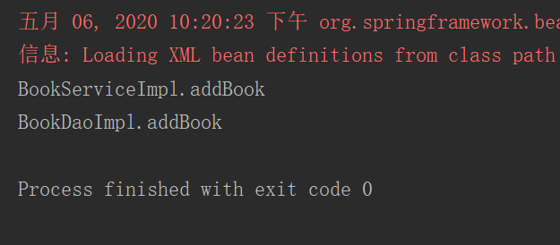

# DI 快速入门

> 当某个角色(可能是一个 Java 实例，调用者)需要另一个角色(另一个 Java 实例，被调用者)的协助时，在 传统的程序设计过程中，通常由调用者来创建被调用者的实例。但在 Spring 里，创建被调用者的工作不再由调用者来完成，因此称为控制反转;创建被调用者 实例的工作通常由 Spring 容器来完成，然后注入调用者，因此也称为依赖注入。
>
> 依赖注入有两种：设值注入、构造注入
>
> 所谓依赖注入，是指程序运行过程中，如果需要调用另一个对象协助时，无须在代码中创建被调用者，而是依赖于外部的注入。Spring的依赖注入对调用者和被调用者几乎没有任何要求，完全支持对POJO之间依赖关系的管理。

当一个类拥有另一个类作为成员，则可以通过属性（依赖，setter）注入。

案例，在 [BookServiceImpl](src/main/java/org/lzn/service/impl/BookServiceImpl.java) 中存在成员变量 [BookDao](src/main/java/org/lzn/dao/BookDao.java)，依赖注入就是通过 [配置文件](src/main/resources/bean.xml) 将 [BookDaoImpl](src/main/java/org/lzn/dao/impl/BookDaoImpl.java) 对象作为参数调用 `setBookDao(BookDao bookDao)` 方法赋值给 [BookDao](src/main/java/org/lzn/dao/BookDao.java)

### 目标类

BookDao

```java
public interface BookDao {
    void addBook();
}
```

BookDaoImpl

```java
public class BookDaoImpl implements BookDao {
    @Override
    public void addBook() {
        System.out.println("BookDaoImpl.addBook");
    }
}
```

BookService

```java
public interface BookService {
    void addBook();
}
```

BookServiceImpl

```java
public class BookServiceImpl implements BookService {
    private BookDao bookDao;
    
    @Override
    public void addBook() {
        System.out.println("BookServiceImpl.addBook");
        bookDao.addBook();
    }

    public void setBookDao(BookDao bookDao) {
        this.bookDao = bookDao;
    }
}
```

配置文件

bean

```xml
<?xml version="1.0" encoding="UTF-8" ?>
<beans xmlns="http://www.springframework.org/schema/beans"
       xmlns:xsi="http://www.w3.org/2001/XMLSchema-instance"
       xsi:schemaLocation="http://www.springframework.org/schema/beans
                           http://www.springframework.org/schema/beans/spring-beans.xsd">
    <!--创建 service-->
    <bean id="bookService" class="org.lzn.service.impl.BookServiceImpl">
        <!--
            property: 用于进行属性注入
                name: bean 的属性名，通过 setter 方法获得
                ref: 另一个 bean 的 id 值的引用
        -->
        <property name="bookDao" ref="bookDao"/>
    </bean>

    <!--创建 dao-->
    <bean id="bookDao" class="org.lzn.dao.impl.BookDaoImpl"/>
</beans>
```

演示

```java
public class Di {
    public void demo1() {
        // 从 spring 容器获得
        // 1. 获得容器
        String xmlPath = "bean.xml";
        ClassPathXmlApplicationContext classPathXmlApplicationContext = new ClassPathXmlApplicationContext(xmlPath);
        // 2. 获得内容
        BookService bookService = (BookService) classPathXmlApplicationContext.getBean("bookService");
        bookService.addBook();
    }
}
```

结果



## 代码

目标类 [BookService.java](src/main/java/org/lzn/service/BookService.java)，[BookServiceImpl.java](src/main/java/org/lzn/service/impl/BookServiceImpl.java)，[BookDao.java](src/main/java/org/lzn/dao/BookDao.java)，[BookDaoImpl.java](src/main/java/org/lzn/dao/impl/BookDaoImpl.java)

配置 [bean.xml](src/main/resources/bean.xml)

演示 [Di.java](src/main/java/org/lzn/Di.java)