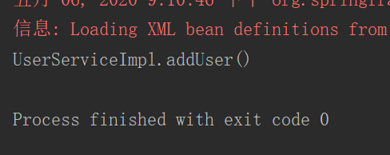

# IOC 快速入门

> 控制反转（Inversion of Control，缩写为IoC），是面向对象编程中的一种设计原则，可以用来减低计算机代码之间的耦合度。其中最常见的方式叫做依赖注入（Dependency Injection，简称DI），还有一种方式叫“依赖查找”（Dependency Lookup）。通过控制反转，对象在被创建的时候，由一个调控系统内所有对象的外界实体将其所依赖的对象的引用传递给它。也可以说，依赖被注入到对象中。

### 目标类

UserService

```java
public interface UserService {
    void addUser();
}
```

UserServiceImpl

```java
public class UserServiceImpl implements UserService {

    @Override
    public void addUser() {
        System.out.println("UserServiceImpl.addUser()");
    }
}
```

### 配置文件

任意位置，一般在 classpath 下。任意名称，一般用 applicationContext.xml。

bean.xml，此案例命名为 bean

```xml
<?xml version="1.0" encoding="UTF-8" ?>
<beans xmlns="http://www.springframework.org/schema/beans"
       xmlns:xsi="http://www.w3.org/2001/XMLSchema-instance"
       xsi:schemaLocation="http://www.springframework.org/schema/beans
                           http://www.springframework.org/schema/beans/spring-beans.xsd">
    <!--
        配置 service
        <bean> 配置需要创建的对象
            id: 用于之后从 spring 容器获得实例时使用的
            class: 需要创建实例的全限定类名
    -->
    <bean id="userServiceId" class="org.lzn.service.impl.UserServiceImpl"/>
</beans>
```

### 演示

```java
public class Ioc {

    @Test
    public void demo1() {
        // 从 spring 容器获得
        // 1. 获得容器
        String xmlPath = "bean.xml";
        ClassPathXmlApplicationContext classPathXmlApplicationContext = new ClassPathXmlApplicationContext(xmlPath);
        // 2. 获得内容
        UserService userServiceId = (UserService) classPathXmlApplicationContext.getBean("userServiceId");
        userServiceId.addUser();
    }
}
```

结果



## 代码

接口 [UserService.java](src/main/java/org/lzn/service/UserService.java)

控制反转的目标类 [UserServiceImpl.java](src/main/java/org/lzn/impl/UserServiceImpl.java)

spring 配置文件 [bean.xml](src/main/resources/bean.xml)

演示 [Ioc.java](src/main/java/org/lzn/Ioc.java)