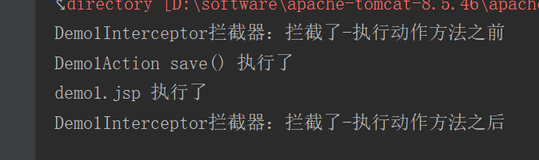
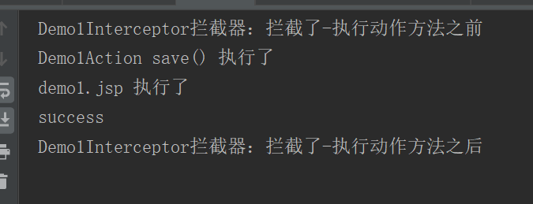
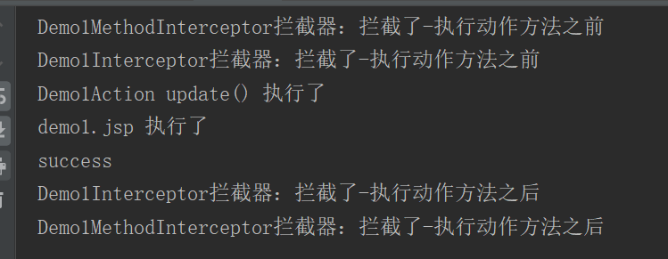

# struts2 基础3

所有例子基本都可通过 [主页](web/welcome.jsp) 查看。

## struts2 拦截器


## 自定义拦截器

自定义拦截器 [Demo1Interceptor](src/main/java/org/lzn/interceptor/Demo1Interceptor.java)

```java
public class Demo1Interceptor extends AbstractInterceptor {
    @Override
    public String intercept(ActionInvocation invocation) throws Exception {
        System.out.println("Demo1Interceptor拦截器：拦截了-执行动作方法之前");
        // 放行。如果有下一个拦截器，就前往下一个拦截器，如果没有了，就到达动作方法。
        String resultValue = invocation.invoke();
        System.out.println("Demo1Interceptor拦截器：拦截了-执行动作方法之后");
        return resultValue;
    }
}
```

拦截动作类 [Demo1Action](src/main/java/org/lzn/action/Demo1Action.java)

```java
public class Demo1Action extends ActionSupport {
    public String save() {
        System.out.println("Demo1Action save() 执行了");
        return SUCCESS;
    }
}
```

[struts.xml](src/main/resources/struts.xml) 如下配置。

```xml
<package name="p1" extends="struts-default">
    <!--声明自定义拦截器-->
    <interceptors>
        <interceptor name=" demo1Interceptor" class="org.lzn.interceptor.Demo1Interceptor"/>
    </interceptors>
    <action name="action1" class="org.lzn.action.Demo1Action" method="save">
        <!--使用自定义拦截器，当配置了任何一个拦截器，默认的拦截器栈就不会再工作了-->
        <interceptor-ref name=" demo1Interceptor"/>
        <result>/demo1.jsp</result>
    </action>
</package>
```

由于使用自定义拦截器，当配置了任何一个拦截器，默认的拦截器栈就不会再工作了，所以可以通过自定义默认拦截器栈，将自定义拦截器加上，然后覆盖默认拦截器栈。

```xml
<package name="p1" extends="struts-default">
    <!--声明自定义拦截器-->
    <interceptors>
        <interceptor name="demo1Interceptor" class="org.lzn.interceptor.Demo1Interceptor"/>
        <interceptor-stack name="myDefaultStack">
            <interceptor-ref name="defaultStack"/>
            <interceptor-ref name="demo1Interceptor"/>
        </interceptor-stack>
    </interceptors>
    <!--将默认拦截栈覆盖成自己的默认拦截栈-->
    <default-interceptor-ref name="myDefaultStack"/>
    <action name="action1" class="org.lzn.action.Demo1Action" method="save">
        <result name="success">/demo1.jsp</result>
    </action>
</package>
```

结果，通过 [主页](web/welcome.jsp) 查看。



## 方法过滤拦截器

有时候需要定义指定只拦截某些动作的拦截器。例如，拦截判断是否登录，没登录则跳转登录页面，但不拦截登录动作。一下例子，两个动作 save、update，方法拦截器不拦截 save。

定义方法拦截器 [Demo1MethodInterceptor](src/main/java/org/lzn/interceptor/Demo1MethodInterceptor.java)

```java
public class Demo1MethodInterceptor extends MethodFilterInterceptor {
    @Override
    protected String doIntercept(ActionInvocation invocation) throws Exception {
        System.out.println(this.getClass().getSimpleName().concat("拦截器：拦截了-执行动作方法之前"));
        // 可以判断 session 中是否有登录信息，没有则跳转到登录页面
        // 放行
        String result = invocation.invoke();
        System.out.println(this.getClass().getSimpleName().concat("拦截器：拦截了-执行动作方法之后"));
        return result;
    }
}
```

动作类 [Demo1Action](src/main/java/org/lzn/action/Demo1Action.java)

```java
public class Demo1Action extends ActionSupport {
    public String save() {
        System.out.println("Demo1Action save() 执行了");
        return SUCCESS;
    }
	
    // 方法不被 demo1MethodInterceptor 拦截
    public String update() {
        System.out.println("Demo1Action update() 执行了");
        return SUCCESS;
    }
}
```

[struts.xml](src/main/resources/struts.xml) 如下配置

```xml
<package name="p1" extends="struts-default">
    <!--声明自定义拦截器-->
    <interceptors>
        <interceptor name="demo1Interceptor" class="org.lzn.interceptor.Demo1Interceptor"/>
        <interceptor name="demo1MethodInterceptor" class="org.lzn.interceptor.Demo1MethodInterceptor"/>
        <!--自定义默认拦截器-->
        <interceptor-stack name="myDefaultStack">
            <interceptor-ref name="defaultStack"/>
            <interceptor-ref name="demo1MethodInterceptor"/>
            <interceptor-ref name="demo1Interceptor"/>
        </interceptor-stack>
    </interceptors>
    <!--将默认拦截栈覆盖称自己的默认拦截栈-->
    <default-interceptor-ref name="myDefaultStack"/>
    <action name="action1" class="org.lzn.action.Demo1Action" method="save">
        <!--不被拦截方法拦截器拦截-->
        <interceptor-ref name="myDefaultStack">
            <param name="demo1MethodInterceptor.excludeMethods">save</param>
        </interceptor-ref>
        <result name="success">/demo1.jsp</result>
    </action>
    <action name="action2" class="org.lzn.action.Demo1Action" method="update">
        <result name="success">/demo1.jsp</result>
    </action>
</package>
```

结果，访问 action1。通过 [主页](web/welcome.jsp) 查看。



结果，访问 action2。通过 [主页](web/welcome.jsp) 查看。



## 文件上传

可以通过 [主页](web/welcome.jsp) 查看。

### 单文件上传

* 定义上传页面，[upload1.jsp](web/upload1.jsp)

    ```jsp
    <s:form action="upload1" enctype="multipart/form-data">
      <s:textfield name="username" label="用户名"/>
      <s:file name="photo" label="照片"/>
      <s:submit value="上传"/>
    </s:form>
    ```

* 定义 `action` 配置，[struts.xml](src/main/resources/struts.xml)

    ```xml
    <package name="p2" extends="struts-default">
        <action name="upload1" class="org.lzn.action.Upload1Action" method="upload"></action>
    </package>
    ```

* 定义动作类 [Upload1Action.java](src/main/java/org/lzn/action/Upload1Action.java)

    ```java
    public class Upload1Action extends ActionSupport {

        /**
         * 表单上提供的字段
         */
        private String username;
        private File photo;

        /**
         * 上传的文件名。上传字段名称+FileName（注意大小写）
         */
        private String photoFileName;

        /**
         * 上传文件的 MIME 类型。上传字段名称+ContentType（注意大小写）
         */
        private String photoContentType;

        public String upload() {
            // 1. 拿到 ServletContext
            ServletContext application = ServletActionContext.getServletContext();
            // 2. 调用 realPath 方法，获取根据一个虚拟目录得到的真实目录
            String filePath = application.getRealPath("/WEB-INF/files");
            // 3. 如果这个真实目录不存在，需要创建
            File file = new File(filePath);
            if (!file.exists()) {
                file.mkdirs();
            }
            // 4. 把 photo 存过去
            // 剪切：把临时文件剪切指定的位置，并且给他重命名。注意：临时文件没有了
            photo.renameTo(new File(file, photoFileName));

            return null;
        }

        //
        // setter/getter
        // ------------------------------------------------------------------------------

        public String getUsername() {
            return username;
        }

        public void setUsername(String username) {
            this.username = username;
        }

        public File getPhoto() {
            return photo;
        }

        public void setPhoto(File photo) {
            this.photo = photo;
        }

        public String getPhotoFileName() {
            return photoFileName;
        }

        public void setPhotoFileName(String photoFileName) {
            this.photoFileName = photoFileName;
        }

        public String getPhotoContentType() {
            return photoContentType;
        }

        public void setPhotoContentType(String photoContentType) {
            this.photoContentType = photoContentType;
        }
    }
    ```

* <a name="size" style="text-decoration:none">设置上传文件大小，通过修改 struts2 的常量</a>

    ```xml
    <!--配置上传文件的大小(5M)。-->
    <constant name="struts.multipart.maxSize" value="524480"/>
    ```

* <a name="suffixName" style="text-decoration:none">设置上传文件的扩展名</a>

    ```xml
    <package name="p2" extends="struts-default">
        <action name="upload1" class="org.lzn.action.Upload1Action" method="upload">
            <interceptor-ref name="defaultStack">
                <!--限制上传文件的扩展名。如果有多个，使用逗号分隔-->
                <param name="fileUpload.allowedExtensions">jpg,png,bmp</param>
            </interceptor-ref>
            <result name="input">/upload1.jsp</result>
        </action>
    </package>
    ```

* <a name="type" style="text-decoration:none">设置上传文件类型</a>

    ```xml
    <package name="p2" extends="struts-default">
        <action name="upload1" class="org.lzn.action.Upload1Action" method="upload">
            <interceptor-ref name="defaultStack">
                <!--限制上传文件的文件类型。如果有多个，使用逗号分隔-->
                <param name="fileUpload.allowedTypes">image/jpg,image/pjpeg,image/png</param>
            </interceptor-ref>
            <result name="input">/upload1.jsp</result>
        </action>
    </package>
    ```

### 多文件上传

* 定义上传页面，[upload2.jsp](web/upload2.jsp)

  ```jsp
  <s:actionerror/>
  <s:form action="upload2" enctype="multipart/form-data">
    <s:textfield name="username" label="用户名"/>
    <s:file name="photo" label="照片"/>
    <s:file name="photo" label="照片"/>
    <s:submit value="上传"/>
  </s:form>
  ```

* 定义 `action` 配置，[struts.xml](src/main/resources/struts.xml)。设置上传文件类型，参考 [上传文件扩展名](#suffixName)，[上传文件类型](#type)。设置上传文件大小，参考 [上传文件大小](#size)

  ```xml
  <package name="p2" extends="struts-default">
      <action name="upload2" class="org.lzn.action.Upload2Action" method="upload">
          <result name="input">/upload2.jsp</result>
      </action>
  </package>
  ```

* 定义动作类 [Upload2Action.java](src/main/java/org/lzn/action/Upload2Action.java)

  ```java
  public class Upload2Action extends ActionSupport {
  
      /**
       * 表单上提供的字段
       */
      private String username;
      private File[] photo;
      
      /**
       * 上传的文件名。上传字段名称+FileName（注意大小写）
       */
      private String[] photoFileName;
      
      /**
       * 上传文件的 MIME 类型。上传字段名称+ContentType（注意大小写）
       */
      private String[] photoContentType;
  
      public String upload() {
          // 1. 拿到 ServletContext
          ServletContext application = ServletActionContext.getServletContext();
          // 2. 调用 realPath 方法，获取根据一个虚拟目录得到的真实目录
          String filePath = application.getRealPath("/WEB-INF/files");
          // 3. 如果这个真实目录不存在，需要创建
          File file = new File(filePath);
          if (!file.exists()) {
              file.mkdirs();
          }
          // 4. 把 photo 存过去。剪切：把临时文件剪切指定的位置，并且给他重命名。注意：临时文件没有了
          for (int i = 0, len = photo.length; i < len ; i++) {
              photo[i].renameTo(new File(file, photoFileName[i]));
          }
  
          return INPUT;
      }
  
      //
      // setter/getter
      // ------------------------------------------------------------------------------
  
      public String getUsername() {
          return username;
      }
  
      public void setUsername(String username) {
          this.username = username;
      }
  
      public File[] getPhoto() {
          return photo;
      }
  
      public void setPhoto(File[] photo) {
          this.photo = photo;
      }
  
      public String[] getPhotoFileName() {
          return photoFileName;
      }
  
      public void setPhotoFileName(String[] photoFileName) {
          this.photoFileName = photoFileName;
      }
  
      public String[] getPhotoContentType() {
          return photoContentType;
      }
  
      public void setPhotoContentType(String[] photoContentType) {
          this.photoContentType = photoContentType;
      }
  }
  ```

## 文件下载

* 定义 actioon，[struts.xml](src/main/resources/struts.xml)。然而文件名称是硬代码。

  ```xml
  <package name="p2" extends="struts-default">
      <action name="download" class="org.lzn.action.DownloadAction" method="download">
          <result name="success" type="stream">
              <!--给 sream 的结果类型注入参数：content-type-->
              <param name="contentType">application/octet-stream</param>
              <!--告知客户浏览器以下载的方式打开-->
              <param name="contentDisposition">attachment;filename=hehe.jpg</param>
              <!--注入字节输入流：取值要写动作类中的名称-->
              <param name="inputName">inputStream</param>
          </result>
      </action>
  </package>
  ```

* 定义动作类 [DownloadAction.java](src/main/java/org/lzn/action/DownloadAction.java)

  ```java
  public class DownloadAction extends ActionSupport {
  
      /**
       * 在 InputSream 命名时，不能使用 in
       */
      private InputStream inputStream;
  
      public String download() throws Exception{
          // 1. 找到文件的存储路径
          String filePath = ServletActionContext.getServletContext().getRealPath("/WEB-INF/files/timg (3).jpg");
          // 2. 把文件读到一个 InputSream 中
          inputStream = new FileInputStream(filePath);
          // 3. 返回一个成功
          // 4. 由一个叫 stream 的结果类型为我们把剩下的事情做完
          return SUCCESS;
      }
  
      //
      // setter/getter
      // ------------------------------------------------------------------------------
  
      public InputStream getInputStream() {
          return inputStream;
      }
  
      public void setInputStream(InputStream inputStream) {
          this.inputStream = inputStream;
      }
  }
  ```

### 解决文件名称是硬编码问题

使用 `OGNL` 表达式解决文件名称是硬编码问题。ognl 表达式参考 [ognl](#ognl)

* 定义 actioon，[struts.xml](src/main/resources/struts.xml)。使用 `OGNL` 表达式解决文件名称是硬编码问题。

  ```xml
  <package name="p2" extends="struts-default">
      <action name="download2" class="org.lzn.action.Download2Action" method="download">
          <result name="success" type="stream">
              <!--给 sream 的结果类型注入参数：content-type-->
              <param name="contentType">application/octet-stream</param>
              <!--告知客户浏览器以下载的方式打开，使用 OGNL 表达式，来动态获取文件名-->
              <param name="contentDisposition">attachment;filename=${@java.net.URLEncoder@encode(filename, "UTF-8")}</param>
              <!--注入字节输入流：取值要写动作类中的名称-->
              <param name="inputName">inputStream</param>
          </result>
      </action>
  </package>
  ```

* 定义动作类 [Download2Action.java](src/main/java/org/lzn/action/Download2Action.java)

  ```java
  public class Download2Action extends ActionSupport {
  
      /**
       * 在 InputSream 命名时，不能使用 in
       */
      private InputStream inputStream;
  
      /**
       * 创建一个文件名的属性
       */
      private String filename;
  
      public String download() throws Exception{
          // 1. 找到文件的存储路径
          String filePath = ServletActionContext.getServletContext().getRealPath("/WEB-INF/files/resultDemo1.png");
          // 2. 把文件读到一个 InputSream 中
          inputStream = new FileInputStream(filePath);
          // 在返回之前，给 filename 赋值
          filename = "照片.jpg";
          // 3. 返回一个成功
          return SUCCESS;
          // 4. 由一个叫 stream 的结果类型为我们把剩下的事情做完
      }
  
      //
      // setter/getter
      // ------------------------------------------------------------------------------
  
      public InputStream getInputStream() {
          return inputStream;
      }
  
      public void setInputStream(InputStream inputStream) {
          this.inputStream = inputStream;
      }
  
      public String getFilename() {
          return filename;
      }
  
      public void setFilename(String filename) {
          this.filename = filename;
      }
  }
  ```

## <a name="ognl" style="text-decoration:none">OGNL</a>

`OGNL` 是 **对象图导航语言（Object Graphic Navigation Language）** 的缩写，它是一个单独的开源项目。 Struts2框架使用OGNL作为默认的表达式语言。`OGNL` 是 `struts2` 整合的一个开源项目，所以在 `struts2` 中，**要想使用 `OGNL` 表达式，必须使用 `Struts2` 标签库**。

以下参考 [ognldemo.jsp](web/ognldemo.jsp)

引入 struts2 标签库

```xml
<%@ taglib prefix="s" uri="/struts-tags" %>
```

*  `OGNL` 表达式的简单使用，`value` 中的值是 `OGNL` 表达式，当找不到时输出 `0`。

  ```jsp
  <s:property value="OGNL-Expression"/>
  ```

* 输出普通的字符串，使用 `''` 来表示字符串。

  ```jsp
  <s:property value="'OGNL-Expression'"/>
  ```

* 调用字符串的 `length()`

  ```jsp
  <s:property value="'OGNL-Expression'.length()"/>
  ```

* 调用 `Integer` 静态属性 `MAX_VALUE`，访问静态方法的方式：@全类名@静态属性名称，struts2 的框架默认是静态方法调用的。可以通过配置开启。

  ```jsp
  <s:property value="@java.lang.Integer@MAX_VALUE"/>
  ```

  在 [struts.xml](src/main/resources/struts.xml) 开启静态方法调用

  ```xml
  <constant name="struts.ognl.allowStaticMethodAccess" value="true"/>
  ```

  

* 访问 `Math` 的静态方法 `randon()`

  ```jsp
  <s:property value="@java.lang.Math@random()"/>
  ```

* 使用 `s:radio` 的标签，创建 `list` 集合，`{}` 相当于创建一个 `list` 集合，`list` 属性中的取值是一个 `OGNL` 表达式

  ```jsp
  <s:radio name="gender" list="{'男','女'}"/>
  ```

* 使用 s:radio 的标签，创建 map 集合，#{} 表示创建一个 map，1 和 0 作为 value 给 radio 标签的 value 属性赋值，男和女作为 key，显示到页面的内容

  ```jsp
  <s:radio name="gender2" list="#{'1':'男','0':'女'}"/>
  ```

## contextMap

动作类是多例的，每次动作访问，动作类都会实例化。所以是线程安全的。与Struts1的区别是，struts1的动作类是单例的。

在每次动作执行前，核心控制器 `StrutsPrepareAndExecuteFilter` 都会创建一个 `ActionContext` 和 `ValueStack` 对象。且每次动作访问都会创建。这两个对象存储了整个动作访问期间用到的数据。并且把数据绑定到了线程局部变量（ThreadLocal）上了。所以是线程安全的。

以下，除了value stack之外，全是map，而contextMap也是一个map。其实就是Map中又封装的Map。（很像dbutils中KeyedHandler封装数据的结构，只是封装数据的结构）

| Key                | Value                        | 说明                                               |
| ------------------ | ---------------------------- | -------------------------------------------------- |
| value stack (root) | java.util.List               | 没有root这个key。它是一个list。                    |
| application        | java.util.Map<String,Object> | ServletContext中的所有属性。                       |
| session            | java.util.Map<String,Object> | HttpSession中的所有属性。                          |
| request            | java.util.Map<String,Object> | ServletRequest中的所有属性。                       |
| parameters         | java.util.Map                | 参数                                               |
| attr               | java.util.Map                | 把页面、请求、会话、应用范围内的所有属性放到一起。 |

查看contextMap中的数据，参考 [contextmap.jsp](web/contextmap.jsp)

```jsp
<s:debug/>
```

