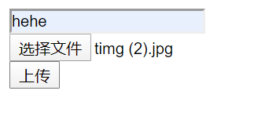
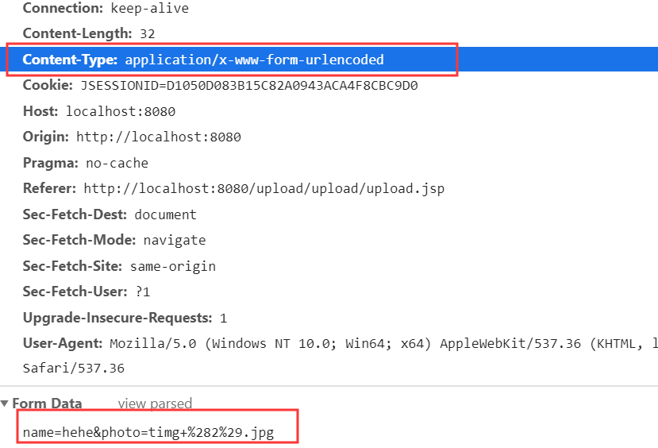
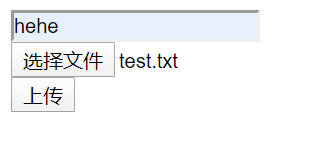
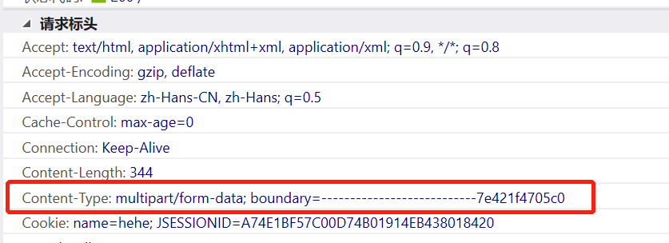
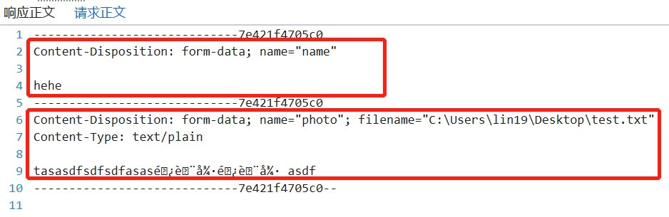
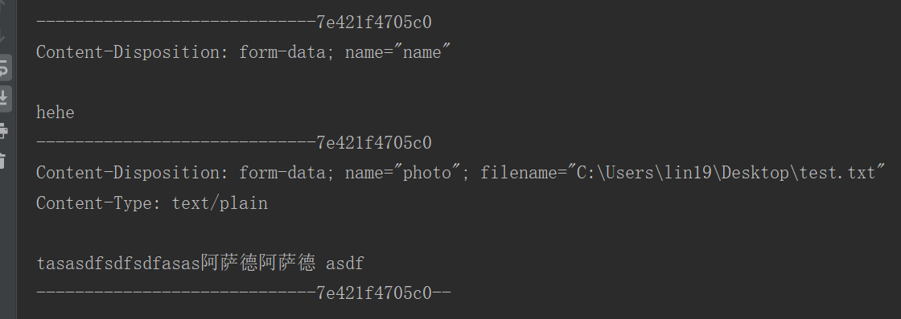

# 文件的上传

## 文件上传的必要条件

* 提供 `form` 表单，`method` 必须是 `post`
* `form` 表单的 [enctype](#enctype) 必须是 `multipart/form-data`
* 提供 `<input type = "file" />` 类的上传输入域

## 默认 `enctype` 提交文件

表单不设置 `enctype` 属性，直接提交文件。

[defaultUpload.jsp](web/upload/defaultUpload.jsp)

```jsp
<form action="${pageContext.request.contextPath}/defaultUpload" method="post">
    <input type="text" name="name" /><br>
    <input type="file" name="photo" /><br>
    <input type="submit" value="上传" /><br>
</form>
```



[DefaultUploadServlet.java](src/main/java/org/lzn/servlet/DefaultUploadServlet.java)

```java
String name = req.getParameter("name");
String photo = req.getParameter("photo");
System.out.println(name);
System.out.println(photo);
```

请求信息



控制台


## `multipart/form-data` 提交表单

表单 `enctype` 设置为 `multipart/form-data`。提交文件。

[multipartUpload.jsp](web/upload/multipartUpload.jsp)

```jsp
<form enctype="multipart/form-data" action="${pageContext.request.contextPath}/multipartUpload" method="post">
  <input type="text" name="name" /><br>
  <input type="file" name="photo" /><br>
  <input type="submit" value="上传" /><br>
</form>
```



[MultipartUploadServlet.java](src/main/java/org/lzn/servlet/MultipartUploadServlet.java)

```java
// 读取 multipart/form-data 数据
ServletInputStream inputStream = req.getInputStream();
byte[] b = new byte[1024];
ByteArrayOutputStream byteArrayOutputStream = new ByteArrayOutputStream();
int len;
while ((len = inputStream.read(b, 0, 1024)) != -1) {
    byteArrayOutputStream.write(b, 0, len);
}
// 以 utf-8 编码的字符串显示
System.out.println(new String(byteArrayOutputStream.toByteArray(), StandardCharsets.UTF_8));
```

请求信息





控制台



## <a id="enctype" style="text-decoration:none">enctype</a>

`enctype` 就是 `encodetype` 就是编码类型的意思。用于设置表单的 **MIME(Multipurpose Internet Mail Extensions，多用途互联网邮件扩展类型)** 编码。请求消息头的 `Content-Type` 作用是一致的。	

### 补充资料

1. 关于 **HTML** `\<form\>` 标签的 `enctype` 数据

   `application/x-www-form-urlencoded` : 在发送前编码所有字符（默认）

   `multipart/form-data` : 不对字符编码，或在使用包含文件上传控件的表单时，必须使用该值。

   `text/plain` : 空格转换为 "+" 加号，但不对特殊字符编码。

2. `enctype` : 规定了 `form` 表单在发送到服务器时候编码方式，有如下的三个值

   * `application/x-www-form-urlencoded`

     默认的编码方式。但是在用文本的传输和 MP3 等大型文件的时候，使用这种编码就显得 效率低下。 

   * `multipart/form-data`

     指定传输数据为二进制类型，比如图片、mp3、文件。
     
   * `text/plain`
   
     纯文体的传输。空格转换为 “+” 加号，但不对特殊字符编码。

## 借助第三方的上传组件实现文件上传

`fileupload` 是由 `apache` 的 `commons` 组件提供的上传组件。它最主要的工作就是帮我们解析 `request.getInputStream()`。

相关 `jar` 包 : [pom.xml](pom.xml)

### 简单实用

1. 创建工厂类 `DiskFileItemFactory` 对象

   ```java
   DiskFileItemFactory factory = new DiskFileItemFactory();
   ```

2. 使用工厂创建解析器对象

   ```java
   ServletFileUpload fileUpload = new ServletFileUpload(factory);
   ```

3. 实用解析器来解析 `request` 对象

   ```java
   List<FileItem> list = fileUpload.parseRequest(request);
   ```

`FileItem` 对象对应一个表单项（表单字段）。可以是文件字段或普通字段。

* `boolean isFormField()`：判断当前表单字段是否为普通文本字段，如果返回false，说明是文件字段；
* `String getFieldName()`：获取字段名称，例如：`<input type="text" name="username"\>`，返回的是 `username`；
* `String getString()`：获取字段的内容，如果是文件字段，那么获取的是文件内容，当然上传的文件必须是文本文件；
* `String getName()`：获取文件字段的文件名称，例如：**xxx.txt**。
* `String getContentType()`：获取上传的文件的MIME类型，例如：`text/plain`。
* `int getSize()`：获取上传文件的大小；
* `InputStream getInputStream()`：获取上传文件对应的输入流；
* `void write(File)`：把上传的文件保存到指定文件中。
* `delete()` : 删除临时文件

上传文件 `Servlet`

[MyFileUpload.java](src/main/java/org/lzn/servlet/MyFileUpload.java)

[fileupload.jsp](web/upload/fileupload.jsp)

