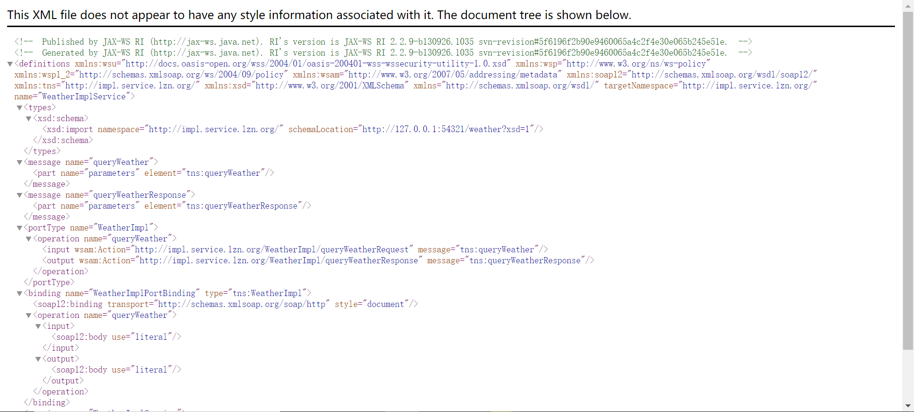
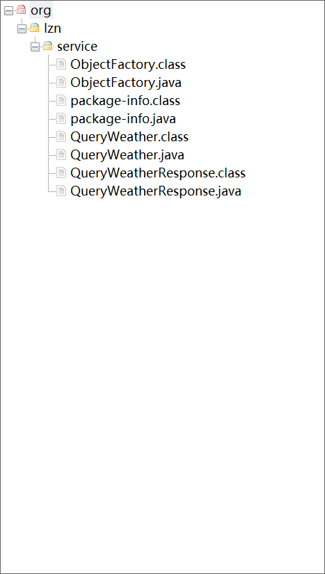
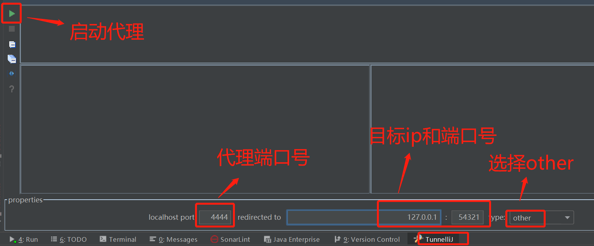
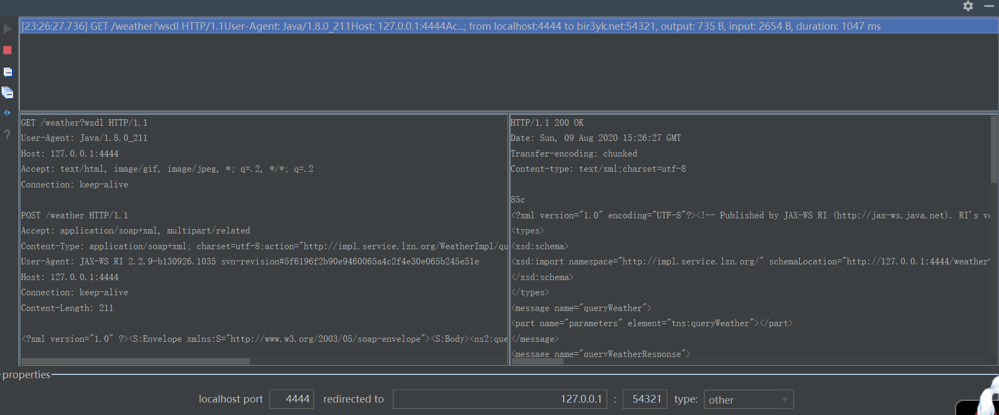

# SOAP

[TOC]

## SOAP

简单对象访问协议是交换数据的一种协议规范，是一种轻量的、简单的、基于 XML（标准通用标记语言下的一个子集）的协议，它被设计成在 WEB 上交换结构化的和固化的信息。

SOAP即简单对象访问协议，他是使用http发送的XML格式的数据，它可以跨平台，跨防火墙，SOAP不是webservice的专有协议。

SOAP = http + xml

## 协议格式

* Envelop：必需，此元素将整个 XML 文档标识为一条 SOAP 消息
* Header：可选，包含头部信息
* Body：必需，包含所有的调用和响应信息
* Fault：可选，提供有关在处理此消息所发生错误的信息

## 入门程序

服务端，发布一个天气查询服务，接收客户端城市名，返回天气数据给客户端

客户端，发送城市名称给服务端，接收服务端的返回天气数据

### 服务端

#### [SEI（Service Endpoint Interface）接口](server/src/main/java/org/lzn/service/Weather.java)

```java
package org.lzn.service;

/**
 * SEI（Service Endpoint Interface）接口，本质上就是Java接口
 *
 * @author LinZhenNan lin_hehe@qq.com 2020/07/21 23:47
 */
public interface Weather {
    String queryWeather(String cityName);
}
```

#### [创建SEI实现类](server/src/main/java/org/lzn/service/impl/WeatherImpl.java)

`@BindingType(SOAPBinding.SOAP12HTTP_BINDING)`，表示发布 SOAP1.2 服务端。

```java
package org.lzn.service.impl;

import org.lzn.service.Weather;

import javax.jws.WebService;
import javax.xml.ws.BindingType;
import javax.xml.ws.soap.SOAPBinding;

/**
 * SEI 实现类<br>
 *     @WebService 表示该类是一个服务类，需要发布其中的 public
 *
 * @author LinZhenNan lin_hehe@qq.com 2020/07/21 23:48
 */
@WebService
@BindingType(SOAPBinding.SOAP12HTTP_BINDING)
public class WeatherImpl implements Weather {
    @Override
    public String queryWeather(String cityName) {
        System.out.println("SOAP1.2 WeatherImpl.queryWeather");
        System.out.println("查询的城市名称：".concat(cityName));
        return "晴";
    }
}
```

#### [发布服务](wsdl-server/src/main/java/org/lzn/Server.java)

发布服务，Endpoint发布服务，publish方法。

需要两个参数。

1. 服务地址
2. 服务实现类

```java
package org.lzn;

import WeatherImpl;

import javax.xml.ws.Endpoint;

/**
 * 发布服务
 *
 * @author LinZhenNan lin_hehe@qq.com 2020/07/21 23:54
 */
public class Server {

    public static void main(String[] args) {
        Endpoint.publish("http://127.0.0.1:54321/weather", new WeatherImpl());
    }
}
```

#### 测试服务是否发布成功

测试服务是否发布成功，通过阅读使用说明书，确定客户端调用的接口、方法、参数和返回值存在，证明服务发布成功。

* WSDL 地址：服务地址 + "?wsdl"。例如 `http://127.0.0.1:54321/weather?wsdl`



### 客户端 

#### <a name="wsimport" style="text-decoration:none">wsimport 命令生成客户端代码</a>

命令 `wsimport -extension -s 目录 -p 包名 WSDL地址`。[命令参数](../readme.md#wsimport)

例如，在当前文件夹生成包名为 `org.lzn.service` 的 `http://127.0.0.1:54321/weather` 的客户端代码

```
wsimport -extension -s . -p org.lzn.service http://127.0.0.1:54321/weather?wsdl
```

生成的文件



#### <a name="program" href="wsdl-client/src/main/java/org/lzn/program/ProgramClient.java">service 编程调用方式</a>

```java
package org.lzn;

import org.lzn.service.WeatherImpl;

import javax.xml.namespace.QName;
import javax.xml.ws.Service;
import java.net.MalformedURLException;
import java.net.URL;

/**
 * service 编程调用方式
 *
 * @author LinZhenNan lin_hehe@qq.com 2020/08/09 22:34
 */
public class Client {

    public static void main(String[] args) throws MalformedURLException {
        // 创建 WSDL 的 URL
        URL url = new URL("http://127.0.0.1:54321/weather?wsdl");

        // 创建服务名称
        // 1. namespaceURI，命名空间地址
        // 2. localPart，服务视图名
        QName qName = new QName("http://impl.service.lzn.org/", "WeatherImplService");

        // 创建服务视图
        // 1. wsdlDocumentLocation，wsdl 地址
        // 2. serviceName，服务名称
        Service service = Service.create(url, qName);
        // 获取服务实现类
        WeatherImpl weatherService = service.getPort(WeatherImpl.class);
        // 调用查询方法
        String weather = weatherService.queryWeather("广东");
        System.out.println(weather);
    }
}
```

## idea TunnelliJ 插件查看 SOAP 报文

idea 安装 TunnelliJ 插件，设置代理配置，然后程序调用代理，由代理来调用目标接口。然后在代理信息中看报文信息。



### 客户端改动

将客户端的 URL 改为 `http://127.0.0.1:4444/weather?wsdl`。

```java
package org.lzn;

import org.lzn.service.WeatherImpl;

import javax.xml.namespace.QName;
import javax.xml.ws.Service;
import java.net.MalformedURLException;
import java.net.URL;

/**
 * service 编程调用方式
 *
 * @author LinZhenNan lin_hehe@qq.com 2020/08/09 22:34
 */
public class Client {

    public static void main(String[] args) throws MalformedURLException {
        // 创建 WSDL 的 URL
        URL url = new URL("http://127.0.0.1:4444/weather?wsdl");

        // 创建服务名称
        // 1. namespaceURI，命名空间地址
        // 2. localPart，服务视图名
        QName qName = new QName("http://impl.service.lzn.org/", "WeatherImplService");

        // 创建服务视图
        // 1. wsdlDocumentLocation，wsdl 地址
        // 2. serviceName，服务名称
        Service service = Service.create(url, qName);
        // 获取服务实现类
        WeatherImpl weatherService = service.getPort(WeatherImpl.class);
        // 调用查询方法
        String weather = weatherService.queryWeather("广东");
        System.out.println(weather);
    }
}
```

### <a name="result" style="text-decoration:none">结果</a>



请求正文

```xml
<?xml version="1.0" ?>
<S:Envelope xmlns:S="http://www.w3.org/2003/05/soap-envelope">
	<S:Body>
		<ns2:queryWeather xmlns:ns2="http://impl.service.lzn.org/">
			<arg0>广州</arg0>
		</ns2:queryWeather>
	</S:Body>
</S:Envelope>
```

响应正文

```xml
<?xml version="1.0" ?>
<S:Envelope xmlns:S="http://www.w3.org/2003/05/soap-envelope">
	<S:Body>
		<ns2:queryWeatherResponse xmlns:ns2="http://impl.service.lzn.org/">
			<return>晴</return>
		</ns2:queryWeatherResponse>
	</S:Body>
</S:Envelope>
```

## SOAP 1.1 和 SOAP 1.2 区别

### 相同点

* 请求发送方式相同：都是使用 POST
* 协议内容相同：都有 Envelope 和 Body 标签

### 不同点

* 数据格式不同：content-type 不同
  * SOAP1.1：text/xml;charset=utf-8
  * SOAP1.2：application/soap+xml;charset=utf-8
* 命名空间不同：
  * SOAP1.1：http://schemas.xmlsoap.org/soap/envelope/
  * SOAP1.2：http://www.w3.org/2003/05/soap-envelope