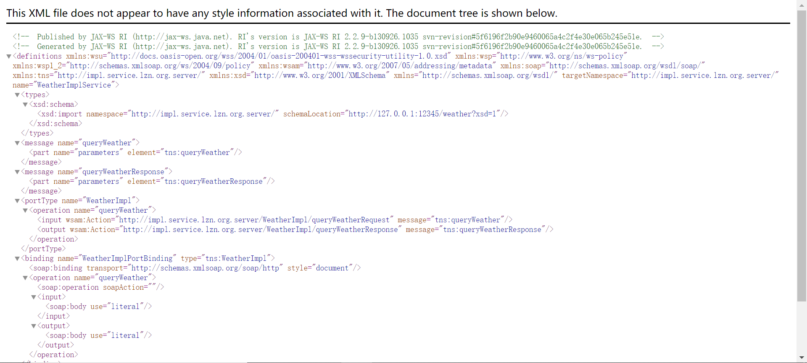
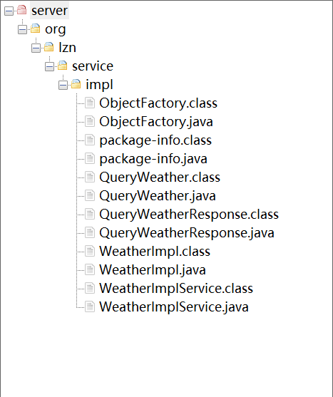

# WSDL

[TOC]

## WSDL

WSDL（Web服务描述语言，Web Services Description Language）是为描述Web服务发布的XML格式。W3C组织（World Wide Web Consortium）没有批准 1.1 版的 WSDL，当前的 WSDL 版本是 2.0，是 W3C 的推荐标准（recommendation）（一种官方标准），并将被 W3C 组织批准为正式标准。

在诸多技术文献中通常将 Web 服务描述语言简写为 WSDL，读音通常发为："wiz-dəl"。

WSDL 描述 Web 服务的公共接口。这是一个基于 XML 的关于如何与 Web 服务通讯和使用的服务描述；也就是描述与目录中列出的 Web 服务进行交互时需要绑定的协议和信息格式。通常采用抽象语言描述该服务支持的操作和信息，使用的时候再将实际的网络协议和信息格式绑定给该服务。

## 文档结构

### \<service\>

服务视图，webservice 的服务结点，它包括了服务端点。

### \<binding\>

为每个服务端点定义消息格式和协议细节。

### \<portType\>

**服务端点**，描述 web service 可被执行的操作方法，以及相关的消息，通过 binding 指向 portType。

### \<message\>

定义一个操作（方法）的数据参数（可有多个参数）。

### \<types\>

定义 web service 使用的全部数据类型。

## 入门程序

服务端，发布一个天气查询服务，接收客户端城市名，返回天气数据给客户端

客户端，发送城市名称给服务端，接收服务端的返回天气数据

### 服务端

#### [SEI（Service Endpoint Interface）接口](wsdl-server/src/main/java/org/lzn/service/Weather.java)

```java
package org.lzn.service;

/**
 * SEI（Service Endpoint Interface）接口，本质上就是Java接口
 *
 * @author LinZhenNan lin_hehe@qq.com 2020/07/21 23:47
 */
public interface Weather {
    String queryWeather(String cityName);
}
```

#### [创建SEI实现类](wsdl-server/src/main/java/org/lzn/service/impl/WeatherImpl.java)

```java
package org.lzn.service.impl;

import Weather;

import javax.jws.WebService;

/**
 * SEI 实现类<br>
 *     @WebService 表示该类是一个服务类，需要发布其中的 public
 *
 * @author LinZhenNan lin_hehe@qq.com 2020/07/21 23:48
 */
@WebService
public class WeatherImpl implements Weather {
    @Override
    public String queryWeather(String cityName) {
        System.out.println("WeatherImpl.queryWeather");
        System.out.println("查询的城市名称：".concat(cityName));
        return "晴";
    }
}
```

#### [发布服务](wsdl-server/src/main/java/org/lzn/Server.java)

发布服务，Endpoint发布服务，publish方法。

需要两个参数。

1. 服务地址
2. 服务实现类

```java
package org.lzn;

import WeatherImpl;

import javax.xml.ws.Endpoint;

/**
 * 发布服务
 *
 * @author LinZhenNan lin_hehe@qq.com 2020/07/21 23:54
 */
public class Server {

    public static void main(String[] args) {
        Endpoint.publish("http://127.0.0.1:12345/weather", new WeatherImpl());
    }
}
```

#### 测试服务是否发布成功

测试服务是否发布成功，通过阅读使用说明书，确定客户端调用的接口、方法、参数和返回值存在，证明服务发布成功。

* WSDL 地址：服务地址 + "?wsdl"。例如 `http://127.0.0.1:12345/weather?wsdl`



### 客户端 

#### <a name="wsimport" style="text-decoration:none">wsimport 命令生成客户端代码</a>

命令 `wsimport -s 目录 WSDL地址`。[命令参数](../readme.md#wsimport)

例如，在当前文件生成 `http://127.0.0.1:12345/weather` 的客户端代码

```
wsimport -s . http://127.0.0.1:12345/weather?wsdl
```

生成的文件



#### [使用客户端代码调用服务器](wsdl-client/src/main/java/org/lzn/Client.java)

```java
package org.lzn;

import org.lzn.service.WeatherImpl;

import javax.xml.namespace.QName;
import javax.xml.ws.Service;
import java.net.MalformedURLException;
import java.net.URL;

/**
 * service 编程调用方式
 *
 * @author LinZhenNan lin_hehe@qq.com 2020/08/09 22:34
 */
public class Client {

    public static void main(String[] args) throws MalformedURLException {
        // 创建 WSDL 的 URL
        URL url = new URL("http://127.0.0.1:54321/weather?wsdl");

        // 创建服务名称
        // 1. namespaceURI，命名空间地址
        // 2. localPart，服务视图名
        QName qName = new QName("http://impl.service.lzn.org/", "WeatherImplService");

        // 创建服务视图
        // 1. wsdlDocumentLocation，wsdl 地址
        // 2. serviceName，服务名称
        Service service = Service.create(url, qName);
        // 获取服务实现类
        WeatherImpl weatherService = service.getPort(WeatherImpl.class);
        // 调用查询方法
        String weather = weatherService.queryWeather("广东");
        System.out.println(weather);
    }
}
```

